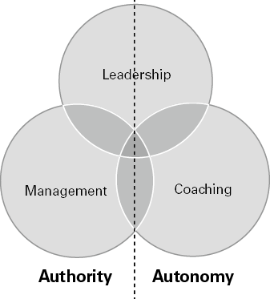
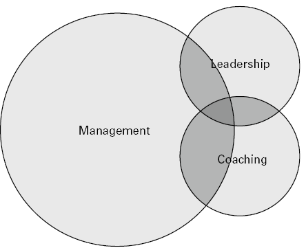
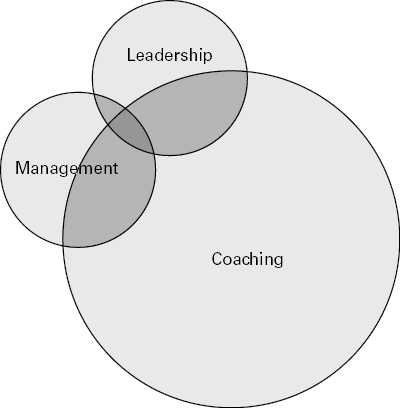

# 保持领导力平衡的实用策略
## 简而言之

管理、领导和辅导之间有什么区别？你怎么知道每个状态需要什么行为？一旦您了解如何根据组织、团队和个人的需求“转变”，您就能够从职能专家转变为战略领导者。

## 有什么问题？

最后，您的职位名称为“领导者”。如果你现在问自己，“我是领导者吗？”，如果是的话，“我还需要做些什么来改进？”——这两个问题经常被带到我的教练门前，那么你就不会孤单了，却带着几分忐忑的问道，仿佛你应该知道答案。让我在这里帮你。
大多数领导者通过一系列管理和职能角色晋升为领导层，直到您成为……的负责人、……的董事、真正的领导者。困难在于，放弃职能角色并成长为领导者比乍一看要困难得多。造成这种情况的原因有以下三个：

1. 你不知道更好;没有人向你展示过其中的不同。
2. 你真的很擅长成为一名功能专家，这就是一段时间以来你得到的报酬。
3. 出色的管理就像肾上腺素飙升：短期、快速、目标导向。您知道团队中的每个人都在做什么，并且您正在指导行动。你的触角触及细节、个人、要完成的工作、永无止境的会议、行动！相比之下，领导似乎，好吧，坦率地说，缓慢。所以，回到立即行动中心。

## 大理念：建立平衡和意识
领导层是复杂而动态的，许多环境以矩阵形式运作。这意味着在您的领导力工具包中建立平衡和意识至关重要。您正在寻求平衡领导、管理和辅导的角色，同时提高您对自己行为的认识。如果建议管理仍然是你的领导者工具包的一部分听起来很奇怪，我在这里只是现实一点。只有在最大的企业集团中，领导者才会采取“思考和行动”战略。对于大多数领导者来说，有时您仍然需要专注于管理工作，并“做事”。
开始思考领导力、管理和辅导之间差异的一种有用方法是使用图 1.1 中的这个简单图表，三个圆圈代表您的领导角色的三个功能：领导、管理和辅导他人。左侧是“告诉”（权威）的主导行为。你知道你想要实现什么，什么时候，为什么以及让谁参与。右侧是“询问”（实现自主）的核心行为。允许其他人决定他们想要如何完成某件事、何时、为什么以及让谁参与。这三个圈子的相互依存表明，在这种自治的权力连续体中存在“灰色区域”，或者，正如我在下面解释的，圈子之间的舞蹈。

> 圆圈相互重叠。 圆圈的右侧是管理角色，显示了权威的中心行为； 左侧是教练角色，显示了 Autonomy 的主导行为。

## 通过领导力跳舞

从图中可以看出，作为经理、领导者和教练的角色之间存在相互依存关系。它既不是一个也不是另一个。您将需要具备同时担任经理和领导者的能力，并将辅导融入这些角色。这里的艺术是了解如何在正确的时间与正确的人选择正确的角色！
为了理解管理和领导之间的区别，我将借用 Ron Heifetz 等人的著作《适应性领导的实践》（2009 年）中跳舞的比喻。这是了解从领导到管理再到教练的现实流程的有用且现代的方式。
想象一个舞厅，有一个相当大的舞池和一个阳台。在您作为领导者的角色中，您将不断地走上舞池，进入动作并回到阳台。
一旦您在快速的管理行动中处于舞池中，您将指导行动，介入并告诉人们该做什么——您拥有权威。看着我，我会告诉你怎么做。
但是在阳台上，您将退出活动。观察、倾听、注意哪些有效，哪些无效，并制定下一步行动的策略。看看这个，可能有更好的方法来做到这一点。
你作为领导力教练的角色补充了这种持续的运动，在那里你要走开，放弃说教和权威。您以指导之手提供自主权。看看你自己，你已经有资源去做这件事了。
自然地，您将在所有这三个角色之间跳舞。有时，您的领导能力会脱颖而出。你很有战略眼光。你退后一步看大局，激励人们追随你的愿景并充当变革推动者。你广泛地建立网络，建立动态的、连接性的关系。
在其他时候，这只是一个白日梦，因为你发现自己陷入困境，管理短期情况，分配任务，解决问题并指导他人。基本上，以权威的方式完成今天非常繁忙的工作。在这个要求非常苛刻的工作世界中，教练怎么样？在日常工作生活的漩涡中，您将始终如一地抽出时间来指导您的团队，要求多于说，指导而不是指导。并且始终知道，通过给予决策自主权，您可以让您的团队在未来蓬勃发展。
在本章中，我想要做的是帮助您确定您的图表在今天的“形状”，以及您希望它在未来成为领导者的发展方向。
试试这个
拿一张白纸画三个圆圈，反映你目前的领导力平衡，圆圈的大小反映你目前的情况。
例如，在变化和危机时期，您的图表可能如图 1.2 所示是很常见的。也就是说，大量时间花在管理他人上，而花在战略或指导上的时间较少。当迫切需要关注短期时，这是一个可预测的图表，因为您可以及时、果断地由合适的人实施变革！

当您的领导圈变得过于占主导地位时，可能不太容易识别，如图 1.3 所示。如果随着时间的推移，你发现你的圈子在这个方向上不平衡，很可能你已经离开了动作，离开了舞池，在阳台上花了太多时间。如果您认识到这一点，您就会有一种感觉，您已经忽略了实地发生的事情、您的员工或客户的感受以及真正的问题所在。您可能非常渴望在地面重新连接。

如果你的领导圈比你的其他两个圈大，如图 1.4 所示怎么办？从本质上讲，这意味着您将退出管理和领导，随着授权和信任行为的出现。虽然您通过赋予团队自主权来完成出色的工作，但您仍然必须小心谨慎，确保在必要时掌握控制权，进行必要的困难对话并在需要时采取果断行动。平衡很难！

## 反思的时间
1. 你的图表告诉你你现在的情况是什么？ （例如，您最近是否处于危机模式并且您的管理圈子急剧增加？）
2. 圆圈保持这种形状多久了？ （例如，你是从一个习惯的地方领导，还是最近转向了不同形状的图表？）
3. 什么（或谁）触发您从一种形状移动到另一种形状？ （例如，是否有您经常参加的会议需要加强，但您保持沉默或只是评论任务和过程？是否有您更愿意执教的人，或者您领导的团队，其中教练更自然 你领导角色的一部分？）
4. 什么需要改变或弯曲？ （当您查看图表时，您希望它有什么不同？）

拿第二张纸画三个圆圈，反映你未来的领导力平衡，圆圈的大小反映你想要的情况。

## 实际灵感
如果您想要一些实用的灵感来重新调整您的领导实践，那么请使用本节，以便您能够更有效地从职能专家转变为战略领导者。这里有五个实践可供探索：

- 放手
- 从今天到明天：打造新愿景
- 面向未来的网络
- 创造空间来反映
- 保持敏捷

### 放手

啊哈！放手。也许是最难做的转变。如果您是一位出色的经理或职能专家，您的身份将包含在您当前的工作角色中。您可能是 IT、人力资源或设施方面的“首选”人选。您知道该问谁，如何比组织中的任何其他人更快更好地完成任务。你招募、委派并信任团队中的其他人，但最终，所有决定都会回到你身上。不仅如此，您还因您在该领域的专业知识而受到赞誉和奖励。
管理过渡大师威廉·布里奇斯（William Bridges，2017 年）将结束和新开始之间的时间称为“中性区”，这是一个“非此即彼”的心理空间，在那里身份不断变化，人们觉得他们已经失去了脚下的土地。但是尝试将您从专家经理到人员领导的转变视为一种实验。通过小规模的探索和项目进行测试，以在有限但切实可行的范围内尝试新的领导角色，而无需致力于特定方向。
例如：

- 参加与平时不同的委员会会议，并开始对比您的职能领域更广泛的问题发表评论。
- 在您的组织内部或外部确定一位具有您想要效仿的技能和行为的领导者。与他们联系并要求他们参加导师会议。
- 这个月在一个你接触有限的功能上花一些时间。找出他们的主要问题是什么；他们如何与客户沟通；您的职能如何帮助他们的职能更有效地运作。
- 查看第 14 章并制作您的“影响地图”以扩展您的网络。

### 从今天到明天：打造新愿景
通过向过去学习、走过现在并展望未来，您可以有意识地为您的团队制定一个新的有趣的愿景。通过使用以下 10 个问题（我为您重新编写了 SWOT 分析），您正在帮助您的团队在认识到他们作为个人和团队的发展时变得更加足智多谋和更有弹性：

1. 在过去的六个月中，团队中出现了哪些新优势？
2. 哪些新的工作方式（加速数字议程？工作/生活议程？）已经变得显而易见，您可以识别和保留？
3. 哪些积极的态度转变和信念变得明显？
4. 您如何利用和加强这些优势？
5. 哪些弱点变得明显？
6. 什么/谁/哪些职能阻碍了你？
7. 您的市场或文化中出现了哪些新的机会和需求？
8. 什么感觉很刺激？今天有什么值得起床的？
9. 谁没有利用这些新兴市场/产品/服务（您可以填补这一空白）？
10. 哪些新威胁是明显的，它们来自哪里？ （本地？全球？健康和福祉？营业额和文化变革？）

### 面向未来的网络

Herminia Ibarra (2015) 在她的著作《像领导者一样行事，像领导者一样思考》中探讨了“能力陷阱”。也就是说，伟大的职能经理通过在他们已经做得很好的事情上做得更好而达到的状态。很明显，你在某件事上做得越好，做其他事的机会成本就越高（组织失去你的成本就越高）。
因此，为了刷新您的领导力视角并开始为未来建立网络，通过建立新的战略网络，专注于 Ibarra 所说的“洞察力”（而不是洞察力）。正如她所说：“洞察力是关于外部视角。这是关于以不同的方式看待事物，因为您已经扩展了您参与的活动以及与您互动的人。它给你新鲜的东西，而不是重复旧的东西。”在接下来的一个月里：

- 与三位新人交谈，他们为您提供不同的领导视角；
- 阅读/收听/观看三篇改变您思维方式的新文章/播客/TED 演讲；
- 将您的团队与外部世界联系起来。一切都是相互关联的——您的客户、竞争对手、同行和您的供应商。如果你只是在你的筒仓里，你就会错过。

### 创造空间来反映
当她于 2020 年成为 Principality Building Society 的第一位女性 CEO 时，朱莉·安·海恩斯 (Julie Ann Haines) 建议高级领导团队每周投入一天时间用于自我发展、成长和学习，这让我感到震惊。这个想法遭到了怀疑。八小时！许多人觉得很幸运能找到一小时。 Julie Ann 不仅实践她所宣扬的东西，而且她有一个有研究支持的观点。根据 Ines Wichert (2018) 关于如何将顶尖人才转变为领导者的研究，领导者反映：
质疑他们的假设并做出更好的决定；
更快地学习并更快地适应新情况；
不会犯同样的错误两次；
通过识别看似无关的情况之间的联系，准备好应对陌生的情况。
当您进行背靠背的电话会议或会议时，无论是虚拟的还是面对面的，您都会知道自己是低头，而不是抬头比以往任何时候都。
当我问领导者不反思的原因时，三个答案很明显：
我看结果还不够快。
我不喜欢这个过程。
我不知道该怎么做（或者，我在反思什么？）。
许多领导人偏向于采取行动，第一点不足为奇。在你的整个职业生涯中都因快速、果断的行动而获得奖励，放慢脚步的艺术可能与领导力格格不入。对许多人来说，这感觉像是被迫浪费时间。放弃对“投资回报”的期望。这是一种非结构化的思维，而不是一种效率练习。
最有用的反思涉及有意识地考虑你的假设和行动。你可以解开情绪和想法的结。反思让大脑有机会在做、体验和说话的混乱中休息。通过按下暂停，您可以让大脑考虑多种解释、不同的心态和替代行为。所有这些都对您未来的发展至关重要。
如果您不确定要反思什么，以下是一些帮助您入门的问题。你最终会找到适合自己的方式。在您的日历中安排时间或使用您的停机时间进行反思。当我游泳时我会反思，而长度却不知不觉地过去了（除非是非常冷的水！）。
从小处着手，以非评判的方式取得进展。也许每天只需 15 分钟，或者每周一次。
自己：

- 这周我有什么值得骄傲的？
- 这周我有什么不自豪的？
- 本周我什么时候感觉最投入和最不投入？
- 本周我对自己有什么以前不知道的了解？
- 下周我如何使用这个学习？
- 本周我是一个什么样的领导者？
- 我是一个什么样的追随者？
- 我如何树立自己的价值观？
- 我在逃避什么？
- 有什么我还在纠结的问题吗？我能做些什么来创建更好的解决方案？
- 在我的领导力中，什么值得我给予最高质量的关注？
- 本周我听到的最新颖、最有趣或最离谱的想法是什么？我怎样才能培育它的成长？
- 我怎样才能给工作带来更多快乐？

其他：

- 我如何帮助我的团队实现他们的目标？
- 我如何妨碍我的团队取得进步？
- 什么关系改善了？
- 我改变了哪些信念允许这样做？
- 哪种关系还需要发展？
- 我如何为我最不愉快的关系做出贡献？
- 本周我是如何给我的团队带来快乐的？
- 保持敏捷

无论您是在舞池还是在阳台上，无论您是教练还是领导者，您都需要在角色之间转换并保持敏捷。当您深入了解细节时，请再次练习搬出。意识到这一点。当你面临一个与你以前做过的任何事情都大不相同的新角色或情况时，尝试、测试、尝试并按照自己的方式行事。事后反思并为下一次做出改变。记住你之前做出改变的速度有多快，不要陷入冗长的决策陷阱。您现在处于敏捷领导的新时代，该时代已经过尝试、测试和实现。
学会接受不可预测性。知道您之前已经在前所未有的情况下采取了行动，所以不要让进一步的变化动摇您的心理弹性。认真对待自己的反应能力，并在沟通方式和采取的行动中保持勇敢和富有同情心。

## 保持领导力平衡的十大秘诀
1. 有意识地关注您的行为，并了解您是在领导、管理还是辅导。
2. 如果您领先，请退后一步。如果您在管理，请介入。如果您在执教，请走开。
3. 具有适应性和响应性。在一次对话中，您可能会在所有三个角色之间切换，这将需要您具备思维敏捷性和行为灵活性的资源。
4. 了解你的触发器。谁或什么激活了三个圆圈之间的运动？是时间还是资历？是某个人还是别的什么？
5. 放弃您作为专家经理的身份。在整个组织中展开您的领导力翼并扩大您的翼展。
6. 帮助您的团队成为学习者。所有伟大的领导者都学习并鼓励他们的团队也这样做。使用愿景问题来鼓励这种学习。
7. 想办法让事情变慢。速度越快，你犯的错误就越多，所以利用反思时间来稳定你的反应。
8. 你就是你所做的。要想改变，就要改变你的行为。
9. 多问，少说。多委派，少指导。成为一名领导力教练，放下控制权的欲望。
10. 现实点。实现完美的平衡是不可能的，所以培养自我洞察力，知道什么时候必须保持一个角色。善待你的缺点，就像你的优点一样！
