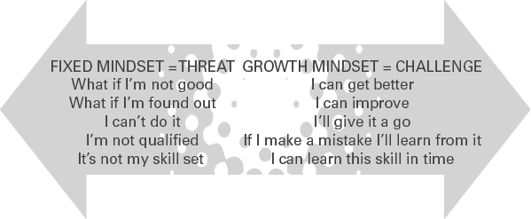

# 通过积极领导科学提高绩效
## 简而言之

“如果我想成为一个更积极的领导者，我该怎么做？”以积极领导的新兴科学为基础，本章提供了培养成长心态、以好奇心领导和营造积极氛围的实用策略。这不是要忽视困难的行为，而是要通过认识到什么是有效的，什么是对他人的激励，你作为领导者的成长。

## 有什么问题？

简而言之，问题在于没有足够的跨组织实践的积极领导。
如果你考虑钟形曲线上的积极领导，最左边的消极、自恋行为和极右的积极发散行为，大多数领导都属于闷热的中间。也就是说，有时您知道自己散发着乐观情绪，表现出欣赏和调节情绪。也许您参加过领导力课程，其中的理论提倡成为一个真实的、变革性的、有魅力的、情商高的或仆人式的领导者，并且您真诚地尝试将所学付诸实践。但在其他时候，你只是一个天生有缺陷的人——压力大、时间短、焦虑和精疲力竭，无法接受任何积极领导的概念。
这表明。来自英国、欧洲和美国的领先组织调查的当前统计数据表明，领导者在遏制工作压力和工作不参与的趋势方面做得还不够——而且这些数据是在对 Covid-19 的影响进行适当调查之前收集的。这里只是一个示例：

- 压力、抑郁或焦虑现在占英国所有与工作相关的健康不良病例的 51%（HSE，2020）。
- 在英国，由于压力、焦虑或抑郁而损失了 1790 万个工作日（HSE，2020）。
- 与工作相关的压力每年给欧洲组织造成约 200 亿欧元的损失（Roberts，2019 年）。
- 在美国，52% 的成年人没有参与到他们的工作中，而 12% 的成年人“积极地脱离”到了痛苦的地步（Harter，2020）。
- 79% 的英国成年人报告称他们经历了与工作相关的压力（Perkbox，2020 年），89% 的人观察到“出勤”（身体不适时工作的人），73% 的人观察到“离开主义”（休假时工作的人） （CIPD，2020 年）。

这里很重要的一个问题是，是什么让如此多的上班族感到如此巨大的痛苦和绝望？不幸的是，受访者在多项调查中给出的两大压力原因是 (a) 繁重的工作量和 (b) 领导/直线经理风格。一项又一项研究表明，高层领导仍然是通过积极的领导实践来减轻压力的关键，但只有 15% 的公司认为他们的领导参与了这一过程（CIPD，2020）。
那么，这与积极领导科学有什么关系呢？积极的领导者创造高效、卓越的绩效（Cameron, 2012）。这不是盲目乐观，只是玩得开心（尽管在大多数工作场所，更多的乐趣不会出错）。这是关于识别积极情绪、欣赏和发现卓越行动的影响（Fredrickson，2001）。这也不是要忽视工作场所中的问题行为、表现不佳或欺凌，而是要注意什么有效，什么为他人提供能量，并通过同情和联系来领导（Dutton 和 Spreitzer，2014 年）。正如 Cameron (2012) 在他的书《积极领导》中指出的那样，其目的是促进诸如“在工作中蓬勃发展、人际关系繁荣、积极情绪和充满活力的网络”等成果（第 4 页）。
换句话说，积极领导和消极领导之间的区别非常简单。积极的领导力鼓励、赋予权力和激励人们。消极的领导使人流失、气馁和士气低落。
所有这一切意味着，领导者必须比他们意识到的更努力地工作，以帮助人们做到最好并发挥他们的潜力。

## 积极的领导在行动中是什么样子的？
作为跨越学术界和商界的人，我经常被科学语言与日常实践现实之间的差异所震惊。被广泛视为积极领导科学的创始人之一的金卡梅伦表示，它“能够促进积极的越轨表现，培养积极的方向并产生对美德的关注”。
将此与我在攻读积极心理学硕士学位时进行的调查进行比较，有一家大型金融机构的 200 多名员工回答了这个问题，积极领导对你来说是什么感觉和是什么样的？回顾今天的答案，我被他们纯粹的人性和简单所震撼：

- 我感到受到关注和赞赏。
- 多微笑，少暴躁。
- 我知道我很重要，这感觉很好。
- 会议从有效的开始，然后再讨论需要解决的问题。
- 他们和我说话时会合上笔记本电脑。
- 他们不会取消、延迟、推迟我们的 1:1。
- 他们表现出关怀和同情。
- 我们笑得比我们担心的多。
- 我没有收到他们的电子邮件，说明早上第一件事或晚上最后一件事出了什么问题。
- 我们有时间互相交谈，面对面交谈。
- 它只会让一切变得更好。

这是脚踏实地的东西。除了学术定义之外，这是关于您的团队等待被倾听，渴望关怀和同情，赢得您的全神贯注，让他们的时间受到尊重并希望工作。
这并不难，但确实需要努力，积极领导的科学和实践值得认真对待。

## 大理念：培养积极的习惯
在本章中，我将概述培养成长心态、以好奇心领导并营造积极氛围的实用方法。这些都是自我洞察力和领导力成长的务实方法；然而，要从领导的“闷热中间”转变为积极领导，需要有意识地养成个人习惯。出于这个原因，我在本章中为您提供了很多“轻推列表”，以便您可以轻松地采取行动。
在第 5 章中，您可以探索更多的方法来利用领导科学通过方向、进步和联系来激励他人。

### 培养成长型思维

让我区分固定型思维和成长型思维。固定型思维模式认为智力是一种不变的静态特征（Dweck，2008）。另一方面，成长心态是相信智力是一种可以通过努力发展和改变的品质。
德韦克关于心态的科学工作对学校产生了巨大的影响，证明以成长为导向的心态对学生的表现有更好的结果。有趣的是，同样的结果也出现在组织中（Keating 和 Heslin，2015），尽管关于成长心态和积极领导之间联系的研究有限，但神经领导力研究所的结果表明，成长心态文化是转型的关键、参与和创新（Derler，2019 年）。
在过去 20 年里聆听领导者的讲话，我了解到固定型思维模式实际上源于缺乏信心和害怕出错。如果我失败了怎么办？如果我被发现了怎么办？那些拥有成长心态的人已经习惯于犯错误并接受错误。他们知道他们的自尊不会因“失败”而受到损害，拥抱学习的机会比限制他们的潜力更有趣。

固定心态将这些想法视为威胁：如果我不好怎么办？ 如果我被发现了怎么办？ 我做不到。 我没有资格。 这不是我的技能。 成长心态将这些想法视为挑战：我可以变得更好。 我可以改进。 我会试一试的。 如果我犯了错误，我会从中吸取教训。 我可以及时学习这个技能。

有趣的是，我还注意到团队和组织可以有固定或成长的心态。当您听到诸如“我们之前尝试过但没有奏效”、“我们不希望这里出现任何错误”、“足够好还不够”等语言时，您会认出一个具有固定思维的组织。足够好，我们需要完美！
我注意到，那些认识到成长心态的能量赋予特性的领导者是他们促进学习、反馈和错误的力量。正如 NeuroLeadership 报告（2019 年）中的一位受访者所说：“如果你真正接受成长心态，你就永远不必进行艰难的对话。你只是在进行一系列对话，并且以真实、人性化和以成长为导向的方式进行对话。”
因此，这里有 10 种培养成长心态文化的方法。这里有一句警告！您想通过树立正确行为的榜样来确保自己正直行事，因此当您查看此列表时，请确保您自己也在实践相同的习惯。

## 实践灵感#1

### 培养成长型思维文化的10种方法

1. 每个人都有一个学习计划，而发展被视为至关重要。
2. 你用失败和成功的个人故事公开谈论心态。
3. 你公开庆祝成功并提供即时增援。
4. 定期分配“超出舒适区”的挑战项目。
5. 注意到从错误中学习。
6. 基于优势的辅导是常态（见第 6 章）。
7. 语言有明显变化，例如发展取代消极。
8. 每周都会与您的团队举行会议，将进展顺利的地方、遇到的障碍、他们学到的东西、他们将采取的不同做法结合起来。
9. 在“假设”和“然而”语言的刺激下，鼓励扩展性思维。
10. 你在教练中使用成长型思维问题：“你如何超越这个？”“你能从中学到什么？”你会有什么不同的做法？“接下来你会做什么？”

这里的艺术是为其他人创造空间来表演。作为领导者，你是促进这种文化的建筑师，所以退后一步，给你的员工挑战，让他们失败，并在那里得到支持。
为其他人创造表演的空间。

### 带着好奇心引领
你可能认为自己是一个好奇的领导者；确实，我希望你这样做，因为这是我在领导职位评估小组中寻找的首要品质。我在这里探索的不仅仅是提出好问题的能力，而是在开始解决问题之前探索组织中当前正在运作的东西的技能。
这门科学的根源在于所谓的“鉴赏式探究”（Cooperrider 和 Whitney，2005 年），它从首先理解“积极核心”来探索组织变革。假设是人类倾向于朝着最常被问到的问题的方向进化（你可能还记得科学课上的“向日效应”，这意味着所有生物都倾向于向光源和积极的方向移动。活力）。
这是我开始辅导、领导力培训和咨询项目的地方。在你告诉我所有的问题和什么需要‘修复’之前，我想先知道：
你最好的样子是怎样的？
你的强项是什么？
什么有效？什么时候有效？
谁希望它起作用？
你什么时候取得了非凡的表现？
那是怎么发生的？

### 试试这个
#### 通过积极的问题好奇

尝试这个。通过首先了解什么是有效的，在任何项目、团队会议、教练会议上带头——你会惊讶地发现这是一种多么罕见的做法。
例如，几年前，我们被要求为客户设计一种新的客户体验方法。该计划始于英国，但预计将在客户的 29 个国家/地区实现全球影响。目标是拥有一种比咨询公司或领导者更长寿的方法论。不是一种时尚，而是我们做生意的方式。这并不是一项新举措——外部咨询公司强加的方法学中出现了一些代价高昂的错误，这些错误与日常业务的相关性有限。我们采取了不同的方法来帮助他们，以了解已经奏效的方法。我们召集了来自整个企业各个级别的团队，询问他们：
您什么时候体验过出色的内部客户服务？
它的外观和感觉如何？
您的客户服务何时让您感到自豪？
谁提供出色的外部客户服务？
卓越的口袋在哪里？
是什么让客户对你真正满意？
相关的客户体验方法必须包括哪些内容？
由此产生的方法已经在整个组织（以及所有 29 个国家/地区）中生存和呼吸了八年，比最初的领导团队的大部分时间都长，并在经济衰退、削减和预算的多次重新优先排序中幸存下来。这是因为起点是卓越的行动之一，并且归组织所有，而不是我的公司。

#### 反思的时间

在接下来几天的会议中，当讨论新项目时，请倾听起点。多久开始讨论出了什么问题，什么需要修复？谁问，它在哪里工作？我们什么时候表现出色？谁做得好？谁是这方面的好榜样？
尝试提出其中一些问题，看看能量如何变化以及项目方向如何发生不同的、积极的转变。

#### 营造积极气氛

“积极气氛”一词是指在工作中积极情绪高于消极情绪的情况（Cameron，2012），多项研究表明，积极的气氛会产生“向上螺旋走向最佳功能和提高绩效”（Fredrickson，2003，第 169 页）。从本质上讲，当存在积极的气候时，个人和组织几乎总是会蓬勃发展，每个人都会受益。
重要的是，积极的情绪不仅能让人们在现在感觉良好，而且还能增加人们在未来表现良好和感觉良好的可能性。和更多。积极情绪可以拓宽人的思维，消除消极情绪，改善应对策略，缓冲抑郁情绪，建立持久的心理资源。简而言之，它们帮助人们生存和发展。
作为领导者，您有如此惊人的机会成为积极的激励者。在您提供的每一次交流中，都有机会激发或失去动力。这里有三个练习供你练习，帮助你培养那些积极的领导“肌肉”。

## 实际灵感#2
### A、只有一天

这可能是一厢情愿的想法，但我希望你能想象有一天，有意识地散发正能量、情感和欣赏！放纵我，超过24小时完成以下10个动作：

1. 一封电子邮件，表达对出色工作的感谢。
2. 一张手写的便条表示感谢。
3. 在一次会议上，您发现行动中的卓越之处，然后当场说出来。
4. 用一个不为人知且很少被注意到的功能来赞美某人。
5. 在内部消息中宣传这种赞美，并说明他们对公司的重要性。
6. 用有意义的个人信息感谢客户。
7. 问问你团队中的一个人，你好吗？表现出诚意。
8. 合上你的笔记本电脑，放下你的手机，全神贯注地听一个人说话。
9. 会议结束后留下来，无论是虚拟的还是面对面的，只是为了聊天。
10. 向某人询问他们的家庭。他们怎么样？目前什么是重要的？

### B. 积极回应

积极反馈几乎没有注册接收者是很常见的。给予者通常真的很惊讶：‘你说他们说他们没有得到多少积极的反馈是什么意思？就在昨天，我才说他们有多棒……’。真好笑。批评的传递耗费了太多的担忧，但积极的反馈就像雪花一样落到了谈话中，在落地之前就消失了。 Shelly Gable 等人（2004 年）围绕我们如何回应正面新闻产生了一些非常有趣的科学，称为积极建设性回应。大多数研究都针对我们在出现问题时如何应对。然而，拼图的补充部分是当事情顺利时我们如何回应以及当你做得好时对个人的后续好处。让我带你看一个例子：
想象一下，您的合作伙伴刚刚告诉您他们有晋升机会。根据 Gable 等人的说法，有四种回应正面新闻的方式：
♥ 中立 + 积极：“很棒，干得好……”（当你回到工作中时）。
♠ 中性 + 负面：无反应。 “对不起，你说什么？”
♣ 积极+消极：‘你一定是在开玩笑吧？这是否意味着你要旅行更多，而我必须更多地玩杂耍？
♦ 积极+积极：“太棒了。做得好。你为此付出了巨大的努力。他们说了什么？进展如何？告诉我更多……’
我想我会像钻石一样回应好消息。然后我记得我的孩子们更小的时候，给我带来新闻，我只是在继续打字时侧头瞥了一眼并“嗯”了一声。唉，可惜了！你明白我的意思。您要注意如何回应正面消息，还要注意如何提供正面反馈。
没有得到正面反馈的原因是你认为你提供了很好的反馈，因为你听到了他们的消息。实际上，在迅速回到你之前做的事情之前，你会给出“真心”的反馈，“干得好......你很棒......很棒的工作......继续前进”等等。 “钻石”反馈需要更多的努力——倾听、积极和好奇。所以，当你的同事告诉你他们的演讲进展顺利时，停止你正在做的事情并真正感兴趣。提出问题，让他们沉浸在您的注意力中！

### C. 情绪传染
我在本章的最后建议是记住“情绪传染”的概念。也就是说，情绪和情绪正在捕捉。员工不是情绪孤岛，他们会不断地传播自己的情绪并受到他人的影响——也就是你的情绪！与“认知传染”（思想的分享）不同，情绪传染的意识较低，而且更加自动化。
情绪传染的先驱研究者 Sigal Barsade 教授 (2002) 将那些受情绪传染影响的人称为“行走的情绪感应器”。令人担忧的是，一些领导者仍然固守着“工作场所没有情绪的空间”的陈旧观念，同时在不知不觉中表现出来并传播愤怒、敌意和恐惧等情绪——同时创造了一种有毒的文化。
幸运的是，它是双向的。越来越多的开明领导者将利用新兴脑科学的知识，并认识到他们有能力为整个组织注入热情、信心和希望。当你这样做时，你会改变我们所知道的工作变得更好。

## 积极领导的十大秘诀

1. 遇到困难时保持积极的态度，帮助他人看到他们可以控制和影响的事情。
2. 表达你的欣赏，然后欣赏更多。
3. 通过增强优势来鼓励高绩效。
4. 榜样学习，并有自己的个人学习计划。
5. 定期征求对您行为的反馈，并根据反馈采取行动。
6. 有一个明确的领导哲学，可以指导你的行动，并会得到他人的认可。
7. 传达对业务和愿景的真诚和真诚的兴奋。
8. 实践道德行为，并按照您所说的去做。
9. 值得信赖，尊重他人。
10. 给予您的团队自主权，为错误留有余地，并庆祝他们的成长心态。