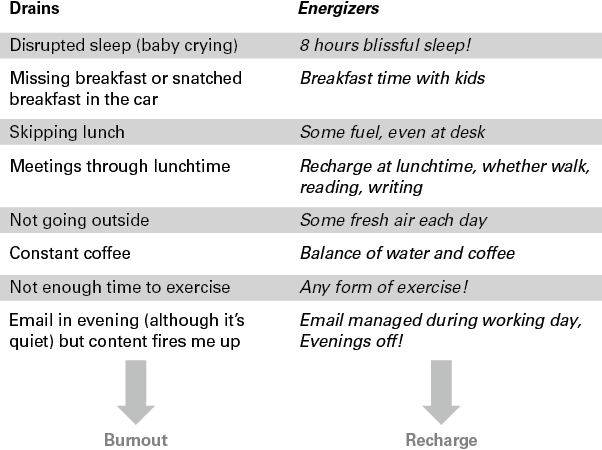
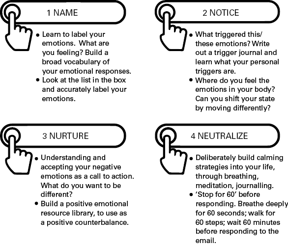
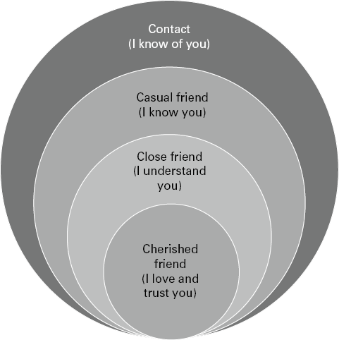

# 管理你的能量是领导力恢复力的关键

## 简而言之

许多领导者太精疲力竭而不能很好地领导，甚至更多的人没有发挥出最佳状态。本章将探讨拥有成功领导所需的身体、精神和情感能量的真正条件。连同 25 分的韧性审核，本章包含了关注个人健康和活力领导的实用策略。

## 有什么问题？

在这个充满挑战的时代，对弹性领导力的需求从未如此强烈。您面临的挑战是复杂且相互关联的，而这些问题只能由具有大局观并能够适应不断变化的环境的领导者解决。作为领导者，您的职位越高，您的工作量也越大。挑战和潜在压力会随之增加，您需要有能力应对和解决此类情况。
这不是为了摆脱你所有的压力。正如耶鲁大学精神病学名誉教授斯蒂芬·索斯威克 (Stephen Southwick) (2018 年) 所建议的那样，“如果你今天能够应对周围世界发生的一切，那么当你站在它的另一边时，你会变得更强大'。但是，您需要在压力下保持能量水平。换句话说，弹性需要能量。没有弹性的人，天生就有“反弹能力”，也不是固定的特质。相反，韧性是内在力量和外在资源相结合的结果，它使您能够在面临挑战的情况下适应和灵活应变，从而使您能够从挫折中恢复，几乎正常运作——并且在许多情况下，因情况而增长（Reivich 和 Shattè，2002）。
韧性需要能量。

除此之外，您还有责任帮助保护团队中人员的能量，因为只有个人和团队能够持续从挫折中恢复过来，领导才能可持续。事实上，对我来说，与管理团队能量远比保护自身能量更有效的领导者交谈更为常见。
因此，虽然培养你的能量以取得进步和茁壮成长是建立弹性能力的解决方案，但许多领导者的现实是精疲力竭和倦怠（Loehr and Schwartz，2003）。当我在韧性活动中询问领导者时，‘谁在工作场所观察到过多的有害冲突？生病和缺勤增加？谁自己经历过倦怠？'，总是多只手举起。以难以忍受的速度“永远在线”的感觉很普遍。
工作场所统计数据证实了这一点。在 2020 年大流行之前，英国最大的已知工作场所压力研究（心理健康基金会，2018 年）报告称，74% 的受访者在前一年感到压力很大，他们不知所措或无法应对。托马斯（2020 年）在福布斯杂志上写道，“全球倦怠猖獗”，并指出世界卫生组织现在已将“倦怠”添加到其医疗诊断手册中。
虽然领导力学者认为必须在组织和系统层面解决领导力弹性问题 (Moss, 2021)，但我主张同时采取个人和系统方法（后者参见第 11 章）。人们常常忘记，领导者在领导他人之前必须先学会领导自己，自我领导是有效领导的基石，所以我将从这里开始：
恢复力不是蹦床，你会一时倒下，下一秒又上来。这更像是在没有路线图的情况下爬山。这需要时间、力量和周围人的帮助，而且您可能会在此过程中遇到挫折。但最终你会到达顶峰并回顾你已经走了多远（Hurley，2020）。

## 大创意：给五块电池充电！

我们将在这里探讨的技能和策略并不是“值得拥有”。 它们对您作为领导者的生存和管理蓬勃发展的团队的能力至关重要。 这是关于在家中和工作中练习健康的适应力习惯，学习是您个人发展计划不可或缺的一部分。
为了保持您的能量水平并作为领导者茁壮成长，假设您有五个需要持续关注和充电的连接电池：

身体
头脑
心
连接
目的
身体弹性
您如何管理睡眠、饮食和锻炼习惯。
心理弹性
您以现实乐观的视角灵活地集中注意力和思考的能力。
情绪弹性
您如何识别您的情绪状态并调节您的情绪反应。
连接弹性
您如何与您所爱和信任的人保持和发展重要的社会关系。
有目的的韧性
你如何将你的生活与意义、目标和幸福结合起来。
这是个人的。只有您才会知道您的睡眠是否受到干扰、您是否依赖酒精、是否停止与您的朋友见面或是否以不成比例的方式对您的孩子发脾气。但是你的第一步是评估生活和工作在哪些方面让你筋疲力尽，让你充满活力，这样你就可以做出一些有目的的改变选择。
在本章中，我们将从弹性健康检查问题开始，以便您评估自己的能量水平。然后在简短的领导者案例研究的帮助下，我们将探索一些实用的策略，为前四个“电池”补充能量和提高领导力弹性。在第 16 章中，我们将重新审视幸福和目标在你生活中的作用——这个电池需要一整章！

## 试试这个

### 弹性健康检查

阅读 Resilience Healthcheck 的 25 条陈述。为每个问题给自己打 5 分，0 = 几乎没有，3 = 有时，5 = 始终有效。诚实和现实。你不必向任何人展示这一点。

### 给身体充电

1. 每天我从一夜的睡眠中醒来都感觉神清气爽。
2. 我的饮食主要包括新鲜烹制的未加工食品。
3. 我全天定时进餐，以健康的方式补充我的能量。
4. 我尽量减少坐着的时间，经常伸展和移动我的身体。
5. 我每周锻炼五次，包括两次力量训练。

### 给你的大脑充电

1. 在我花时间的地方，我是主动的，而不是被动的。
2. 我可以尽量减少干扰，一次专注于一件事。
3. 我避免对潜在的困难情况进行反思或灾难性的处理，并专注于我可以控制的事情。
4. 我优先安排足够的时间用于具有长期价值的重要活动。
5. 我在工作日留出空间进行反思和安静的时间。

### 给你的心充电

1. 我在一天中的任何时候都知道自己的情绪状态。
2. 我知道是什么让我陷入无益的情绪状态。
3. 我克制自己的沮丧、不耐烦或焦虑的感觉，尤其是在时间紧迫的时候。
4. 我可以很快地让自己摆脱坏心情。
5. 我刻意培养我的积极情绪。

### 为您的连接充电

1. 我用专注的、充满爱的关注来培养我生活中的重要关系。
2. 我有我信任的亲密朋友，无论是在工作中还是在工作外。
3. 我有有效的工作/生活界限，工作不是假期的特征。
4. 我优先考虑与朋友一起玩乐和定期“休息”的时间。
5. 我享受与他人的互动、出席并表现出真正的兴趣。

### 充电的目标

1. 我了解自己的长处，并有时间在工作中成为最好的领导者。
2. 我知道我要去哪里，并对我的方向充满热情。
3. 我可以阐明我的价值观以及对我来说重要的事情。
4. 我的价值观与我在现实中的生活方式保持一致。
5. 每天，我都会花时间思考什么对我领导他人的方式很重要。

### 反思的时间

您的分数将反映您目前的生活状况，并且不太可能在任何时候将所有五块电池都充满电。也就是说，你的分数很可能在 70-80 分之间，处于弹性的中间。比这更高，你已经有了一些很好的习惯。低于此值，可能是当前的环境影响了您的某些分数，或者您可能正在经历一些长期无益的习惯。反思你的分数，问自己以下问题：

- 您最满意并想加强的方面是什么？
- 什么最让你震惊，你想改进？
- 弹性健康检查的哪个领域最需要注意？
- 为了持续改进，你准备改变哪些习惯？

在下一节中，我们将探讨为前四个方面充电的一些策略——为身体、思想、情绪和社交关系充电——所有这些都将帮助你提高上述分数。我已经概述了一些简短的领导者小插曲，当你依次阅读它们时，只需在引起你共鸣的句子下划线并尝试相关练习。

## 练习灵感

### 给身体充电

“烧毁了，但还在燃烧！”是奈德的喊声。在压力很大的角色中，Ned 通过不断的活动感觉自己处于控制之中。每周有四个早晨，Ned 会从早上 5 点到 6 点在跑步机上跑步。他的会议从早上 7 点开始，一直持续到晚上 8 点或更晚。他在旅途中吃东西，靠肾上腺素和咖啡生存。他试着每天晚上和他的伴侣坐下来吃顿饭，如果工作不中断，他通常会做到这一点。他的家人周末相对空闲（他有三个 14 岁以下的小孩），尽管最近四个星期天需要工作大约四个小时。他在晚上 8 点到 10 点之间赶上电子邮件——阅读和发送。
虽然 Ned 感觉处于控制之中，但他并非如此。他的睡眠被打乱，血压升高。他和他的伴侣就工作量争论不休，他知道他的孩子们错过了和他在一起的时间。
给身体充电并让身体变得更好是很难的！我不需要重申可用的多产建议（多喝水，多吃蔬菜，不要工作到这么晚！）但做出适合您、适合您的工作和适合您的个人决定完全是另一回事家庭。这也是一个改变一些根深蒂固的习惯的问题，这样当事情变得艰难时，你就有了“储备金”。
值得重申的是，除了饮食和呼吸之外，睡眠是影响您恢复能力水平的最重要因素。我的大多数客户都严重睡眠不足，因此每晚保持 7-8 小时的睡眠质量至关重要。我很欣赏马修·沃克 (Matthew Walker) (2017) 的书《我们为什么睡觉》，他非常坚持认为，您在晚上工作的时间越长，工作效率越低。

### 练习 #1：排水管和增能器

这个练习的目的是写出什么消耗你和什么让你精力充沛，并使用清单开始补充你的体力。您可以使用此列表来合并工作和家庭中所有消耗或精力充沛的活动（例如会议或有害关系），但图 2.1 显示了 Ned 的初始身体列表。

> 排水：睡眠中断（例如婴儿哭闹）；活力：8小时的幸福睡眠。流失：错过早餐或在车内抢早餐；劲量：与孩子共进早餐。排水：不吃午饭； energizer：一些燃料，即使在办公桌上。排水：午餐时间开会；劲量：午餐时间充电，无论是散步、阅读、写作。排水：不出门；劲量：每天呼吸新鲜空气。排水：恒咖啡；劲量：水和咖啡的平衡。排水：运动不足；劲量：任何形式的运动。 Drain：晚上发邮件（虽然很安静）但内容让我很兴奋； energizer：在工作日、晚上休息时管理电子邮件。

当你查看他的清单时，很容易说少做左手多做右手，因为你必须弄清楚什么对你来说是现实的。例如，当我在他的名单上与 Ned 合作时，重要的是要认识到现在睡一整晚可能不太现实，但在午餐时间停止会议可能是现实的。这都是一个平衡的问题。以下是 Ned 和我在执教时所做的一些其他实际决定——这是他知道他能够（并且确实）维持的：

- 每周保证三个午餐时间免费。同意团队。
- 利用这些午餐时间进行反思、写作或阅读。
- 这次开始写一本领导力日志（第 1 章中的建议问题）。
- 每天都有新鲜空气，无论多短。
- 将两次跑步机课程更改为两次力量训练课程。
- 周末和孩子一起锻炼（不是自己），一起开始新的爱好。
- 每周两次在下午 6 点前完成电子邮件。

## 试试这个

写出你自己的身体消耗和能量消耗清单。使其尽可能广泛和诚实。为了达到更好的平衡，你能阻止什么让你筋疲力尽，并增加让你精力充沛的东西？让你的决定符合你的生活方式，而不是你觉得你“应该做什么”。

### 给心灵充电

艾娃沉思。作为慈善部门的高级领导者，Ava 发现当她面临潜在的困难情况时，她的头会转来转去，白天在她的脑海中唠叨，在晚上将她唤醒。这会引起她的焦虑，削弱她的信心并破坏她专注于工作的能力。 Ava 与她的团队中的一个表现不佳的人进行了艰难的对话。她多次在脑海中进行对话，并说服自己这会出错！
有弹性的人有能力积极调整和适应具有挑战性的情况，就像一种可以吸收应变并保持其形状的超级材料。这需要心理和情感的灵活性，这是韧性的基本组成部分（Seligman，2011）。 2012 年，我和 Ilona Boniwell 教授共同编写了英国的第一个弹性课程 SPARK，并创造了“粘性路径”一词来描述我们的情绪和感觉发生冲突时的感觉。当你“沉思”某种情况时，你自己就会知道这一点；它在你的脑海中一圈又一圈，或者你可能会“灾难化”。当存在不确定性、谣言和大量媒体信息时，这种情况尤为普遍。通过问自己四个很好的自我指导问题，尽量不要让粘性路径在你的脑海中获得牵引力，然后沿着粘性路径走回去。

### 练习 #2：粘性路径

1. 你在这里有什么控制权？
2. 在这种情况下，你能告诉自己的最积极但最现实的故事是什么？
3. 今天你可以专注于哪些小目标会分散你的思考？
4. 你可以和谁交谈（谁会给你一个不同的观点，而不是推进你的消极想法）？

支撑这四个问题的是心理弹性的科学基础：

- 只**控制**你能控制的。放下你无法控制的事情。重要的是，让自己处于精神和情绪控制的位置，这会增加你的个人能动性。
- 现实的**乐观主义**是心理弹性的核心。创造一个良性的自我实现预言，用一个务实但积极的故事让你的头脑平静下来。
- 通过分心来**集中**你的大脑。
- 寻找替代叙述并**拓宽视野**。

例如，回顾 Ava 沉思潜在困难情况的习惯，以下是 Ava 的答案：

#### 你在这里有什么控制权？

我可以准备谈话。
我可以写出要问的问题。
我可以确保在进行对话时我处于冷静状态。

#### 在这种情况下，你能告诉自己的最积极但最现实的故事是什么？

我的同事知道她表现不佳。
这不会是一个惊喜。
如果我坚持事实并保持同理心，我们就可以找到一个好的解决方案。
我可以在这种情况下处理自己。

#### 今天你可以专注于哪些小目标会分散你的思考？

先去散散步。
为下周的会议设计演示文稿。
与 2 个团队共进午餐。

#### 你可以和谁交谈（谁会给你一个不同的观点，而不是推进你的消极想法）？

莎拉——冷静和反思。
鲁本——总是从一个非常不同的角度来看待事物。相信他。

### 给心脏充电

Noah 在数字领域工作，领导 IT 团队。他领导着一个庞大的团队，在他最近的 360 份报告中收到了关于他缺乏情绪控制的反馈。他的团队成员注意到，他的情绪容易被触发，很难摆脱情绪，他的坏情绪对团队的影响具有传染性。到了上午 10 点，每个人都可能心情不好！团队的初级成员都在躲避他，高级管理人员觉得有必要保护其他人免受他的伤害。在与他的老板艰难交谈后，诺亚承认他一直忽视他个人的“警钟”，需要认真对待情商这个领域。
你的情绪是你个人的警钟。当你感到心烦意乱、不耐烦或恼火（以及让别人看到）时，比跟踪你的思维习惯更容易注意到。但听到这些警钟是至关重要的。如果您发现自己一直处于压力之中，身体就会过度暴露于肾上腺素和皮质醇的释放，这些激素在压力期间会增加（Quinn 等，2021）。这两种激素在我们所谓的“战斗或逃跑”反应中都发挥着宝贵的作用，但也会使您面临感染和免疫系统受损的风险（Sapolsky，2004）。

## 试试这个

### 练习 #3：从名称到中和

这是一个由四部分组成的练习，用于学习管理您的情绪反应。 我认为这四个阶段中的每一个都是“热键”，目的是在你完成这些阶段时中和它们的热量。
图 2.2 中和你的“热键”

> 阶段 1. 命名——学习给你的情绪贴标签。 你有什么感觉？ 建立广泛的情绪反应词汇； 查看框中的列表并准确标记您的情绪。 阶段 2. 注意——是什么触发了这些情绪？ 写一篇触发日志，了解你的个人触发因素是什么。 你在哪里感受到你身体的情绪？ 你能通过不同的动作来改变你的状态吗？ 第 3 阶段。培育。 理解并接受你的负面情绪作为行动的号召。 你想要与众不同的是什么？ 建立一个积极的情感资源库，用作积极的平衡。 阶段 4. 中和——通过呼吸、冥想、写日记，有意识地在你的生活中建立平静的策略。 在响应之前停止 60 秒。 深呼吸 60 秒； 步行60步； 等待 60 分钟，然后再回复电子邮件。

你有什么感觉？
☐ 防御性
☐ 挑战
☐ 乐观
☐ 自信
☐ 精疲力竭
☐ 生气
☐ 醇厚
☐ 快乐
☐ 沮丧
☐ 焦虑
☐ 空
☐ 被动
☐ 渴望
☐ 担心
☐ 烦躁
☐ 宁静
☐ 反光
☐ 害怕
☐ 兴奋
☐ 无望
☐ 无忧无虑
☐ 激怒
☐ 骄傲
☐ 冷静
☐ 不耐烦
☐ 累
☐ 受刺激
☐ 接受
☐ 羡慕
☐ 悲伤
☐ 和平
☐ 宁静
☐ 安心
☐ 热情
☐ 反抗
☐ 惊讶
☐ 沮丧
☐ 生气
☐ 参与

经过反思，诺亚意识到他一天中的大部分时间都处于高度触发状态，对任何分心的事物都会感到烦恼和沮丧。这些情绪也记录在他的身体里，他皱起脸，弓起身子。他了解到简单的运动可以改变情绪状态。而当这两种负面情绪响起的时候，他的正面情绪却几乎没有表现出来。他开始写日记，命名并注意他的情绪，特别关注他的积极情绪。
两种积极的情绪特别普遍，感恩和希望，诺亚决定通过每天晚上写下这些情绪来建立这些情绪：

- 我今天感谢什么？
- 什么给了我希望？
- 明天我还能欣赏谁？

“停止 60”是他和他的团队的生命线（他的团队开玩笑地建议他应该在回应之前与 60 人交谈！）。

### 为您的连接充电

Ines 是一家会计师事务所的通讯主管。她非常忙，决定做出一些应对决定。结果，伊内斯决定不再与她的朋友见面。她曾经属于一个自行车队，他们在星期六出去玩，每个月至少会见她的两个最好的朋友两次。正是和这些朋友在一起，她才可以轻松地笑一笑，而在忙碌的工作压力下，伊内斯觉得她只能应付平衡工作和家庭的需求。维持友谊一直是她觉得必须妥协的领域。
形成依恋和与他人建立联系的高能力是复原力的支柱之一，也是核心心理需求（利伯曼，2013 年）。当我们从挫折中恢复过来时，强大的个人纽带对于支持我们至关重要，而基于信任的关系是您安全的基础。韧性经常被视为个人的“坚韧”，西方理想强调需要挖掘自我以克服困难，因此忽略了社会支持的力量（Hartling，2008）。
你想要并且需要一个你认识的人的小网络，无论是在你的个人生活还是在工作中。生意上的艰难时期可能会给人带来压力，而在艰难时期，人们很容易退缩并关闭社交关系。 Shawn Achor (2011) 的研究表明我们应该反其道而行之：“在压力中生存得最好的人是那些在压力中真正增加社会投资的人。”
图2.3 朋友圈

> 圆圈代表社会关系的水平。 核心是珍贵的朋友（我爱并信任你）。 第二个层次是密友（我理解你）。 第三级是普通朋友（我认识你）。 第四个层次是联系（我认识你）。

## 反思的时间

### 练习#4：反思朋友圈

没有什么“整洁”的练习可以立即改变 Ines 的友谊世界，或者你的。就像生活中的许多事情一样，这是一个需要反思的领域，而这个朋友圈是一个很好的起点。问自己以下问题：

- 如果您回顾上周并在整个朋友圈中分配百分比数字，谁会得到您的时间？
- 你如何加强与亲密朋友的联系？
- 你珍惜的人是否有足够的时间陪伴你？
- 你可以通过哪些简单的方式让你理解、爱和信任的朋友知道你在他们身边？

#### 伊内斯做了什么？

在我们的辅导课程中，Ines 对友谊圈图感到惊讶。经过反思，她意识到，作为她公司的新任公关主管，她的大部分时间都花在与陌生人或熟人在线建立联系上——大约 80% 的时间都花在了她的时间上。虽然其中大部分对于她的角色来说是必要的，但她“空闲”的 20% 的可用友谊时间都用于她的家人——亲密和珍爱的朋友被挤出了。她知道，目前，她不能把大量时间花在爱好上，比如骑自行车，但她可以让她的密友知道她的关心，让她最珍爱的两个最好的朋友回到她的生活中。 Ines 只做了两个简单的改变：

- 向她的密友发送了感谢卡——“我为你而来，我很快就会回到你的生活中！”
- 与她最好的朋友在接下来的三个月里记录时间并同意她的伴侣。边界和优先级。

本章即将结束时，您现在将了解韧性是一种习得的技能，您可以选择一些行为习惯。从根本上说，这是您从过去学习、应对现在并利用这些知识建立乐观未来的能力。因此，这就像在健身房锻炼肌肉一样。如果你不使用它们，它们就会变弱。如果您每天使用它们并好好锻炼它们，它们就会变得强大而有用。日常练习很重要，这样当你需要强壮的肌肉时，它们就会得到锻炼并准备好投入练习。

## 恢复精力和恢复力的十大方法

1. 从过去学习并利用这些知识来提高您应对未来的能力。
2. 坚信您可以管理自己的感受和应对压力情况的能力。
3. 展示自我调节能力，控制您的情绪冲动、感受和反应。
4. 像照顾他人一样练习自我照顾。
5. 建立你的积极情绪资源库。注意并培养你的积极情绪！
6. 为重要的人际关系投入时间。向您所爱和信任的人表示感谢。
7. 灵活而准确地思考逆境的原因和影响。
8. 拓宽你的视野，与和你有不同故事的人交谈。
9. 通过寻求帮助和表现出脆弱性来培养舒适感。
10. 确定什么是可控的，什么不是，并相信好的结果。
11. 哦，是的，睡个好觉！