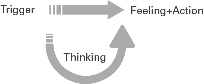
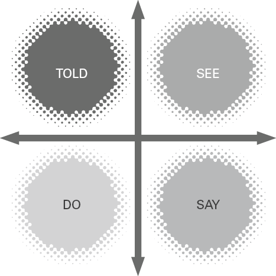

## 简而言之

领导需要信心。 “不知道”或“冒名顶替综合症”的感觉对你们许多人来说都很熟悉——领导力成长道路上永远存在的挑战。作为一名领导者，你并不孤单（事实上，有时这很重要），因此理解自信、扩展你的界限和挑战你的信念构成本章的基础，同时对你的思维方式、行为方式和行为方式进行可持续的改变。向他人展示自己。

## 有什么问题？

信心不足和过度自信的问题对您来说是显而易见的，正如您每天看到的那样，并且很可能是您自己体验过的。信心不足会导致领导者的职业发展受阻或限制他们的职业生涯，因为他们“玩小事”，呆在舒适区并限制他们的潜力。过度自信会带来许多问题。拥有至高无上自信的领导者往往表现得自负或傲慢，为自己和他们的组织做出仓促和过于乐观的决定。狂妄需要谨慎来平衡，就像焦虑的不确定性需要通过保证来抵消一样。
正如Francisco Dao (2018) 在他的 Inc 杂志专栏中所说，“自信是领导力成长的根本基础。在没有首先建立信心的情况下尝试教授领导力就像在沙子上盖房子一样。它可能有一层漂亮的油漆，但充其量最终还是摇摇欲坠。
但是信心的概念很难确定，几十年来科学家一直在努力解决这个问题（例如 Bandura，1977）。因为它是一个如此滑溜溜的概念，可以是短暂的或持续的、令人惊讶的、令人惊讶的和改变职业生涯的，这意味着这个词被过度使用和误解了。 Confidence 是英语中为数不多的用作名词、动词、形容词和情感的词之一。例如：
*我对……没信心*
*这段经历让我有信心开始自己的事业……*
*我心情轻松、自信……*
*我想和你有信心地交谈……*
更具限制性的是，它也用于描述一种状态，或一种完整的存在方式：
*我不是一个自信的人……*
*我没有信心。*
除此之外，信心通常被视为一个性别话题。有相当多的文章和课程致力于提高女性的自信心和“冒名顶替综合症”，你会认为这只是一个女性问题，这是情有可原的。我注意到女性更公开地与同事讨论她们的信心水平，但我可以从经验中向您保证，男性和女性同样希望讨论围绕自信的问题，科学也呼应了我的理解（布朗，2010 年；催化剂报告，2020 年）。事实上，我们越是将自信定型为性别，男性拥有高度自信而女性“遭受”低自信，我们就越忽视需要解决的系统性问题。

## 大理念：信心是一种期望！
信心不是遗传的、普遍的或永远的。
信心是多变的、具体的和个人的。
令人高兴的是，这意味着可以抑制信心，因此在每种情况下都很少感到不自信或过度自信，更常见的是在特定时间体验您的信心水平下降或增加。例如，您可能对自己的团队果断有信心，但当被问及您对董事会的意见时，您就没有信心了。你可能是一个开放和鼓舞人心的公众演说家，但在与一小群同龄人交谈时却张口结舌。
当我第一次读到将信心定义为期望时，这对我来说是一个启示。多年来，我一直在用自己的定义胡说八道，但我真正的“啊哈！”是在阅读了 Rosabeth Moss Kanter (2006) 的书《信心》之后出现的。正如她所说，“信心不是乐观主义或悲观主义，也不是性格属性，而是对积极结果的期望。”你们中那些拥有健康自信的人期望某件事能取得好成绩。带着这样的期望，你会付出努力并期待一个积极的结果。缺乏信心的领导者会做最坏的打算，并创造出自我实现的预言。
因为信心是一种期望，这意味着持续的信心依赖于你解开你的思维模式并理解你的想法如何创造你的感觉、你的行为和你得到的反应。
理解它是一件很棒的事情。通过控制您的思维，您可以从无意识的信心不足循环转变为有目的的、积极的健康信心循环。反之亦然。通过“消除偏见”导致过度自信和冲动行为的想法，您看到的领导者拥有足够的自信来领导他人，同时具备通过相互尊重提问、犯错、检讨和领导团队的能力，分享与合作。

### 试试这个

想一想当您在管理自己的信心时遇到困难时的情况。请具体说明事件或触发器并回答以下三个问题：
触发因素是什么？
它让你感觉如何？
结果你采取了什么行动？
图 4.1 触发和后果

例如，我清楚地记得我的出版商建议我开始在社交媒体上宣布这本书即将面世的那一刻，创造了一个明显的“狂热粉丝群”！ 我感到非常焦虑，并且至少推迟了两周发布任何内容。
写出示例后，添加第四个问题：
触发之后，你对自己说了什么？
图 4.2 触发器与思考

老实说，我当时对自己说的是，‘你不能这样做，你看起来很傲慢，如果这本书不好怎么办？如果被发现了怎么办？如果没人回应怎么办？你会看起来像个傻瓜’等等。因此，我感到恶心和焦虑，并拖延了。
你看，掌握自信的艺术就是认识到你的想法在创造积极或消极情绪和结果中所起的作用。如果我预料到最坏的情况，我就会制造焦虑并以无益的方式行事。因此，如果我改变我的想法，我可以改变情绪平衡、我采取的行动以及我可能收到的回应。当然，我确实发布了关于即将出版的书，并且被亲切、有益和鼓舞人心的评论所淹没。我消耗了多少负能量。
但是你必须对自己非常诚实，因为你的自言自语不太可能是善意的，或者你想向其他人展示的东西（不像我的例子！）。
让我们举几个商业例子，这样我就可以向你展示改变你的想法如何改变你为自己创造的结果。

## 示例#1

**触发条件**：劳伦正在向董事会做报告。其中一位董事说，“劳伦，请你结束吧，我们的时间不多了。”
**思考**：我知道我不擅长这个角色。我很烦他们。我不能在这个级别操作。每个人都看着我，认为我无法应对。我在想什么，我能做到这一点？我接下来该怎么做？
**感觉和行动**：我感到焦虑，我的心在狂跳，我可以听到自己开始道歉，听起来很犹豫。我说对不起，然后快速浏览以下 10 张幻灯片。
**结果**：董事会开始注意到 Lauren 惊慌失措，并对她的完成方式感到惊讶。他们对听到战略计划很感兴趣，想知道它是否不像他们想象的那么可靠。
再想想劳伦，充满信心……
**触发条件**：劳伦正在向董事会做报告。其中一位董事说，“劳伦，请说到点子上，你跑题了，我们没时间了。”
**思考**：嗯，至少他们感兴趣。他们很忙，但很忙。我将停止使用幻灯片，只总结要点。我可以做这个。
**感觉和行动**：我感觉可以控制。我说，‘我看你时间不多了。我把这个计划的要点总结为三点。这是我正在寻找的行动。
**结果**：主席感谢 Lauren 认识到他们的时间问题并在她的演讲中灵活运用。他们认真对待提案并在之后进行讨论。劳伦得到了她需要的同意。

## 示例#2
**触发条件**：Kit 正坐在一个新的领导委员会中，召集会议以更有效的方式应对危机。他收到反馈说他需要在会议上多说，因为他倾向于倾听和做笔记。在初次会议上，他被要求做出贡献。
**思考**：我没有足够的信息来添加任何有用的东西。我没有所有的事实。我不知道他们为什么选择我参加这个委员会。他们犯了一个错误。其他人都比我知道得更多。如果我说错的话，我会看起来很傻。
**感觉和行动**：我对自己感到恼火。我知道我需要停止思考该说什么，但我不知道什么时候说。我说“不，没什么可补充的”，然后在没有做出贡献的情况下离开会议。
结果：Kit 发现为委员会做出贡献越来越难。他的贡献越少，就越难留下自己的印记和增加价值。三个月后他离开委员会。
再想想Kit，充满信心……
**触发条件**：Kit 正坐在一个新的领导委员会中，召集会议以更有效的方式应对危机。他收到反馈说他需要在会议上多说，因为他倾向于倾听和做笔记。在初次会议上，他被要求做出贡献。
**思考**：如果我只是添加我的意见，不会有什么不好的事情发生。这不会出错。我们在这里都在同一条船上，每个人都在学习，包括我。
**感觉和行动**：我感到有些焦虑，但开始说话，以一位同事的评论为基础，并展示了我的上一家公司在他们面临的几次危机中所做的事情。我很高兴自己能说出来。
**结果**：Kit 开始喜欢加入委员会。他找到自己的声音并学习如何做出贡献，同时平息他的自言自语。

## 命名并驯服你的小精灵！
像 Kit 和 Lauren 一样，我们都有自言自语。了解它、接受它并驯服它是一种美妙的修行。为了帮助你开始这个过程，认识到你可以通过给它一个名字或形状来控制你在脑海中说的话是很有用的。这可能听起来微不足道，但它确实有效。史蒂夫·彼得斯（Steve Peters，2012 年）在他出色的著作《黑猩猩悖论》中将自言自语的形象塑造成需要管理的“猴子”。
我认为我们的“自言自语”不是猴子，而是小鬼。我的小精灵叫鲍勃。他身材矮小，弯着腰，脸上永久地皱着眉头。他坐在我的肩膀上，告诉我什么时候做错了，人们会如何嘲笑我，我应该做什么和不应该做什么。如果我不理他，他就会大声喊叫。但我爱鲍勃。他让我安全，让我保持清醒，让我脚踏实地。他也需要学会什么时候闭嘴！
给你的小精灵一个名字。感谢他们努力保护您的安全。告诉他们你有这个并坐在那里安静。

### 你的想法来自哪里？

一旦你了解你的想法来自哪里，你就可以开始对它们做一些事情。你可以扩展它们，爱它们，改变它们，当然，当它们是多余的时，扔掉它们。变化可能发生，这就是为什么这个简单的矩阵如此神奇。您的置信度将来自以下四个来源中的一个（或多个）来源，如下所述并如图 4.3 所示：

- 你被告知你是谁以及你可以做什么（例如父母、老师、同事、配偶、朋友）。
- 您会看到其他人并进行自我比较。
- 你有经验，你做一些事情，并对你的能力得出结论。
- 你对自己说些什么，在你的自我对话中，你创造了关于自己的信念。

图 4.3 神奇的信心矩阵

您信心的深度和广度将取决于这些领域中的每一个的普遍程度以及您对自己持有这些信念的时间。让我通过一个内部求职面试和四位具有不同自信程度的候选人来阐明这一点：
**Noel**：从孩提时代起，诺埃尔就被告知要坚强，不要犯错，要自力更生。由于他所在组织的新价值观包括“拥抱脆弱性”，他在采访中难以证明这一价值观。
**Vanessa**：在面试之前，Vanessa 仔细研究了其他候选人的职业历史、他们的 LinkedIn 个人资料和照片。她四处打听他们，并说服自己，与他们相比，她并没有胜出。当被问及她在采访中如何将自己与同龄人进行比较时，Vanessa 犹豫不决。
**Dev**：这是 Dev 第三次接受“提升”领导角色的面试。他的反馈是一致的，他在面试中不如面对面。德夫开始相信他“只是不太擅长面试”，因此给人的印象是焦虑和犹豫。
**Malia**: Malia 努力控制她的自言自语。当她陷入灾难时，她想象如果她没有得到这个角色，她的职业生涯会发生什么。她会丢掉工作吗？失去她的自尊？无法在其他地方担任另一个领导角色？一旦超出预期，Malia 就无法回答有关她在公司的未来的问题。
如果这看起来有点夸张，因为所有四位候选人都有自己的信心危机，但事实并非如此。事实上，更有可能在任何面试情况下，大多数受访者的脑海中都会出现这样的想法。此外，它是健康的。我宁愿采访一个“自信脆弱”的人，也不愿采访一个相信自己有所有答案的人，一路上几乎没有学习。
但当然，要达到这个最佳点，你必须抓住你的想法，好好摇一摇，确保它不会压倒你的行动。这让我进入下一部分要探索的内容，即如何转变您的信心。
在我们这样做之前，这里有一些在这个阶段要做的反思。

### 反思时间

想一想你与自信作斗争的另一个时刻。不要一概而论；要具体说明上下文、情况以及您的想法和感受。它可能是一封电子邮件、一段艰难的对话、一个你必须做出的决定或一个你发表的演讲。现在你脑子里有这种情况，我希望你探索一下你的想法和感觉可能来自哪里：
告诉：您的想法是否反映了过去人们告诉您应该做什么或感觉，或者您应该如何行动？
看：你在和谁比较？
做：你以前什么时候经历过这种情况？
说：你在心里对自己说了什么？
现在扭转上下文，想想你感到自信的时刻。再次，具体说明情况。从本质上讲，您感觉可以控制自己的情绪和行为，这就是这里的目标。并回答相同的问题。

### 你注意到哪些差异？

当我的客户观察到高或低信心的体验之间的差异时，有很强的相似性。例如，当您感到信心不足时，很可能：

- 你在按照别人过去的剧本行事，你还没有解决，你还在试图取悦他们。你的语言经常用“应该”这个词来反映这一点。
- 你将自己与不可能或不合适的榜样进行比较。或者只是你不认识的人。你在社交媒体上看到过他们，你听过他们说话，你看过他们的个人资料，你得出的结论是你没有堆叠。如果您不断将自己与他人进行比较，并感觉自己不够聪明——不够聪明、不够成功、进步不够快——你可能很快就会陷入自我怀疑。
- 你以前遇到过这种情况，但进展并不顺利。你已经决定你不太擅长这个，你的语言反映了这一点。你很可能会再次避免这种情况。
- 你的自言自语是没有帮助的。其实，真的很不厚道！

当您体验到健康的自信时，很可能：

- 你有很好的早期学习或解决了过去为你制定的无用脚本。
- 你期待健康的榜样。谁以前成功地做到了这一点？谁设法解决困难，尊重写作，表现体贴，并以同情心行事？你向这些人寻求建议。你意识到你不认识的人可能和你有同样的信心问题！
- 当你以前经历过这种情况，但进展不顺利时，你把这看作是你学习的一部分。你寻求反馈并采取行动。这是一个您准备投资的学习循环（有关成长心态的更多信息，请参见第 3 章）。
- 你的自言自语是富有同情心的。当你出错时，你不会自责，你会认识到错误的发生，你会从决定中继续前进，而不用深思熟虑。

## 实际灵感
5个步骤来扩大你的信心

1. 改变你的状态
2. 控制可控
3. 挑战你的思维
4. 表现得“好像”
5. 采取行动！

### 第 1 步：更改您的状态

要改变您的状态，请考虑您的移动方式和所说的内容。我什至要说你的生理机能是你改变状态的最重要的工具。在您不想进行的艰难对话之前以及您感到焦虑的地方想象自己。你怎么坐？你脸上的表情是什么？你的眼神交流如何？
现在想象一下你准备开始一场艰难的对话的那一刻。你知道这可能很难，但你有信心并有能力尽可能有效地处理它。再说一次，你坐的怎么样，你的面部表情有什么不同？
所以，当你感到不自信时，即使是短暂的：
移动、眼神交流、坐起来、身体前倾、张开手势、明显放松并表现出开放感。

虽然人们会更相信他们所看到的而不是他们听到的，但一旦您的生理机能看起来自信且有影响力，您也必须发声：
考虑您的呼吸、声音的音质、音调、速度和语气。

听听你如何谈论你自己和你的主题。你使用自信的词还是你的语言充满“混乱”？你听起来是犹豫还是道歉？你是在说话还是在积极倾听？

### 第2步：控制可控

你也可以通过改变你的注意力来改变你的状态。你可以通过学习只专注于你可以控制的事情来做到这一点。想象一下，您在周五晚上收到一封电子邮件，要求您参加周一早上的重要会议。你的思想变得疯狂，你会陷入灾难。不知不觉中，你已经想象自己失去了工作、房子和未来——你的信心崩溃了。你能控制什么？您可以发邮件询问更多详情吗？你可以在周末分散自己的注意力吗？可以问问同事吗？控制你能控制的，接受你不能控制的。

### 第3步：挑战你的思维

宇航员克里斯·哈德菲尔德 (Chris Hadfield)（2015 年）在他的非凡著作《宇航员地球生活指南》中描述了消极思维的力量。正如他所说，“我很确定我可以应对生活给我带来的一切，因为我已经考虑过如果出现问题该怎么办，以及正确的做法。”
为了获得信心，你必须控制你所能控制的，并努力实现最现实的结果。制定计划不是浪费时间，而是富有成效，让您高枕无忧。这意味着你：
考虑最坏的可能结果；
概述最好的结果（尽可能详细地想象最坏的结果！）；
描述最现实但积极的结果（并采取行动实现这一目标）。

### 第 4 步：表现得“好像”其他事情是真的

欺骗你的头脑。假装你觉得难相处的人是你最好的朋友。那你会怎么做？假装在你演讲时打哈欠的人只是累了。表现得好像你直率的老板没有意识到她在冒犯你。您现在采取的行动和收到的回应有何不同？

### 第5步：行动！

与自信最接近的科学术语是“自我效能”，由心理学家 Albert Bandura (1977) 定义。班杜拉认为，通过经验和采取行动，最容易提高自我效能感，即“我能”的感觉。这意味着你必须走出你的舒适区！
作为演示者，如果不演示更多，您就无法变得更加自信。
你无法通过避免困难的对话来理清你的困难关系。
如果没有可能会吓到您的新经历，您就不会加强您的角色。
只有通过更频繁地发言，你才能学会在会议中被听到。
有毒行为只能通过您自信的声音来解决。
只有先改变自己，才能改变文化。
享受扩大舒适区的乐趣。处理你从未想过的事情（我正在努力制作单口喜剧！）并学会再次享受学习的乐趣。请记住，信心是会传染的，失败也是如此，所以要学会期待前者。

## 最后的思考

### 过度自信怎么办？

我知道本章主要关注那些想要增强信心的领导者，因为这是教练中提出的问题。但是，我想在本章结束时最后考虑一下过度自信。在极端情况下，这是有毒领导的领域，看涨导致无数的商业问题。您正在寻找一位相信自己是正确的领导者，几乎不需要与他人合作或检查，因为他们的方式是正确的。最终，这样的领导者会创建无权的、不稳定的团队。
我希望你们中那些缺乏信心来应对有毒领导者的行为的人现在能够更好地控制自己的思想、情绪和行为，以便进行正确的对话。如果您需要这方面的进一步帮助，请参阅第 10 章，了解如何构建困难的对话。
如果您知道自己的领导者可能会从不切实际的乐观主义、鲁莽或冲动行为的角度行事，我敦促您在自己的行为中注入一些脆弱性和谦逊。有一些伟大的研究表明，任何健康的“有机体”（个人、家庭、团队、组织）的关键是信心和脆弱性的结合（布朗，2015 年；莫尔斯，2020 年）。
哈佛大学的心理学家一致认为，“消除偏见”思维和拓宽视野的最佳方式是提出问题（Soll 等，2015）。并且小心不要用你认为正确的答案来引导 FIRST，否则人们只会同意你的观点。尝试以下问题：

- 我在这里没有想到什么？
- 为什么我可能会犯错？
- 我们最大的竞争对手或批评家会如何评价这个计划？
- 我还应该考虑什么？
- 还有哪些可能的风险？
- 你会怎么做，为什么？
- 假设我们不能选择这些选项中的任何一个，我们还能做什么？

## 自信的十大秘诀
1. 不要担心是否完美。对于复杂的业务决策，永远没有正确或错误的答案。
2. 作为领导者，你能做的最好的事情就是收集适当的信息，运用你最好的判断——然后去做。
3. 在你做出最终决定之后——承诺！不要不断地猜测自己或保持清醒担心它。
4. 在外面表现出勇气——即使你并不总是从内心感受到它。
5. 对不知道所有的答案感到舒服并寻求帮助。
6. 将脆弱性视为平衡不足和过度自信的杠杆。
7. 尝试做新的事情——经常！走出你的舒适区，继续拥有新的体验。
8. 学会忍受失败而不是完美。你是人类。从错误中学习并继续前进。
9. 记下你的思维模式并注意你的消极思维习惯。然后开始通过有意识地以不同方式思考来改变它们。
10. 视角（不是完美）是你最好的朋友。在任何时候，都要正确看待你的领导角色。