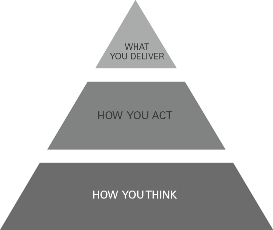
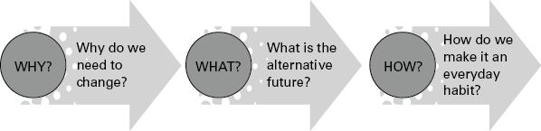
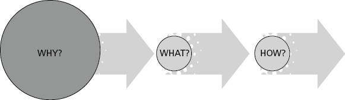
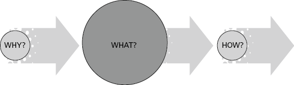
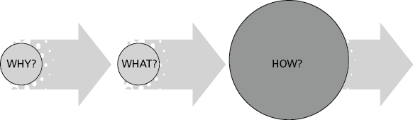

# 成为杰出的变革领导者
## 简而言之

并非每个人都以相同的方式经历变革，领导者需要了解他们在创造团队变革体验方面的积极作用。通过了解变革领导者的角色、您的心态以及实现卓越变革的三个简单阶段——为什么？什么？如何？ – 您将在变革领导方面获得相当大的灵活性。

## 有什么问题？

在当今瞬息万变的商业世界中成为领导者需要非凡的步伐和精力，您必须成为超人，才能不被大量有关变革的信息、行话、模型、播客和书籍所淹没。因此，许多领导者很难知道如何行动、如何领导以及如何激励他们的团队面对更多的变化。
鉴于每天都在发生变化，并且在您业务的每个方面都在发生变化，因此建议的数量是可以理解的。它是全球性的，但又是本地化的。转瞬即逝。无害而重要。我们在 2020/21 年的大流行中共同经历的变革清楚地提醒我们，我们生活在这个动荡、不确定的世界，以及领导者需要以勇气、敏捷和同情心做出回应。
变化的概念也被假设所包围。让我们来看看一些粘的：

- 改变是艰难而漫长的；
- 它需要大量预算和特殊人才来完成；
- 每个人在经历变化时都会经历“悲伤循环”；
- 那些抵制变革的人是“化石”、“恐龙”、“顽固派”、“懒惰”（或任何其他你想给尚未加入的人贴上负面标签的人）；
- 如果您以变革模式领导，每个人都会效仿！

我们将在本章中检查这些假设，但最后一点引发了变革领导力的一个有趣问题。因为无论你如何激励、说服、哄骗、威胁或鼓励，人类都是孤独的生物，他们最终会做自己想做的事，即使这意味着离开他们的角色。
但是，在您绝望地举起双手之前，我们可以切开有关变革的大量材料，并探索变革领导力的两个重要方面，这些方面经受住了时间的考验，在教练室中不断重播，并在今天仍然具有相关性：
成为变革领导者，而不是变革管理者。
简化复杂性并使更改尽可能简单。
任何经历过重大变革计划的人都知道，变革很少是直截了当的（无论您的计划建议什么！），而是一个反复的过程，需要强有力的领导、整个组织的投入并考虑“路线修正”作为您附和。这就是变革领导者的重要性所在。变革管理通常被认为是反动的，通过线性过程工作，有起点和终点。变革领导需要不同的技能：需要有远见和前瞻性；能够影响和激发行动；敏捷并响应您不断变化的业务环境。

## 反思时间

### 您是变革经理还是变革领导者？

在一张纸上画五条线，从 0 到 10 标记它们。想想变革经理和变革领导者之间的这五个区别，并给自己打分。

#### 变革经理 变革领导者

我是控制还是激励？
我是遵循流程还是赢得人心？
我是功能性的还是战略性的？
我从事的是有限的项目还是文化转型？
我是挑战绩效还是改变行为？

#### 从变革经理到变革领导者——什么才是真正重要的？

如果您看了以上内容并知道您想将自己的行为转变为成为变革领导者而不是管理者，请通读本节。正如我在其中的许多章节中所说的那样，您的心态至关重要，这就是我们要开始的地方。

#### 变革领导者的三个心态位置

1. 我的信念塑造了我的行为（并引起了他人的反应）。
2. 变化与过程有关，转型与人（头脑和心灵）有关。
3. 每个人都是独一无二的（我需要调整自己的行为来反映这一点）。

#### 信念塑造行为

俄罗斯小说家列夫·托尔斯泰 (Leo Tolstoy) (1900) 有句著名的话：“每个人都想改变人性，但没有人想改变自己。”换句话说，正如您从下面的图 9.1 中看到的那样，改变的努力往往会动摇，因为您的信念坚持改变总是决定你的行为和你提供的东西。
图 9.1 心态的影响

为麦肯锡研究撰写的文章，Boaz 和 Fox (2014) 建议“如果公司能够在一开始就识别并解决普遍存在的心态，那么他们在组织变革努力中取得成功的可能性是忽略这一阶段的公司的四倍。”
使用下面的陈述来探索你的心态。如果您发现一些无益的信念可能会阻碍您带领人们进行变革，请在日记中记下这些信念，例如，“这会很困难”、“人们不会接受这个”、“我不同意”。善于引领变革”，然后尝试一些不同的信念（这就是你自己思想的美妙之处，你可以瞬间改变它们！）。注意一旦你学会习惯性地、真实地改变你的思维方式，你的行为会如何随着时间的推移而改变。

## 试试这个

让我们从探索你的心态开始。拿一张纸填空
持久的变化是……
改变的另一个词是……
当我想到改变时，我想到的视觉形象是……
我擅长改变……
我不擅长改变……

### 变化与过程有关，转型与人有关

我送给客户的一本首选书籍是 William Bridges 的《管理转型》（2017 年）。当我读到布里奇斯的作品并读到令人震惊的提醒，即巨大的变化需要人类的转变时，这对我来说是一个启示。没有任何神奇的步骤和经济激励可以确保您的团队接受变革——它一直是（并且永远是）一种心理转变。虽然变化可以很快发生，但转变通常发生得更慢。正如布里奇斯所说：“当发生变化而没有过渡时，这只是椅子的重新排列。”
这听起来可能很明显，直到您停下来思考最近一直在进行的变更项目。在项目的规划阶段，您的时间都花在哪里了？这个过程花费了多少时间？花在人身上的时间比例是多少？

### 每个人都是独一无二的（并不总是坏的）

变革模型假设每个人都会以同样的方式行事，最普遍的变革模型可能是 Kübler Ross (1969) 的变革曲线。值得注意的是，这种变革模式自诞生以来的 50 多年以来如此盛行，因为它旨在为患有绝症的伴侣标记五个悲伤阶段。
如果你不知道这个模型，它会引导你经历悲伤的五个阶段：否认、愤怒、讨价还价、抑郁、接受。我对它的主导地位感到担忧的是员工如何预设他们会对变化做出反应。我无法告诉你我有多少次走进一个组织，听到关于变革的对话，比如，“我想我们都会否认……我们接受变革还需要一段时间……我不”我觉得很生气，但我想这会发生的。
人们会对变化产生情感上的反应，对于某些人来说，变化类似于悲伤的阶段，该模型将真正帮助他们了解如何带领人们度过这一阶段。但不是所有人，也不是所有时间。经常发生的事情是，那些爱的人在混乱之后改变和繁荣，保持沉默或在雷达下运作。他们通常是你需要的人，帮助你通过过渡影响他人。
值得反思的是，那些不接受您的变革计划的人会立即成为贴上负面标签的人。正如我上面提到的，贴在这些人身上的标签并不漂亮，而且一直是负面的。但是，如果您挑战自己的观点会发生什么？
如果不接受您的变革项目的人不明白您为什么要这样做怎么办？
如果他们在变革过程中感到被遗忘或被排除在外怎么办？
如果他们希望知道发生了什么事怎么办？
如果他们只是对自己的未来感到害怕或恐惧怎么办？
如果您作为变革领导者，灵活地与不同性格的人就变革进行沟通以吸引他们的参与，该怎么办？
如果您作为变革领导者对那些不接受变革的人表现出好奇心和同情心怎么办？

## 反思时间

### 不同的人：不同的方法

想想你团队中的不同性格。他们将以不同的方式对您的任何变更项目做出反应，并且您对他们的行为需要同样风度翩翩。以下是您可以通过变化来处理不同个性的方法的快照：
如果个人偏好分析数据：
向他们提供比您希望收到的更多的信息。
确保“为什么”明确且结果公平。
让他们有时间反思变化，并赞扬他们的自主性。
如果个人对速度和成就有偏好：
尽可能给他们一个控制的位置，让他们领导。
赞扬他们的速度和可见的成就。
注意并奖励增量变化和改进的性能。
与他们讨论更改将改进哪些方面。
如果个人对人际关系有偏好：
与他们谈论变化，而不是你想要的。
注意感受，并意识到他们和其他人可能会感受到的潜在焦虑。
表扬你的开放并表现出你的关心。
如果个人偏爱社交和团队：
尽可能让他们参与变革。
赞美他们将团队凝聚在一起的能力。
对变革项目的战略要有创意。

## 大想法：简化复杂性——为什么、什么、如何？

每家公司在其地位、市场和当前需求方面都处于不同的位置。因此，没有固定的、神奇的方法可供每个公司用来成功实施变革。但幸运的是，对于每个变更项目，无论大小，都始终保持必不可少的三个组成部分。
图 9.2 变革路线图

该路线图的三个组成部分是：为什么——为什么我们需要改变； 什么——替代的未来是什么； 以及如何 - 我们如何使其成为日常习惯？
第一阶段：为什么？
为什么我们需要改变？
图 9.3 从为什么开始

只需看看人们在 2020 年融入他们生活的极其迅速的变化，从在家工作到在家上学，就会告诉您关于这第一步需要了解的内容。当改变的需求很明确时，人们就会接受它。当然，当需要迫切的外部需求时，人们往往别无选择，只能顺从和转移。
当改变的需求很明确时，人们就会接受它。

但是，当变化不是由外部冲动驱动时会发生什么？大多数组织的情况是，当宣布变革计划时，一个大问题仍然存在：

### 我们为什么这样做？

这个没有答案的简单问题甚至会扼杀最重要的新项目：
作为人事主管，Leila 负责推出该组织的新价值观。随着新的 CEO，组织重点从“命令和控制”转向“承担责任”，20 年来一直存在的六大价值观正在现代化。新的三个“R”，尊重/责任/奖励，大张旗鼓地推出。在品牌价值文献和海报的支持下，价值论坛和研讨会在整个公司举行。大量预算已分配给品牌设计、企业启动和领导力跟进。然而六个月后，这些价值观并没有在整个组织中产生共鸣，大多数员工（在六个月的价值观调查中）表达了怀疑、对投资的愤怒，或者更糟的是，漠不关心。
在高层领导团队会议上，学习是明确的。高级团队对价值观的现代化有着清晰的愿景。他们了解这种转变可以为业务带来什么，团队可以如何进行不同的互动，从而提供变革性的客户体验。但很少有人能看到这一点。通过跳过传达“我们为什么需要改变”的基石，新的价值观只是企业变革的另一个代价高昂的部分，在员工心目中，它很快就会消失。
故事并没有就此结束，而是回到了过去。取而代之的是，高层领导决定放眼于团队之外，着眼于员工，并从洞察力开始。下一个实际灵感部分反映了他们的下一步行动。

## 实践灵感#1
### 从洞察力开始，找到您的 WoW

鉴赏式探究是一种有据可查的、基于优势的方法，用于探索团队处于最佳状态的时刻的故事（惠特尼和特罗斯滕-布鲁姆，2003 年）。它不仅对您的指导至关重要（参见第 6 章），而且还是您进行任何变革项目的起点。通过找出有效的方法（您的 WoW），您将获得宝贵的洞察力。采取任何新的变革举措并找出：
谁已经在这样做了？
他们是怎么做的？
是什么让它起作用？
当您这样做时，您会发现在您的组织中已经发生的最佳实践的非凡示例。无论您是希望改变客户体验、革新您的技术、改变行为还是培养组织弹性——无论您希望在个人、团队或组织层面做出什么改变，您都会发现隐藏在显而易见的例子中。
然后作为变革倡导者与这些人一起工作。

### 寻找您的变革倡导者

您的变革倡导者将来自三个领域：
他们已经在实践你想要的改变（但并不总是知道）。
他们对变革倡议感到兴奋（并将影响其他人）。
他们了解数据（并且可以向您和其他人解释）。
这三种类型的人对您的企业都至关重要。您将需要从业者、影响者和数据驱动的技术人员。如果您错过了这三个中的任何一个，您将面临批评的风险，例如“它在实践中行不通”、“没有人支持该项目”或“没有好的基础数据”。
现在让您的变革倡导者参与下一步沟通变革。

### 沟通 x 10

完成洞察阶段后，开始交流“我们为什么要进行此更改”。如果你认为你已经告诉人们“为什么”，那就再做一次。我曾经得到很好的建议，通过改变“与 10 的力量交流”，这一直困扰着我。找到每一种沟通方式来做到这一点——视频广播、播客、内部通讯、论坛、变革冠军、会议、1:1。任何和所有这些都会奏效，不要低估八卦工厂的力量——无论好坏。在管理转型中，威廉布里奇斯提供了四条明智的建议：
不要把不沟通合理化。
小道消息已经有了。
你告诉过他们一次，但它不会沉没。
说你知道的，说你不知道的，并承诺给他们更多的信息。

### 反思时间

你有什么改变项目？写下来并回答上面学习后的六个问题：
组织中的哪些地方已经存在最佳实践？
如果你不知道，你如何扩展你的洞察力并找出答案？
谁将是您的变革倡导者？
您将如何奖励他们在变革项目中与您并肩作战？
你对什么沟通媒介感到舒服？
谁能帮助您将交流扩展到您不熟悉（但与他人相关）的方法？

### 阶段 2：什么？
替代的未来是什么？
图 9.4 构建一个引人注目的未来

你已经解释了“为什么？”，现在是时候考虑“是什么？”也就是说，你必须规划一个比过去更具吸引力和吸引力的替代未来。我应该补充一点，这不仅需要清晰，还需要简单。复杂的未来制图过程可能会吸引少数人，但大多数人都希望抓住一个鼓舞人心的愿景。放下过去，未来需要更有吸引力。
放下过去，未来需要更有吸引力。

当史蒂夫和我搬离我们已经生活了 17 年的村庄以及我们抚养孩子的地方时，我制作了一张简单的视觉明信片来提醒自己我们搬家的原因（其中包括一个丽都，一个咖啡馆，没有车！）。如果这听起来很简单，那么您只是在扩大规模。每个人都需要不断提醒自己未来会怎样——而且越容易想象，接受度就越高。
因此，如果您想要一个精美的 14 选项卡 Excel 电子表格，并附有非常复杂的思维导图和 60 个强大的幻灯片，请开始阅读下一部分！

## 实际灵感#2
### 思考头脑和心脏

强大而引人注目的愿景有两个基本要素：
它简单易懂。
理想情况下，写下来时，它不应超过半页纸，并需要大约 30 到 60 秒的时间来解释。这意味着它可以快速有效地传达，更重要的是，它很可能被记住并传递给其他人。或者让它在一页上可视化。
这是合乎逻辑的，但也具有情感吸引力。
一个强大的愿景是合乎逻辑的：它是合理的，并且在智力上起作用。然而，它也必须有意识地诉诸情感。换句话说，它必须“抓住”人，让他们想要跟随，但也可以明确实现，是一个合理的目标。

### 试试这个

如果你像大多数领导者一样，逻辑愿景是清晰的。但是如何吸引人们的情绪呢？在这里释放你的思想，放下你的判断思维，享受一些乐趣：
如果你的愿景是一种动物，它会是什么？ （不像听起来那么愚蠢。我的一个客户将他试图改变的有毒文化比作一群鬣狗。这导致了公司大肆宣传的创造性荒野愿景。）
如果你的愿景可以用三个情感词来概括，它们会是什么？
什么比喻描述了你的愿景？它像是…？
画出你的愿景，无论多么基本。什么突出？

### 第 3 阶段：如何？

我们如何使这成为日常习惯？
图 9.5 如何养成习惯

不要因为缺乏一致的承诺而让所有艰苦的变革工作都失败了。鉴于人力资源管理协会的研究（Meinert，2018 年）表明，多达 70% 的变革举措因领导不力或执行不力而失败，这是最能考验你的阶段。您的团队需要知道您是认真的，并且您已经为长期工作做好了准备。

## 实用灵感#3

以下是客户向我建议的维持变革的五个最重要的想法：
**1.表明你是认真的**
如果你想让人们接受未来的图景，你就必须表明你准备采取行动改变旧习惯，以实现未来的目标。
现在奖励哪些行为会改变或需要改变？
或者正如 Chip 和 Dan Heath (2011) 在他们的可读书 Switch 中所建议的那样，“你必须设计一个环境，使改革更有可能发生。”这无疑将包括艰难的对话，突出那些不更能接受。甚至让人们离开，以及情况的切实变化：
Tom 领导着一个 400 人的联络中心，负责客户体验转型。这有很多因素，但让我们采取一个关键的改变——像人一样与客户交谈。 “为什么”很明确，并且对发现他们的对话被笨拙的脚本和官僚主义的衡量所扼杀的客户团队非常有吸引力。在“如何”的第一阶段，汤姆的管理团队简化了脚本并延长了客户谈话的时间范围。但它并没有像他们希望的那样工作。放弃所有脚本、时间测量和附属奖励，将信任牢牢地放在代理手中，让他们自由交谈，并在解决客户问题所需的时间内，实现了信念的飞跃。来自客户的最宝贵的反馈，并在墙上庆祝，说：“第一次与联络中心交谈，我感觉自己像一个人！”任务完成了。

**2.保持一致**
您的所有沟通、优先级操作和招聘约会都会发送一条消息。确保您保持一致，因为相互矛盾的信息令人困惑，并让人们有机会对变化的现实持怀疑态度。并确保您自己的行为与您所倡导的新价值观一致。

**3.帮助人们放手**
“人们不喜欢结局。然而，变化和结局是齐头并进的”（Bridges，2017 年）。在您的团队接受任何新事物之前，他们将不得不放弃之前的事物。这可能需要时间，因为有些人可以在很长一段时间内坚持旧的做事方式！熟悉中有一种吸引力，就像橡皮筋一样，人会在可能的情况下向后弹跳。
如果发生这种情况，未来很可能不会抵消旧的：
展示新事物如何是旧事物的进步。
证明这不会消失，它不是一种时尚或时尚。这是新的现实。
不要只是将更多新东西添加到人们的“待办事项”列表中。帮助他们委派或倾销可能留下的东西。

**4.不要期望太多**
再次对奇普和丹·希思说：“当你听到人们说改变很难因为人们懒惰或抗拒时，那是完全错误的。事实上，事实恰恰相反：改变很难，因为人们已经筋疲力尽了。 ’看起来冷漠的往往只是疲倦。不要过度承诺产出，并对可以（和不能）改变的内容设定切合实际的期望。

**5.庆祝成功**
改变不需要是认真的，或者只是一个漫长而艰难的过程。它可以是涉及和互动的、有趣的并且通常是快速的。它可以令人着迷，并且充满了人们成长和发展的机会。
我今天早上读到，变革的步伐永远不会像今天这样缓慢。这是一个令人叹为观止的想法。因此，鉴于“改变为常态”可能是您前进的口头禅，庆祝每一个里程碑，传达积极的一面并欣赏每个人的进步。

## 成为杰出变革领导者的十大秘诀
1. 用你的热情、能量和信念激励他人，让人们愿意追随你。
2. 表现出同情心。 放下旧事是主观的，有些人会发现它比你更难。
3. 将标准设置在现实水平并庆祝小胜利。
4. 尽可能详细地描述变化。 使其视觉化、语言化和有形化。
5. 拥抱创造力和创新。 庆祝新的做事方式。
6. 值得信赖，做你说你会做的事，做你希望别人做的事。
7. 提供培训、辅导和指导，帮助人们接受新的现实。
8. 榜样的动力。 设定变革的步伐并询问“现在需要做什么？”
9. 调节你的情绪和压力点。 保持冷静。
10. 总是回到“为什么？”，“什么？”和“如何？”让你脚踏实地，走上成功的轨道。