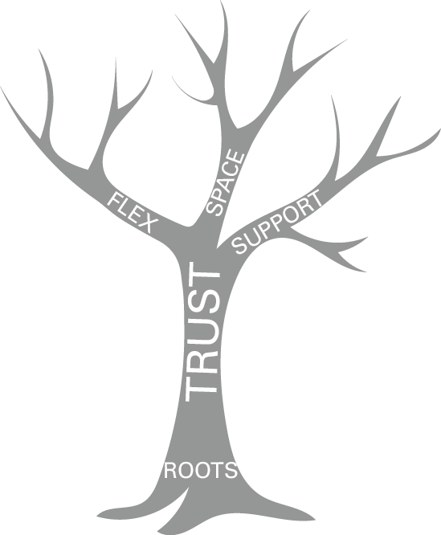

# 从生存到繁荣

如何嵌入弹性文化

## 简而言之

在 2020/21 Covid-19 大流行的挑战下，在全球聚光灯下测试了对弹性劳动力的需求，让许多商业领袖提出这样一个问题：“我们如何在整个组织中嵌入弹性？”本章探讨了一个模型嵌入文化弹性，帮助您通过信任、目标、灵活性、支持和空间，主动了解发展蓬勃发展的团队所需的条件。

## 有什么问题？

Terrence Deal 和 Allan Kennedy (2000) 阐明了文化的许多复杂定义，并声明：“文化是我们在这里做事的方式。”我将通过概述文化来补充这一点，就像背后讲述的故事一样或者在酒吧里，关于你的组织。当你的同事被问到，你的公司是什么样的？你的老板是什么样的？他们是否讲述了生存的故事（艰难、严峻、困难的经理、不可能的客户、深夜、倦怠）或蓬勃发展的故事（富有创意、富有挑战性、受到照顾、伟大的经理、艰难但公平）？
我们可以将组织弹性定义为“公司吸收压力、恢复关键功能并在变化的环境中蓬勃发展的能力”（Reeves 和 Whitaker，2020 年）。这听起来很简单，但科学家们直到最近才注意到定义与现实之间的悖论（Moss，2021）。
当气候未知、多变和不可预测时，就需要复原力。在这种时候，它需要领导者以快速和信任的方式跨职能运作。然而，领导者往往在孤立的经济孤岛中工作，寻求使股东价值最大化的短期解决方案。这种复杂、不确定的环境也需要团队的支持、足智多谋和充满活力！如果这听起来不可能，那是因为许多组织旨在实现这一点的精确逆转。这些做法中有多少是您熟悉的？

- 背靠背的会议。
- 不可持续的电子邮件收件箱。
- “午餐是给懦夫的”的态度。
- 对错误的容忍度低。
- 时间专注于眼前和紧急的事情，胜过长期重要的事情。
- 丰富的筒仓心态。
- 很少有机会全天充电。
- 庆祝加班。
- 学习被挤进了简短的课程中，很少被重温。

并不是说福利策略被忽视了。事实上，它们开始成为人力资源职能部门的一个受欢迎的主要目标。但通过“自我保健”培训和辅导来解决恢复力的主题是很常见的。信息很明确 - 这是一个个人问题，我们将帮助您应对。这导致科学家们争辩说，每个人都从错误的角度来解决组织倦怠和弹性的问题：“让我们推荐更多的瑜伽、健康技术、冥想应用程序和补贴的健身房会员资格——这将解决它”（Moss，2021 年） ）。
根据我的经验，嵌入文化弹性不仅是个人关注的问题，也不仅仅是企业的责任。我们需要从各个角度讨论适应力，正如第 2 章讨论个人如何通过身体、精神和情感充电来恢复精力，本章也提供了更广泛的组织解决方案的概念。

## 大创意：从根深蒂固到蓬勃发展的团队

对树木的科学理解正在发生一场革命（请耐心等待，我在这里有一个观点！）而 Peter Wohlleben（2018 年）是第一个向普通观众传达其惊奇的作家，他的书“隐藏的生活”树木：他们的感受，他们如何交流。自达尔文以来，我们通常认为树木是孤立的、孤立的和竞争的——适者生存的战场。现在有大量科学证据驳斥了这一想法（格兰特，2018 年），表明树木是合作和相互依存的，依赖于地下和我们头顶的共生关系，共享空间和光线。
与组织的类比是惊人的。有弹性的团队与其根源、愿景和目标有着深厚的联系，并与应对新情况和适应新情况的能力保持平衡。空间优先用于学习和成长。这些技能是通过基于同理心、现实乐观主义和“能做”信心的支持关系网络来实现的。而这四个因素——根、弹性、空间和支持——都以信任为基础。由于树木需要水和阳光，因此信任对于：
相信公司的愿景和宗旨；
接受变化并迅速工作以通过挑战解决问题；
花时间享受学习和成长；
对他人脆弱和同情。
图 11.1 韧性的根源

## 策略1：扎根

位于切尔滕纳姆的国家明星学院使患有复杂残疾的年轻学生能够通过教育和学习实现他们的潜力。学院总是要做出复杂的决定，但在 2020/21 年 Covid-19 大流行期间，这些决定变得更加尖锐，并且需要快速执行。当我与他们的校长 Simon Welch 谈论他们的反应时，他对“根源”的关注让我震惊：
建立弹性文化不是一蹴而就的，而是建立在组织目标和愿景的良好基础上。在 National Star，这意味着将我们的每一个决定都带回到他们的主要目的：我们教育和关心的学生和年轻人。每年学生都在变化，他们的需求也在变化，但目标和愿景不会——即使如何实现它。作为一个相互信任的领导团队，我们越认识到变革的必要性和成功的经验，我们就越有能力应对瞬息万变的环境。

### 实践灵感#1

### 测试你的目的

拥有愿景和目标是领导力实践不可或缺的一部分，大多数领导者都能清楚地表达这一点。但是您是否确信您的愿景（我们前进的方向）和目的（我们为什么这样做）对其他人来说非常清楚？在压力下发生的第一件事就是质疑你的目的：我为什么要这样做？为什么我今天早上起床？我有什么关系？我如何有所作为？
虽然您不负责个人意义的形成，但您有责任确保您的组织的愿景和目标是丰富、令人兴奋和根深蒂固的。如果您不确定，这里有八个问题供您分发给您的团队并找出答案。
表 11.1 测试你的目的

|                                                | 同意 | 不同意 |
| ---------------------------------------------- | ---- | ------ |
| 我了解并理解我们组织的愿景                     |      |        |
| 我相信我们的目标                               |      |        |
| 我对未来很乐观                                 |      |        |
| 我为组织为客户所做的一切感到自豪               |      |        |
| 我知道我的团队的目的以及我们如何发挥作用       |      |        |
| 我知道我如何增加价值并帮助实现团队和公司的目标 |      |        |
| 我适应并想尽我所能                             |      |        |
| 我有明确的目标和可见的里程碑                   |      |        |

## 策略 2：以信任为导向
在 The Speed of Trust 中，Stephen Covey (2008) 建议，“信任是改变一切的一件事。 这是我们这个时代最不了解、最被忽视和最被低估的可能性。”我当然没有遇到过任何组织或团队能够快速和尊重地运作，尤其是在逆境中，没有信任的基础 . 在我的世界中，信任的主题是每个领导团队计划的核心，毫无疑问，信任构成了 Lencioni (2002) 运作团队五项原则的基础。 也就是说，没有信任，组织中的其他任何事情都不会以令人满意的方式运作。
试试这个 #1
信任的重要性
当你尝试这个简单的练习时，你就会明白信任对于嵌入弹性文化的重要性。 只需填写表 11.2 中的不同列，然后凭直觉行事。
表 11.2 信任的重要性

|       | 当我信任一个人时，我... | 当我不信任一个人时，我... |
| ----- | ----------------------- | ------------------------- |
| 相信… |                         |                           |
| 感觉… |                         |                           |
| 说…   |                         |                           |
| 行为… |                         |                           |

你可能会注意到，根据你对其他人的信任程度，你的行为完全不同。这是其他领导人注意到的。没有信任，他们：

- 互相隐藏他们的弱点和错误；
- 对寻求帮助或提供建设性反馈犹豫不决；
- 延迟提供他们自己职责范围之外的帮助；
- 对他人的意图和能力下结论；
- 小心眼。

带着信任，领导者：

- 承认弱点和错误；
- 请求帮忙;
- 接受有关其职责范围的问题和意见；
- 在得出否定的结论之前，互相给予怀疑的好处；
- 在提供反馈和帮助时承担风险；
- 毫不犹豫地提供并接受道歉。

想象一下，在压力下将这些谨慎的不信任行为扩展到整个团队，你就会变得脆弱、软弱和僵化。当谷歌设立“亚里士多德计划”来研究为什么一些谷歌团队跌跌撞撞而另一些团队飙升时，“心理安全”的重要性是令人惊讶的答案（Duhigg，2016）。团队的组成并不重要。重要的是人际信任、相互尊重和敢于直言不讳的自信气氛。正如 Duhigg 在团队中报道的那样，‘我们必须能够谈论混乱或悲伤的事情，与让我们发疯的同事进行艰难的对话。我们不能只关注效率。
如果你问，‘是的，但你如何建立信任？，你并不孤单。那是因为这并不容易，或者只是遵循我的众多“成功的 3 个步骤”计划之一的案例！
但我可以向你保证，如果你从信任开始并以信任行动，你就会从他人那里产生信任。如果您是脆弱的并且愿意与您的团队分享个人的东西，那么您将表明对开放和同情的重要性的理解。
当我领导需要高度信任的团队领导力培训时，我们从以下练习开始：
分享一些团队不了解你的个人信息

我总是对团队之间的脆弱性和信任速度感到谦卑。

## 策略 3：弯曲、弯曲和适应
我工作的大多数组织都有变革、“蓝天”或创新团队——一群致力于探索和预测未来、测试和尝试不同方法、利用新颖策略即兴发挥的团队。不出所料，他们是令人兴奋的、富有创造力的团队。然而，组织的其他人以习惯性的僵化方式行事仍然令人惊讶地普遍。你可以通过人们使用的语言和他们采取的行动看到这一点。例如，您多久听到一次：
我们从不这样做。
我们以前试过。
客户不会让步。
董事会对这种方法不感兴趣。
它不会工作。
一直都是这样。
或者看到团队从危机到危机，一周又一周，不停地从错误中吸取教训，庆祝有效的方法，并且很少质疑他们采取的行动背后的假设（苏亚雷斯和蒙特斯，2020）。
这意味着错过了弯曲、弯曲和适应不断变化的环境的机会。让我们探索不断变化的语言和学习，以进一步嵌入文化弹性。

### 实际灵感#2

#### 乐观的语言

“乐观主义”这个词被广泛使用，很容易忘记它实际上是一种“解释性风格”。也就是说，你如何解释逆境或挫折？当困难的事情发生时，你会使用“总是”、“从不”或“一切”之类的词吗？所以，例如，如果你没有得到想要的晋升，你如何自言自语？ “我永远不会升职……这总是发生在我身上……我会永远被困在这里。”如果你和某人关系不好，你如何解释？ “一直都是这样……永远不会改变……他对每个人都是这样。”即使悲观主义者遇到好事，他们也将其视为侥幸。
团队精神上的灵活性和对可能性持开放态度的能力是文化弹性的核心（Seligman，2011）。乐观的团队以特定的、时间的和非个人的方式解释不良事件，例如不总是，不永远，不跨越一切（也不总是我们的错）。换句话说，当他们遇到挫折时，他们能够将其视为特定于某种情况的、暂时的，因此可以改变，与团队缺陷无关。这使团队能够获得积极的能量，并能够将问题情况改变为对他们有利。我和我的客户谈论“遏制”不良事件——在它周围放一个盒子，不要让它泄漏到其他任何地方。

#### 试试这个 #2

悲观与乐观的想法
想一想您的团队遇到的情况并不顺利或仍未解决；例如，错过了关键的最后期限、愤怒的客户或 IT 崩溃。当您考虑这种情况时，整个团队使用了什么语言 - 悲观还是乐观？在与您的团队分享这一学习成果之前，请先亲自尝试一下；写出悲观的思维句子，然后训练你的大脑写出一个乐观的版本。我在表 11.3 中举了一个例子——拒绝新项目的预算。

|      | 悲观思维                            | 乐观思维                                                     |
| ---- | ----------------------------------- | ------------------------------------------------------------ |
| 总是 | 永远都是这个样子                    | 这不是什么好消息，但我们可以根据反馈重写和重新提出           |
| 绝不 | 我们永远不会通过董事会得到这个      | 六个月前我们确实收到了一份提案。 我们可以再试一次            |
| 一切 | 也许这个团队只是运作不佳            | 作为一个团队，我们在很多方面都做得很好，这个结果并没有改变这一点 |
| 我们 | 我们没有足够的资源。 系统对我们不利 | 我们需要重新思考如何分配资源以适应系统                       |

### 实用灵感#3
#### 从危机到机遇

领导者常常关注危机的消极方面，而没有意识到情况中的机遇（Wooten 和 James，2014 年）。危机是组织变革和振兴的机会，充满了创新和系统改进的可能性。它们可以使您变得更好，以更高的诚信行事或增强您的客户体验。以下是您可以与团队一起使用的 10 个问题，以实现弹性、灵活的学习：
在过去的几个月里，出现了哪些新的优势？
哪些新的工作方式变得明显，我们可以识别和保留？
哪些积极的态度转变和信念变得明显？
我们如何利用和加强这些优势？
哪些弱点变得明显？
什么/谁/哪些职能阻碍了我们？
我们的市场或文化中出现了哪些新的机会和需求？
什么感觉很刺激？现在什么值得起床？
谁没有利用这些新兴市场/产品/服务（我们能否填补这一空白）？
哪些新威胁是明显的，它们来自哪里？ （本地、全球？健康和福祉？营业额和文化变革？）

## 策略 4：空间 vs 速度
当任何团队面临压力或面临相当大的逆境时，步伐都会加快。就拿我 2020 年的一位客户来说吧。一周之内，他们就将 1,000 名员工中的 85% 转移到了家庭办公，同时确保了其余 15% 留在总部或呼叫中心的员工在安全的环境中运作。 IT 系统得到调整，符合人体工程学的家具被订购，灵活的工作实践迅速到位。人力资源部门加班加点适当休假，员工学会在家上学。与高级领导团队一起，人力资源、IT、财务、客户和变革团队正在全力以赴，以实现有目的、快速的变革。在我们历史上的非凡时期取得了惊人的成果。
但这里有一个悖论。因为要嵌入可持续的文化弹性，空间的必要性必须与节奏的紧迫性相等。我所说的“空间”是什么意思？
空间的必要性必须与节奏的紧迫性相等。

我的意思是能够反思和考虑你一周的工作。
我的意思是在工作日结束时，你的油箱里还有能量，还有更多的东西可以给你的家人。
我的意思是查看您的电子邮件收件箱并且不会感到不适。
我的意思是结束会议并有时间与他人交谈。
我的意思是当有人想和你说话时关闭你的笔记本电脑。
我的意思是在你的日历中安排“思考时间”——并坚持下去！
那就是空间。
第 2 章专门讨论个人的恢复力和自我照顾，我将恢复力等同于需要持续关注和充电的五种电池（身体、思想、心灵、灵魂和连接）。组织弹性也不例外。事实上，一些科学家（Loehr 和 Schwartz，2003）坚持认为“最重要的组织资源是能量”，随着个人集体能力的提高，组织的能量能力也在增加。值得回到第 2 章并从组织的角度进行第一次“引流/激励”练习，我敢打赌，你的组织“引流”列表的首位将是会议。我知道高管们每天参加大约 15 到 20 次会议，只有在工作虚拟化时才会增加。

### 实用灵感#4
#### 更好的会议，更多空间

如果您让会议更有效率，从而在整个组织中释放更多空间会怎样？那将是一个多么美好的目标！虽然许多关于使会议富有成效的书面建议是标准费用，例如有一个目标驱动的议程并知道你的目标，这仍然是很好的建议。斯蒂芬·罗格尔伯格 (Stephen Rogelberg) (2019) 关于会议的科学书籍读起来很有趣，他引用了英特尔前首席执行官安迪·格罗夫 (Andy Grove) 的话说：“举行不当和不必要的会议确实是一种时间盗窃，一种可以预防的盗窃。 '
以下是您可能没有尝试过的 10 种策略，但我已经体验到了它们的实际成功：

1. 不要安排一小时的会议。将它们安排在特定的、不寻常的时间，例如18 或 43 分钟。

2. 始终准时开始，无论谁错过了（并将您最重要的信息放在首位，以便人们学会准时）。

3. 短点更好。改为进行 15 分钟的“聚在一起”或步行 10 分钟。

4. 将人们分配到议程的不同部分，并让他们提前做好准备（有时间安排）。

5. 不要重复使用相同的议程。它很懒惰，人们会养成不良的会议习惯。

6. 会议越复杂，应邀请的与会者就越少。

7. 尝试无声会议。我爱他们！在会议的顶部，分配你的头脑风暴主题，让每个人静默 10 分钟，写下他们的想法。然

    后开始对话。如果这感觉有点牵强，就问一个问题，然后给每个人两分钟时间写下他们的想法。

8. 当你被邀请参加会议时，问“为什么？”，或者更礼貌地，“你希望我贡献什么？”

9. 在会议中使用计时器。根据我的经验，人们一开始会抗拒，但在让每个人都遵守时间方面做得很好，尤其是当您想

    让所有与会者都发表意见时。一旦人们了解了三分钟输入的真正含义，您很快就会发现您不需要它！

10. 让合适的人进入房间，少即是多，并确保每个人都参与其中。

## 策略 5：支持——“依靠我”
50 年来，进化论中一直流行认为人类基本上是自私的。理查德·道金斯 (Richard Dawkins) (1976) 的著作《自私的基因》(The Selfish Gene) 阐释了自然选择通过孤独的个体在竞争中脱颖而出的哲学——类似于早期的树木理论。
最近，心理学家、社会科学家和历史学家打破了这一理论。例如，历史学家 Rutger Bregman（2020 年）在其美丽的书《人类》中表明，合作而不是竞争、信任而不是不信任以及寻找他人的优点和积极方面是我们的基本本能。换句话说，Brene Brown (2015) 建议，“我们天生就与他人联系”。
科学说，在面对极端逆境时向他人展示善意、感激和同情是很自然的（Seligman，2011）。但是对于文化弹性，您需要知道在整个组织的各个方向——向上、向下和横向——人们可以团结起来。不仅仅是在面对危机时，而是通过在您的组织 DNA 中根深蒂固的相互支持的愿望。

### 反思时间

#### 谁是真正的团队？

杰出的女性战斗老兵米歇尔·达洛奇奥 (Michelle Dallocchio)（2017 年）在她的著作《沙漠勇士》中写道，“逆境具有将真实的自己介绍给自己的非凡能力。”这是一个发人深省的陈述，暗示逆境和压力剥去外墙以揭示真实的人——或者在本章的情况下，真实的团队。那么，在支持方面，您的团队是否具备基础知识？您的团队准备好应对逆境了吗？真正的团队在压力下是什么样的？我使用首字母缩略词 CORE 来开始这个理解过程，这里有四个问题来开始你的反思：
同情心：您的团队是否相互关心并分享成功和失败？
开放性：团队是否能够彼此进行诚实、坦率的对话，给予和接受建设性的反馈？
足智多谋：在压力下，团队是否齐心协力，共享资源并创造解决问题的新方法？
期望：每个人都知道对彼此的期望是什么、角色清晰、团队团结和支持？

### 实用灵感#5
#### 扩展您的教练实践以嵌入支持

当领导者谈论教练时，他们通常指的是指导他们的团队。在第 5 章和第 6 章中都有这方面的想法，如果你已经到了在你的领导工具箱中教练是一项一致的、积极的技能，而不是警告性的“修复”的地步，干得好！将你的教练实践扩展到你所属的领导团队是值得的——我指的是同伴教练。
要将“支持”作为文化弹性的五分之一嵌入，您组织的各个级别都应该感到有些人可能会受到伤害，他们可以信任的人以及他们可以诚实的人。我知道对于一些领导者来说，开始同伴辅导会让人感到尴尬，但我可以向你保证，一旦实践，这是双赢的。经历过这种情况的客户说，这是解决困扰他们的问题的好方法；他们会找一位值得信赖的同事来交流想法，这减少了孤立感。
以下是让您入门的五种方法：

1. 确定您信任的同伴（他们需要能够保密）并邀请他们与您一起探索同伴辅导。解释你希望从中得到什么。也许与他们分享这一章？
2. 每个 20 分钟是一个很好的开始时间。如果它需要更短，好吧，只是不要以“时间不够”作为不开始的理由！
3. 选择您想要关注的主题，例如它可能是你正在做的一个项目，一段艰难的关系，杂耍斗争。保持重点和具体。尽量不要只是呻吟！请记住，您是在寻求观点、问题和意见，但您并不是在向他们寻求解决方案（尽管这可能会自然而然地出现）。
4. 当轮到您担任教练时，请全神贯注地倾听。
5. 最后，确定一个洞察和一个行动对你们来说是一个好习惯。

总而言之，您可以看到韧性技能不是您可以简单地嫁接到组织议程上的东西！它需要采取积极主动的方法，并希望确保员工的各个层面都认同您的目标，以信任和同理心行事，并保持心理灵活性。您的团队会感谢您为思考和发展创造的空间，而跨职能产生的支持将使您处于有利位置，以便对下一个逆境做出灵活的反应。

## 嵌入文化弹性的十大技巧

1. 仔细看看您的组织设置如何成为恢复能力的障碍。哪些系统没有用？
2. 营造以人际信任和相互尊重为特征的团队氛围。
3. 在会议上练习对话轮换，确保每个人都有发言权。
4. 培养多种做事方式，采取多种方法解决问题。
5. 为乐观、好奇和远见的优势树立榜样。
6. 当您注意到工作节奏变得不舒服时，请腾出更多空间。
7. 以灵活的态度和能够伸展和恢复的团队来平衡您的牢固根基。
8. 从逆境中恢复过来，但重新学习并适应新环境。
9. 注意在整个组织中受到赞扬的内容。与其奖励过度工作，不如奖励足智多谋、支持和成长。午休吧！
10. 从信任开始，以信任行动，回报信任。