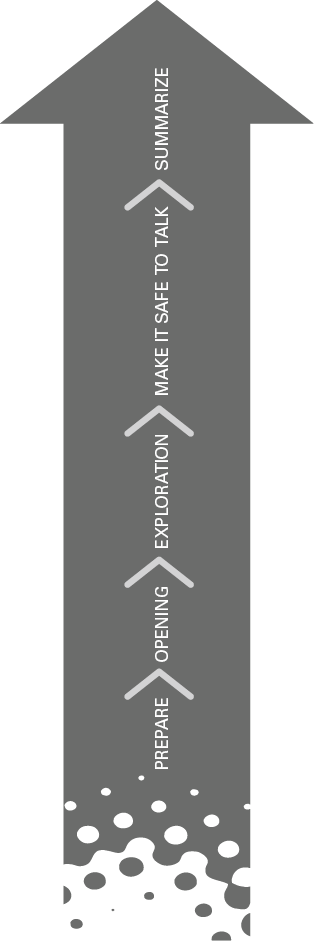

# 如何以同情和自信来掌握艰难的对话
## 简而言之

是什么让一些对话对你来说如此困难？您如何进行这些对话以达到您想要的结果？这个结果必须对你、对另一个人和这段关系有效——而不是成为一个没有人确定下一步的“混乱”。了解如何使用 POEMS 模型准备您的思维方式并提高您的技能。这将帮助您为困难的对话创造一个安全的空间，并取得双方都同意的结果。

## 有什么问题？

“艰难的谈话”有什么难的？如果这是一个让您感到担忧的话题，那么您并不孤单！在教练领导者中，这是导致手湿冷和高度焦虑的一个主题，每个人都有反馈出错的故事——无论是在给予还是接受端。
如果我们将困难的对话简化为本质，那么您将：
预期问题（并且对达成互利的结果感到不安）。

谈话对你很重要，情绪高涨，如果你和大多数领导者一样，你已经在脑海中重演了这次谈话，这让事情变得很困难。
正是这种期待导致了犹豫、怀疑和焦虑。正如《沟通失败》(Failure to Communicate) (2010) 一书的作者霍莉·威克斯 (Holly Weeks) 所说：“当你将困难的谈话视为普通的谈话时，它往往会取得最好的效果。”只是将谈话定为“困难”会导致大量的“什么”如果'思考，例如：
如果出错了怎么办？
如果他们哭/喊/走（选择你的情感恐惧）怎么办？
如果我做得不好怎么办？
如果我伤害了他们的感情怎么办？
如果他们拒绝反馈怎么办？
如果它升级并变得非常严重怎么办？
如果我们破坏了关系怎么办？
如果我被触发并且表现不佳怎么办？
如果是“职业限制”怎么办？
如果不解决怎么办？
这种想法的有害之处在于它会导致您希望回避的结果！因为这种想法会导致五种不同的领导行为：
回避。只是希望如果您忽略它，问题会消失或自行解决。
最小化问题。 ‘可能是我，不是你’； ‘别担心，这真的不是什么大问题’； “这只是一个很小的问题”。
责备。你自己（“我没有很好地管理他们”）或他们（“他们没有承担责任”）。
触发行为。你在压力下的领导风格大放异彩。面对潜在的冲突时，您如何反应？带有攻击性、被动攻击性、退缩性、防御性、幽默感？
'即兴发挥。您不知道如何准备，会出现什么问题？

## 大想法：平衡同情心和信心

确实会出什么问题？真的很多！认真对待艰难的对话确实很重要，因为处理不当的交流的后果可能影响深远。值得庆幸的是，对于结果混乱的混乱交流，还有另一种选择，POEMS 模型将引导您逐步进行自信的对话。
在此之前，我们需要谈谈准备和您的心态。不掌握这一点，任何模型都不会有效。就像那句古老的格言所说，“不准备，准备失败”。
著名教练 Mary Beth O'Neill 敦促执行教练控制 Backbone 和 Heart 之间的紧张关系。我赞同这一点，并进一步建议您要达到的平衡是同情心 + 信心。

### 让我们从慈悲开始

有两个因素对同情心很重要。第一个是同理心，能够理解别人的感受和想法——因此，对别人的同情。第二个因素是你有能力处理好这两者之间的紧张关系，既要深切关心你领导的人，又要明白有时你会不受欢迎，所以要对自己富有同情心。

### 要是你更像我就好了……

数十年社会科学研究的有力科学发现表明，我们一生都希望每个人都更像我们。如果你更像我，像我一样思考，像我一样说话，就不会有更困难的对话——所以想法是这样的。职业关系中化学反应的主要决定因素是相似性或吸引力，或者换句话说，我们被那些与我们相似的人以对我们很重要的方式所吸引。 Herminia Ibarra 在“像领导者一样行动，像领导者一样思考”（2015 年）中将其称为关系形成的自恋原则。
为什么这在困难的谈话中很重要？这意味着你更有可能在艰难的谈话中受到负面影响，因为这个人不会像你那样对压力大的情况做出反应。也许他们在你说话时会反思；或者当你坐在那里沉寂无声时他们会哭泣。或者他们会交叉双臂，说出致命的“很好”这个词，因为你迫切地试图找到前进的道路。

### 护理的钢丝绳

Kim Scott 的 Radical Candor (2019) 将同情描述为“关心个人”。她建议，在我们努力在艰难的谈话中“保持专业”的过程中，我们否认了做人的本质：“我们都是人，都有人的感情，即使在工作中，我们也需要被这样看待。当这种情况没有发生时，当我们觉得必须压抑自己的真实身份才能谋生时，我们就会变得疏远。
这里的困难在于个人关心你领导的人，同时准备好作为回报不受欢迎之间的紧张关系。不是一个容易管理的紧张局势，但我将帮助您管理下面的 POEMS 结构。

### 信心连续体

正如您在图 10.1 中所见（您可以在第 4 章中进一步探讨），置信度存在于一个连续体上。一方面是谦虚，另一方面是傲慢。
图 10.1 置信连续体

这意味着您既不为举行这次谈话而道歉，也不认为您是最重要的。因此，在这种情况下的信心是相信你有能力以可接受的方式处理这次谈话，而不会损害对方。
了解与许多领导技能一样，自信不是与生俱来的固定特征也很有用。它可以随着时间的推移获得和改进——就像掌握困难对话的技能一样。出于这个原因，我经常在教练中建议客户在进行艰难的对话之前采用以下一些自信的信念：
需要进行这种对话。
我很好，他们很好。这不是关于赢。
我已经尽可能多地准备了。
我有应对出现的任何挑战的经验。
我很了解自己，可以保持冷静。
我可能不明白，但没关系。犯错是人类，我会从中吸取教训。
我感到同情，并且知道如何让谈话变得安全。

## 是时候反思了：什么可能会让你出轨？

为了让同情心和信心的平衡保持稳定，重要的是要知道什么可能会让你出轨。我的意思是什么情绪或行为可能会让你偏离正轨？ Marshall Goldsmith 在 Triggers (2015) 中强调需要决定如何回应而不是做出反应，因此打破了长期存在且往往适得其反的本能链。
四位客户与我分享了他们的“脱轨”时刻及其影响：
那个人开始哭了，所以我开始道歉说我很抱歉，这不重要，真的不是什么大问题。当我知道我们甚至还没有开始艰难的谈话时，我感到很可怕，然后更糟。

我的同事微微转过身，闭上眼睛说，‘好吧，你想让我做什么’。我不知道该怎么办。我只是嘟囔着‘好’，会议就结束了。

罗伊辛和我关系很好。当我告诉她这个艰难的消息时，她微笑着告诉我不要那么认真。我上过课吗？放手吧，下次她会更好。来吧，休息一下。我们只是去喝了杯咖啡，从来没有交谈过。

他们站起来（我还坐着），用非常响亮的声音说：“你一定是在开玩笑吧？”有点撞到桌子。严重地！每个人都可以在外面的办公室听到。感觉很威胁，我只是不知道是否应该回击、闭嘴或如何找到中间立场。最后，我只是推迟了谈话。

在阅读他们的故事时，请考虑以下问题：

- 你在压力下如何反应？
- 哪些情绪或行为会触发你并让你偏离正轨？
- 你需要做什么才能保持自信？
    （如果您想了解更多相关信息，请转到第 7 章，我们将在其中探讨压力下的偏见、不同的个性和风格。）

## 实践灵感#1
### 六个心态问题

现在，很明显，您对这场艰难对话的心态很重要！事实上，这是保持同情和信心之间微妙平衡的唯一方法。让我在这里帮助准备问题，旨在了解您的意图并将您的心态转变为成长和开放。通过回答这些问题，您将一些“灰色”思维引入到否则可能过于僵化的问题中。
因此，在您进行艰难的对话之前，这里有六个问题可以让您的心态处于有用的位置：

1. 对你来说，这次谈话有什么困难？ （你期待什么问题？你为什么对此感到不安？）

2. 他们有什么问题？ （通过考虑对方的观点，开始为这次对话建立灵活的思维。）

3. 你感觉怎么样？ （所有困难的谈话都是情绪化的。你的情绪是什么？说出它们的名字，这样你就不会被它们劫持。）

4. 你对这个问题有什么贡献？ （这不是一个容易回答的问题，但它可以从不同的角度揭示谈话的方向。也许你没有

    及时提供反馈？或者在之前的谈话中完全诚实，这意味着问题现在已经升级了？）

5. 你希望你、他们、这段关系得到什么样的结果？

6. 你需要如何表现才能实现你的关系结果？ （例如，此人听到此消息的最佳方式是什么？）

最后两个问题是 Crucial Conversations (Patterson et al, 2011) 的作者提出的，我特别喜欢的是对关系的关注。在艰难的谈话中考虑你的结果是标准的，但很少有效地考虑关系的结果，然后将其转化为改变你的行为。

### 试试这个

想一想您需要进行的艰难对话，然后回答六个问题。我敦促你写下你的答案，因为写作的行为，而不是仅仅思考，会让你清晰。在回答这些问题时，您对自己的心态有什么见解？你注意到你的行为需要改变什么才能获得更成功的结果？你对这个问题的贡献是什么？

## 实际灵感#2

在你的心态处于良好状态之后，是时候计划这次谈话了。 POEMS 是一个五步模型，您可以将其用作困难对话的规划工具。这不是一个脚本，因为没有任何困难的对话会完全按照你计划的方式进行，但我已经给了你一些例子来帮助你理解每一步。它旨在通过结构帮助您放慢速度，如图 10.2 所示。
慢下来，有结构。

图 10.2 POEMS 模型

**准备**

1. 做好准备。写下你对上述六个心态问题的答案，并检查你对这个问题的态度——如果你现在生气或沮丧，现在不是进行对话的时候。
2. 呼吸。淡定。
3. 随身携带事实证据——无论是看到的、听到的还是书面的。
4. 预订安全空间——虚拟或面对面。你要去哪里谈话？酒店大堂的中间位置并不理想，对所有人开放的办公室也不理想。如果必须以虚拟方式举行，请确保你们都坐在舒适且私密的地方。
5. 确保你为会议安排了足够的时间——如果你没有足够的时间，那就推迟到你有时间为止。快速进行困难的对话永远不会成功。

**开放**

- 通过创建“共同目的”声明，为会议制定一个强有力的、自信的理由。例如，“我们需要讨论您的表现，以便我们都清楚前进的道路。”
- 从事实开始。这很关键。事实是不能争论的（或者如果是的话，在谈话中暂停一下，找出事实并重新开始）。例如，“在过去三个月中，您的表现下降了 24%”； “在你写的上一份董事会报告中，有六个错误。”
- 讲述你的故事。仅凭事实是不够的。正是事实加上你的结论使这成为一种双向讨论。使用“我”来表明这是你的故事，而不是别人的。这是一个关键的心理步骤，因为您正在向其他人证明这只是您对事实的看法——他们可能有不同的故事。您正在为坦诚的相互对话打开大门，而不仅仅是呈现事实的灌篮版本。根据事实让您“思考+感觉”的内容来构建您的故事可能会有所帮助。
    例如：‘在我们今天下午的领导会议上，你打断了我两次，尽管我们上周讨论过这个问题。这让我觉得我对你行为的影响不够清楚，因为这让我感到沮丧和沮丧。

**探索**

- 探索对方的观点——让他们从他们的角度谈论他们的解释，他们的“故事”情况。有时人们需要找借口或发泄情绪，才能接受改变的必要性。 Monique Valcour 于 2017 年在哈佛商业评论中写道，建议将对话的目的从“说服”转变为“学习”。正如她所说，“无论我们说得多么好，多么合乎逻辑，如果不探索对方的看法，我们就无法理解和解决问题。”

- 你可以听而不一定同意。这是找出他们行为动机所在的唯一方法。

- 避免封闭式和“为什么？”问题。这些只会导致防御。而是问“什么？”和“如何？”的问题。在第 6 章中，我描述了“Tug of Tell”，即人类想要告诉某人该做什么、想什么、做什么——或者只是按照你的方式行事的愿望。因此，保持开放和探索的时间比您认为需要的时间要长得多：

    - 你怎么看这种情况？

    - 从你的角度来看，这感觉如何？

    - 是什么让你这么说？

    - 这里还有什么重要的？

- 你在这里的目标是为你、为他人和这段关系获得最好的结果。为此，您需要尽可能多的信息。鼓励他们表达他们的事实、故事和感受。聆听并愿意在了解更多事实时重塑您的故事。

**确保谈话安全**

- 在任何困难的谈话中，无疑都会出现Roadbumps或Flashes，这表明谈话刚刚变得“不安全”。它可以很快发生。闪光是语言或非语言的快速反应，可以包括叹气、转身、耸肩、水汪汪的眼睛或闭上眼睛。他们可能是这样的表达：“好吧……好吧……你会说……我不敢相信你在说这个”等等。青少年擅长于此——摇头、扬眉、“随便”你被触发了！呼吸，保持冷静。
    路障往往是新信息、更严重的行为反应或强烈的情绪。你需要放慢速度，仔细聆听，让谈话回到正轨。回到上面的例子，你在有人打断你的情况下打开对话：
    “在我们今天下午的领导会议上，你打断了我两次，尽管我们上周讨论过这个问题。这让我觉得我对你行为的影响不够清楚，因为这让我感到沮丧和沮丧。
- 理想情况下，您会对此开场白得到深思熟虑的回应。但你也可能会得到：
    “认真的露西？你不是在这里有点敏感吗？我确定你也有打断别人的时候吗？你想让我做什么，让你一直说下去……？
- Roadbump 或 Flash，你必须确保有人可以安全地与你公开交谈——而不是采取防御或敌对的方式。不要陷入愚蠢的游戏或战斗。你不需要赢得任何东西。当我们相信某人将我们的最大利益放在心上时，我们就会感到安全；我们尊重此人的意见并相信他们的动机和能力。
- 要处理关键的闪光点，您需要融合自信、谦逊和技巧。这里有五个最好的技巧可以帮助你：
    - 对比。目前我最喜欢的技巧是一场艰难的谈话有升级的危险。对比是一种“不要/不要”的陈述，它解决了任何误解并提供了上下文和比例：“不，约翰，我不是说我希望你让我继续说下去。我是说我想不间断地完成我所说的。
    - 保持好奇。无论回应多么具有挑衅性，只要问问自己，“我想知道他们为什么会有这种反应”，这让您有时间思考。在艰难的谈话中，开放式问题是你最好的朋友：“我们怎样才能最好地解决我们之间的这个问题？”“你怎么看？”
    - 进进出出。在你说话的时候进入谈话，但记住也要走出去听。保持冷静。正如我之前提到的，你可以不同意就听。
    - 说说你在房间里看到的。然后回到探索：
        ‘你听起来真的很沮丧？是什么原因造成的？
    - “我注意到你的肢体语言有一种不安感。我真的很想听听更多关于你的想法和感受。
    - 说声对不起。有时，只需一个简单的道歉就可以让对话重回正轨。 “对不起，我措辞笨拙……”但请确保这不是在面对侵略时恢复谦逊，因此请在正确的时间真诚地道歉。

**总结（以解决方案为重点）**

- 先总结一下。当你总结时，你表明你已经倾听、反映并听到了他们的观点：
    “这就是我听到的……” “这就是我相信你说的……？”
- 在所有这些出色的工作之后，最好的下一步是就前进的道路达成共识：
    “你想如何解决这个问题？”
    “接下来你希望看到什么？”
    “你有什么建议作为下一步？”
    “你以后想做什么？”
    “你希望我得到什么支持？”
- 制定双赢的改变：协商下一步要采取的措施。你们双方都同意的行动是什么？寻找能够解决现在和未来问题的选择，专注于双赢的方法。期望自己做出改变并证明这是一条双向街道。
- 不幸的是，并非所有艰难的对话都以相互积极的协议结束。因此，如果这不会发生，请说明您希望在未来看到的行为。您在这里有两个选择：
    - 决定不升级，但具体说明您预计将来会发生什么（加上这种情况不会发生的后果）并获得同意。
    - 决定升级，解释原因以及接下来会发生什么。
- 始终以书面形式总结您的谈话。

您可能已经在问自己，我真的需要在 15 分钟的对话中这样做吗？虽然这可能需要时间（练习会变得更容易），但我保证会有巨大的回报。你会带着准备好的心情进入谈话，以同情心行事，保持观点和信心，以取得良好的结果。

## 掌握困难对话的十大技巧
1. 为了保持同情心和信心之间的平衡，首先通过六个问题来掌握你的心态。
2. 呼吸，保持冷静。在开始这次谈话之前，确保你的情绪状态稳定。
3. 避免拔河！保持开放，保持好奇。
4. 计划，但不要编写脚本。写出你的 POEMS 框架，以帮助你坚持到底：
    1. 准备
    2. 打开
    3. 探索
    4. 确保谈话安全
    5. 总结
5. 知道你的意图。如果它是否定的，这将渗透到您的口头和非口头语言中。寻找你的积极意图。
6. 保持对自己和他人的看法。如果您认为这种对话很困难，那么对于接收者来说可能更是如此。
7. 了解你的触发因素、你在压力下的风格，以及什么可能会让你的谈话脱轨。
8. 当您遇到 Roadbumps 时，请放慢谈话速度。它将帮助您找到正确的词语并表明您正在倾听。
9. 将对话从“说服”转变为“学习”。这里发生了什么？
10. 准备，准备，准备。需要我多说？！