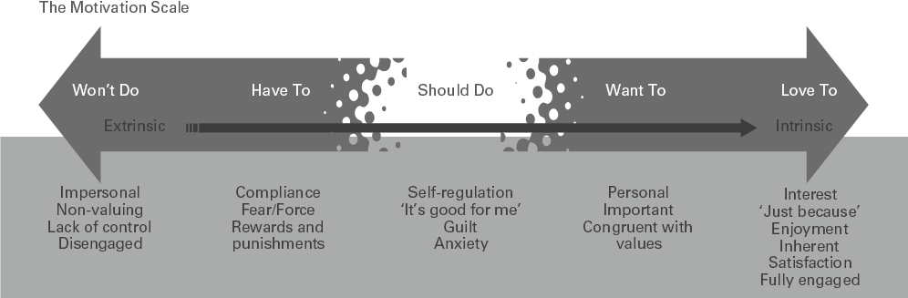
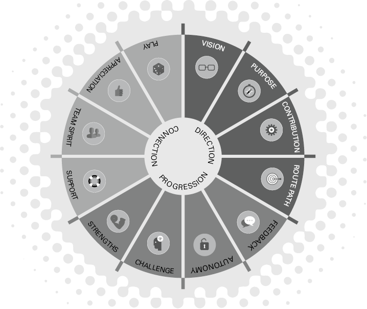
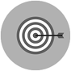
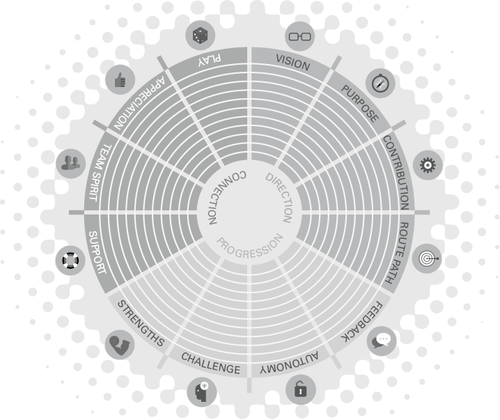

# 激励我！
如何通过 12 步流程为您的团队赋能

## 简而言之

领导和授权人们以适合他们的方式表现并取得伟大的成果是伟大领导的艺术和科学。本章将确定个人成就感的重要性，并考虑 12 个因素，这些因素使一个有能力的团队能够蓬勃发展。

## 有什么问题？

问题是你不能激励任何人。相信我。我是站在公司演出舞台上的人，被要求激励每个人并“鼓舞士气”。当我凝视着数百人双臂紧紧交叉的眼白时，我几乎可以听到他们喃喃自语：“是的，当然，激励我，尝试一下。”这是一场艰难的演出！
处于一种积极的状态是非常个人化的。激励我的东西（冷水游泳、波涛汹涌的大海、独自写作的时间、适当的肚皮笑、燃木火）可能不会让你的船漂浮。相反，让我失望的东西（任何当权者，仍然是一个十几岁的叛逆者！）可能是提高士气的关键。
但是，在您沮丧地向前迈进一章之前，作为领导者，您可以做的是为动力蓬勃发展创造条件。此外，您在建立这种环境方面发挥着关键作用。您正在为人们创造表演空间。
您正在为人们创造表演空间。

为了实现这一点，有必要了解什么是动力，以及为什么您的团队的动力会下降。这个话题如此复杂的原因在于，动机取决于多种因素，包括环境和任务、他们当前的信心和健康状况，以及个人挑战（Pink，2011）。
我在本章中的工作是简化科学，以便 a) 您很好地了解动机是什么，不是什么，并且 b) 您有一个 12 点策略，可用于评估您的动机水平团队，并作为增强动力的“如何做”工具，以便您的团队能够蓬勃发展：
激励他人没有诀窍。它需要对手头的情况有清晰、公正的理解，并在个人和群体层面深入洞察人性的变幻莫测。换句话说，它需要努力思考和努力工作。当一个组织处于压力之下时，挑战和风险就会变得更高（Fiorina，2003 年）。

## 大想法：动机量表

动机是欲望（实现某事）、意志（在其上花费精力）和驱动力（尽管遇到挫折仍坚持）的组合。当科学家谈论动机时，他们区分两种不同的类型：内在动机和外在动机（Deci 和 Ryan，2012）。
外在动机是由金钱、激励和头衔等外在因素触发的。一旦这些因素不再存在，动力就会停止。外在动机（传统的“胡萝卜加大棒”）有其用途，但只会产生短期结果。
内在动机来自“内在”，与某项工作或任务给予人的喜悦或成就感有关，而不是它带来的回报。内在动机带来长期结果。正如 Herzberg (2003) 所说，“忘记赞美。忘记惩罚。忘记现金。你需要让他们的工作更有趣。
这在实践中意味着，通过理解下面的动机量表，您可以更深入地了解什么是激励和不激励您的团队——以及下一步做什么。
图 5.1 动机量表

左边是“不会做”的外在行为，包括客观、不重视、缺乏控制和不参与。 “必须”包括服从、恐惧/强迫、奖励和惩罚。量表中间是“应该做”，包括自我调节、“这对我有好处”、内疚和焦虑。量表右边是“想要”的内在行为，包括个人的、重要的、一致的和价值观。 “热爱”包括兴趣、“只是因为”、享受、内在、满足和全情投入。
**不会做**：不敬业的人。开始工作，但“灯灭了”。做所问的，但没有更多。这种状态的人你没招，怎么回事？在某些时候，他们对工作、团队和贡献的渴望失去了兴趣。
**不得不做**：一个非常有动力的状态！那是因为它是由合规性、恐惧和截止日期驱动的。奖励将在这种状态下有效，但仅在短期内有效。这是一种生存状态，而不是您希望您的团队长期处于这种状态。但他们会非常专注。
**应该做**：运动、饮食、新年决心和待办事项清单的动机阶段！这个阶段有一种“这对我有好处”的感觉，但没有人强迫你（不像之前的阶段）；这都是自我调节的。因此，这个阶段伴随着内疚和焦虑的情绪。
**想做**：我们正在进入内在动机状态。你会取得一些成就，因为它感觉很好，感觉很个人化，与你的价值观一致，而且很可能会让人感到兴奋。你最后还是想要奖励。
**喜欢做**：当你全神贯注、感兴趣并沉浸在心流中时（Csikszentmihalyi，1990）。你可能会不花钱也不需要外部奖励。有趣的是，这样的奖励会让你感到无所适从，因为它给你喜欢做的事情附加了一个衡量标准，只是因为……
关于这五种动机状态需要注意的重要一点是，找到一个完全不参与工作的人与找到一个完全热爱他们的工作的人一样不寻常。换句话说，您只需执行一项任务即可体验所有五种状态，或者一天内完成多项任务。
例如，当我完成四年的兼职博士学位并且每个周末都需要工作时，有很多天我可以在几个小时内体验所有五个州。例如，我的想法是，'我不想这样做......但我必须这样做，我有一个提交截止日期......好吧，露西你真的应该开始......我真的很想专注于这项研究......哦，我喜欢我在这里读到的东西，这太令人兴奋了……'等等！
那么，动机量表对您和您的团队有何意义？以下是开始使用它的三种方法。

## 试试这个
首先将其应用于自己，从而更有效地了解该量表。想想你在 24 小时内完成的主要任务，工作和家庭：

- 您什么时候经历过五种状态中的每一种（以及您在做什么）？
- 你在每个州都有什么感受？
- 在艰难的阶段，你如何激励或奖励自己？

你如何重新安排你的 24 小时来做更多你喜欢的事情？

聆听您的团队使用的语言。调整自己的动机语言，你会开始听到，“我不想这样做......我希望我能花更多时间这样做......我应该完成我的待办事项清单......”
与您的团队分享体重秤，并找出他们一天中大部分时间都花在哪里。我可以想到一个直接的例子：
Nadene 以前被视为团队的“明星”表演者，开始错过最后期限，不与其他团队成员互动。低着头，她比平时更安静。在使用量表进行讨论后，Nadene 说她被工作压得喘不过气来，每一天都是“不得不做”的一天。她只是在完成待办事项清单，没有时间做她喜欢的工作——新员工的入职介绍。经过良好的教练谈话后，Nadene 和她的经理重新安排了她的一些工作量，腾出时间做她喜欢的事情。这不是一个大的调整，但这是一个值得的转变，纳德内赞赏她的经理注意到正在发生的事情，花时间进行良好的谈话，并投入时间和资源来重新调整她的工作量。

## 实践灵感#1

扩大规模——从不会做到爱到
如果您的问题是，我可以做些什么来帮助我的团队提升规模？这是给你的部分。
团队的巅峰表现发生在他们蓬勃发展的时候，12 个基本因素决定了一个团队能否蓬勃发展。动机轮概括了这 12 个基于证据的因素，我将简要概述它们，然后为您提供大量将它们付诸实践的想法。
图 5.2 激励轮

轮子的组成部分包括愿景、目的、贡献、路线路径、反馈、自主、挑战、加强、支持、团队精神、欣赏和玩耍。 轮子的中间是方向、进展和连接。
发展一个蓬勃发展的团队
这 12 个因素可以归为以下标题：
方向——一个团队需要知道它要去哪里，需要关心到达那里。
进步——团队成员需要知道他们的表现如何，处于学习环境中，并认识到他们正在做的事情越来越好。
联系——协作、良好的关系和团队合作对于帮助团队蓬勃发展至关重要，感谢他们的辛勤工作也是如此。
让我们仔细看看这三个标题下的不同因素：

### 方向

我们需要知道我们要去哪里以及为什么（并对此有所感受）：

### 想象

您的团队了解您的愿景和目标。
团队成员对未来充满信心。

### 目的

团队为他们所代表的东西感到自豪。
团队相信他们的团队很重要并且会有所作为。

### 贡献

团队成员知道他们如何增加价值。
球队想尽自己最大的努力。

### 路线路径

团队成员有明确的目标。
团队知道下一步要做什么并且可以实现它。

### 进步

我们需要知道我们每天都在变得更好：

### 反馈

团队成员定期获得反馈并相互提供反馈。
团队相信他们可以坦诚相待。

### 自治

团队成员被赋予责任。
该团队相信他们的声音被听到了。

### 挑战

团队成员有激励的晋升机会。
学习对团队很重要，并被积极讨论。

### 优势

团队成员的优势得到认可和重视。
团队有机会进一步发挥优势。

### 联系

我们需要知道我们并不孤单，我们的努力受到赞赏：

### 支持

团队受到您的鼓舞，并定期接受您的指导。
团队成员可以互相寻求支持。

### 团队精神

团队喜欢合作，是一个很棒的团队。
团队成员互相关注并共享相同的目标。

### 欣赏

团队成员对他们所做的工作感到赞赏。
团队的努力得到了回报。

### 玩
团队成员说他们玩得很开心，有很多笑声。
团队知道成功和成就是值得庆祝的。

## 反思时间

当您反思上述 24 条陈述时，请使用这个空白的动力轮来评估您团队当前的动力水平。 我知道这可能因人而异，但这个练习会让你开始思考 12 个因素中的每一个。 以 0 为中心，10 为轮的外侧，为您当前的团队适当地遮蔽每个区域。 然后使用 10 个辅导问题来指导您思考下一步。
图 5.3 动力轮工作表

工作表的因素包括愿景、目的、贡献、路线路径、反馈、自主、挑战、加强、支持、团队精神、欣赏和发挥。 轮子的中间是方向、进展和连接。

### 辅导问题

1. 当您查看动机轮时，您的优势在哪里？
2. 你对让这一切如此强大的团队做了什么？
3. 您如何进一步开发该领域？
4. 您的团队是否同意这是一个优势领域？
5. 动机较弱的领域在哪里？
6. 你认为造成这种情况的原因是什么？
7. 您认为您需要“做更多”什么来加强这个领域？
8. 哪些其他经理在这个重点领域有效地激励了他们的团队？
9. 您现在有哪些“快速取胜”可以激发动力？
10. 对您而言，什么是有效的长期战略？

## 实际灵感#2
### 改变的 20 个想法

当您回答上述教练问题时，这里有 20 个想法可以帮助您加强动力领域，从而帮助您的团队蓬勃发展。挑选适合您的产品；有些想法你会喜欢，有些你不会，那没关系。将这些想法作为跳板，让您和您的团队分享和开发更多灵感。
我不能再强调动机是一种共同的努力。与您的团队分享比例尺和车轮。让他们选择什么可以帮助他们感到更有动力并坚持他们的想法。你不必强加你的，即使你认为它很棒！这只是一种刺激，可以帮助您进行动力之旅。
动机是一种共同的努力。

#### 方向想法

1.**愿景**：作为团队领导，制定五分钟的“愿景演讲”。为了做到这一点，想象一下你在一年内看到团队的位置；描述他们如何作为一个团队工作；他们正在取得什么；他们如何展示最佳实践；如何发挥他们的优势；团队的气氛如何；您将听到他们说什么以及为什么每个人都如此高兴成为这个团队的一员。完成此操作后，制作您的愿景演讲并与团队一起练习！
2.**目的**：一个共同的、令人信服的目的可以帮助团队朝着同一个方向努力。与您的团队一起设计这个，因为团队是您组织中最有效的变革单位。通过回答三个问题开始这个过程：
我们的团队是做什么的？
我们是为谁做的？
为什么我们所做的很重要？
3.**目的**：收集“成功案例”——确保你在团队会议上谈论它们，分发它们，将它们与你组织的愿景和目标联系起来。有一周的“成功故事”。向为此成功做出贡献的团队成员写一封感谢信。
4.**贡献**：让员工了解并参与组织和整个团队的大局。展示他们的角色如何为更大的使命服务，并增加他们在工作中的联系感。
5.**价值观和贡献**：查看您组织的价值观并选择对您有意义的价值观。向团队成员描述这个价值对你意味着什么以及它如何在你的生活中发挥作用。与您的团队成员分享这一点，以便他们更深入地了解您。
6.**路线路径**：以一个项目为例，将该项目可视化为一段旅程。勾勒出这段旅程，并沿着路线路径创建视觉里程碑。与团队一起玩得开心，让这些视觉效果变得有趣和有趣。在时间线中勾勒出您在每个里程碑时可以求助的人。计划您将如何庆祝每个里程碑的成就。

#### 进阶思路
7.**个人反馈**：征求对自己的反馈。您多久获得一次有用且一致的反馈？你可以从谁那里得到反馈？你目前从多少不同的人那里得到反馈，你如何提高反馈的质量和数量？为了做到这一点，决定你特别想要培养的技能或行为，并选择两个会给你诚实、建设性反馈的人。
8.**反馈练习**：通过使用 Do/Think/Feel 模型练习你自己的反馈技巧。这意味着你在说，‘当你这样做或说这个时，它让我思考……，这让我觉得……’而且，具体的、当场的赞美是好的！ “公开表扬/私下批评”表明尊重并取得成果。
9.**自主性**：查看您的月度计划并选择一项对团队成员来说重要、新且具有挑战性的任务。安排与团队成员的会议，向他们简要介绍这一挑战，并安排时间检查任务的进展情况并审查进展情况（允许他们选择他们想要的方式）。
10.**自治**：不是你主持团队会议，而是在整个团队中轮换所有权。每个成员“拥有”那一周的会议，并在会议内有五分钟时间谈论他们本周热衷的事情。
11.**挑战**：查看您的奖励系统并与您的团队一起开发。考虑每个人的个人优势，制定互惠互利的新奖励，例如技能培训或个人发展。因此，寻找对人来说是一种奖励的培训和技能课程（同时也增加团队内的能力），并在课程结束后要求个人向整个团队展示他们的主要学习，以增加团队学习能力。
12.**心流和目标设定**：让团队中的每个人告诉彼此他们何时处于“心流”状态（即，他们的挑战水平何时满足他们的能力水平）——通常是他们热衷的爱好或活动。引导讨论如何将这些元素应用到工作中。

#### 连接思路

13.**支持**：花时间与员工会面并听取他们的意见。一种激励措施或方法可能并不适用于所有人，因此找到一种单独的方法很重要。不要害怕提出直接的问题，比如“是什么促使你留在这里？”“什么会吸引你？”和“什么样的激励对你有意义？”这样的问题可以洞察员工的价值观，并确保您的激励方法有效。
14.**支持**：将任务指导与个人指导分开。安排时间只是为了与您的团队之一聊天。一起喝杯咖啡/茶，不要让工作打扰。只要亲自赶上他们，让他们知道你重视他们。
15.**支持**：提高你的听力技巧。练习在你的辅导课程中只问“什么”和“如何”的问题，不要打断。
16.**欣赏**：说声“谢谢”。这听起来可能很明显，但是当员工在一个项目上付出额外的努力或实现了你们共同设定的目标时，没有什么比接受个人感谢更重要了。立即给予明确的确认（“感谢完成我需要的报告。这对我今天早上的会议至关重要”）让员工知道他们做了什么以及为什么他们的努力很有价值。这可以通过在团队会议上承认员工来跟进。
17.**赏识**：了解团队中每个成员的个人日期并记录下来，例如他们的生日、周年纪念日、孩子的生日。提供卡片或文本，或在团队会议上确认。
18.**团队精神**：鼓励团队向彼此提供有用和有帮助的优势反馈，以便您建立团队的能力和适应力，以从他人那里获得积极和建设性的反馈。在团队会议中，要求每个人选择一个其他人来提供反馈。让每个人选择他们看重对方的一种优势，以及他们希望“更多”看到的一种优势。鼓励团队用具体的例子来配合反馈，以加深他们的反馈技巧。
19.**团队精神**：举办比赛以创建新的团队奖励计划或团队成员完成项目。
20.**比赛**：你的球队想怎么踢？这对团队来说非常个人化！在 BusinessBalls 中查找“破冰船”（谷歌这个）并在团队会议开始时玩一些能量游戏。举办主题日，为慈善事业筹款；带上食物和/或水果来休息一下，或者与当天的主题联系起来，例如。独立日;圣乔治节或澳大利亚日！

## 激励的十大秘诀
1. 对每个人的福祉和动机水平表现出真诚的个人兴趣。在过去的六个月里，它发生了怎样的变化？引导教练对话。
2. 当有人表现得不投入时，与其指责他们，不如问问自己，“我们做了什么来创造这种不投入的状态？”他们不是这样加入你的，所以找出他们的动机之旅以及你需要做什么把它说对了。
3. 分享动机量表和动机轮。你的团队有什么想法？他们对什么感兴趣？他们想以不同的方式做些什么？
4. 了解团队的目的。使用上面的三个问题来制作一个激励性的目的陈述，并使这个陈述在团队中变得直观和重要。
5. 为你的团队提供挑战，确保挑战的水平满足他们的感知能力。缺乏支持的太多挑战会令人沮丧。太少的挑战只是无聊。
6. 研究一次又一次地表明，员工职业生涯中最具激励作用的因素是他们与老板的关系。确保你是你的团队会指出并说，‘他们真的很鼓舞人心的人。他们理解我。
7. 鼓励创新思维。所有的点子都是好点子，让一个小团队有时间来研究它们，直到你知道是否值得进一步研究。
8. 永远不要低估欣赏的力量！知情的、真诚的“谢谢”比任何聪明的激励都更有价值。
9. 奖励外在动机（见量表），给内在动机留出时间。奖励可以减少人们“喜欢做”的任务，因为他们会在没有任何奖励的情况下尽其所能地去做。
10. 给你的团队足够的报酬，这样“薪酬和奖励”的话题就不会被讨论了。然后你可以专注于这个人想要贡献的所有伟大的东西。