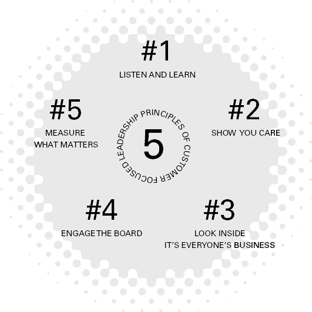
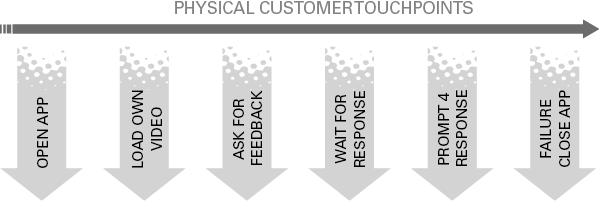
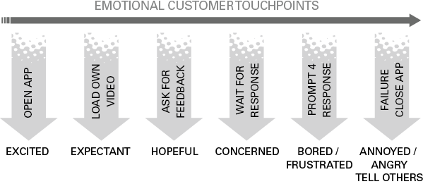
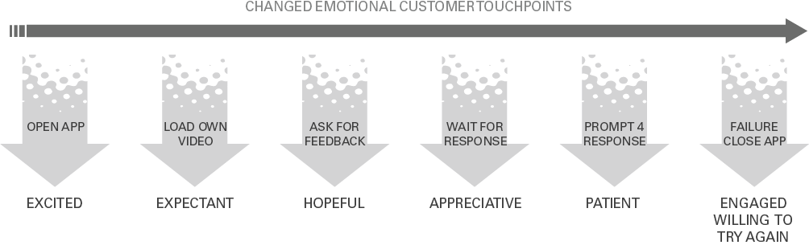
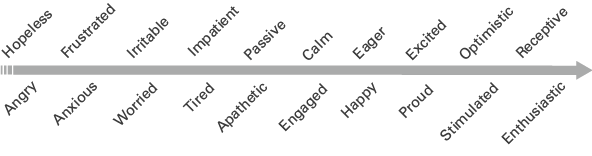

# 成为以客户为中心的领导者，真的！

## 简而言之

许多领导者敦促他们的员工将客户置于他们所做一切的核心位置。然而，尽管充满激情和信念，真正的客户关注仍然难以捉摸，体验包含在数据处理中，而不是人际互动中。本章概述了使客户体验人性化的五项原则，为您提供实用指导，使其在您的组织中成为积极的现实。
*本章是在以客户为中心的领导力专家 Jo Hale 的宝贵贡献下完成的，他在全球呼叫中心转型、影响董事会层面的战略决策和激励公司为客户服务方面的行动方面拥有 25 年的经验。

## 有什么问题？

这是一个假设的场景。

> **案例分析**
> ‘Glow!’ 是一家专门从事女士运动服的零售企业。在他们的网站上发布了四个价值观，在整个企业中都可见，并向所有员工强调： 思考客户；在一起更好；充满激情；推动创新。根据这些价值观，决定重新推出他们流行的瑜伽应用程序并使其真正与客户互动，以便客户可以发布自己的瑜伽课程并接收有关其进度的实时反馈。 IT 团队对该产品非常满意，已完成最后期限，并获得了用户的早期积极反馈。
> 然后 Covid-19 大流行蔓延，迫使人们在室内做更多的单人瑜伽。对该应用程序的反应异常激烈，牵引力的增加超出了所有预测数据，但功能开始出现问题，客户在登录和接收反馈方面遇到问题。呼叫小型联络中心的电话增加了 67%。每个团队对客户的反应都有不同的反应，没有“联合”的解决方案。以下是部门反应的快照：
> IT 团队对他们的产品充满热情，并认为这是一个“巨大的胜利”。
> 客户呼叫中心团队人手不足，而且被电话淹没。他们需要更多资源并需要临时员工。
> HR（人力资源）认为呼叫中心的人数很多，无法增加。
> 由于零售店的问题，财务部门希望削减成本，并且不赞成雇用更多员工。
> 管理层决定切断电话，仅通过电子邮件回复客户，让他们知道他们将在 28 天内收到回复。
> 客户将他们的情绪反应从“兴奋”转变为“沮丧”和“恼火”。
> 在没有回应的情况下，客户会在社交媒体上发布他们的负面反馈，警告其他客户不要使用 Glow！
> 客户 NPS（净推荐值）得分直线下降。
> 董事会注意到了。他们的奖金与 NPS 分数挂钩。现在是关键业务！
> 聘请了一名顾问，他会重新打开电话，雇用临时员工，清除积压工作并使 IT 恢复功能。三周之内，问题得到解决，但信任被削弱，品牌声誉受损，许多客户就这样离开了，再也没有回来。
> 董事会指责管理层，管理层指责人力资源，人力资源指责财务，财务指责联络中心，每个人都指责 IT。

这里有一个悖论。虽然业务中的一切都发生了变化，从技术到通信，再到全球化，但对客户而言，一切都没有改变。尽管彼得·德鲁克（Peter Drucker，1954）在大约 60 年前写下了他那句臭名昭著的话，“企业的目的是创造和留住客户”，但许多企业仍在努力理解这个基本概念。
是的，您需要优质的产品，但最重要的是，您需要一种能够提高忠诚度和建立长期关系的客户体验，在他们收到产品或体验您的服务之前就开始，并贯穿整个生命周期。客户仍然希望能够轻松找到、使用（和退回）您的产品和服务。他们想与您互动，有时会看到您。他们喜欢按需升级的机会，并根据关系区分他们的体验。他们想要互动和可控的体验，他们想知道自己很重要。这没有改变。
但是，组织中的领导者很容易脱离客户的现实，像上面的例子一样在孤岛中运作。尽管领导者劝告他们的追随者将客户置于他们所做一切的核心，通过文化模型刻画在血液中，但客户通常只不过是数据——要向上报告的投诉数字、流失率或保留率、利润标记，或行为经济学家的视觉效果。客户在那里被测量、映射和建模——并被塑造成组织形态。

## 大理念：使客户人性化！

为防止上述情况在您的组织内重演，您需要勇于将客户体验带回基础。五项原则是以客户为中心的领导力的核心。这包括让自己沉浸在客户旅程中，拥抱情感体验（内部和外部）并将其与业务战略和衡量标准联系起来。
图 8.1 以客户为中心的领导力五项原则

## 原则#1：倾听和学习
每天您都会听到有关客户的信息。你听吗？你帮助别人倾听吗？
与以客户为中心的领导力互动的第一个阶段是自我教育。在您接受后来的战略和衡量原则之前，请退后一步，站在客户的立场上。使用以下问题来反思您当前的意识水平。
您的目标是了解成为客户的感受，并与体验的情感联系起来。这不是一些敏感的笨蛋——客户体验是您业务的支柱，而不是一种放纵。在这一点上值得强调的是，“客户”是指您的内部客户，也包括外部客户。
回答以下问题后，请与您的团队分享您的学习成果。不要让这成为一个责备游戏：“好吧，如果不是为了销售/人力资源/IT/ExCo*（*在适用的情况下删除），我们会没事的！”这是关于倾听和学习。当您的客户与您的企业互动时，他们会说什么、感觉和做什么？然后与您的高级领导团队分享您的学习，并要求他们回答相同的问题。共享的学习经验对于了解客户将是非常宝贵的。

## 反思时间

### 您对客户的了解程度如何？

1. 今天从您的组织购买是什么感觉？ （我的意思是字面意思 - 从您的组织购买，给联络中心打电话，报告服务问题，退回产品。）
2. 从客户的角度来看，什么是容易的，什么是障碍？
3. 本周您从客户那里学到了什么教训？
4. 您希望客户在与您互动时感受到什么情绪？
5. 客户流失的根本原因是什么？ （他们去哪里？）
6. 关于以客户为中心，您奖励哪些行为？
7. 阻止面向客户的团队为客户提供优质服务的最令人沮丧的障碍是什么？
8. 您个人为提高客户体验质量所做的最后一件事是什么？
9. 客户在您的领导会议中处于什么位置？
10. 您多久在领导会议上讨论内部客户关系并解决孤岛心态？

## 原则#2：表现出你的关心
让我们通过考虑您的客户对您的组织的情感体验来开始回答您对其中一些问题的回答。您的目标是将客户互动从一种交易活动转变为一种情感参与——并将您自己的观点从客户作为数据的一部分转变为值得建立关系的心跳。
与我共事的大多数领导者都了解客户旅程和接触点的语言。也就是说，客户与您的公司互动的所有宝贵时刻，从他们第一次听说您到关系结束。我会更进一步，并建议阅读本章的许多人将制定客户旅程，包括关键数据点和支持这些数据点的流程。
但是，当您查看客户与您的关系时，需要考虑两件重要的事情。是的，您可能了解数据接触点，但是在此过程中客户在哪里？真正重要的不是客户做了什么，而是他们说什么以及他们的感受。这很重要，因为情感体验将推动忠诚度和信任度——最终决定您的净推荐分数（或您自己的客户满意度衡量标准）和回头客。
真正重要的不是客户做了什么，而是他们说什么以及他们的感受。

Colin Shaw 和 John Ivens (2005) 的著作《建立卓越的客户体验》中的研究指出，69% 的消费者表示情绪占他们所有客户体验的 50% 或更多。这是有道理的，因为作为人类，当我们体验某事时，它会先通过我们大脑的情感方面，然后再进入逻辑方面。而且您会知道，如果您想到自己的糟糕或令人兴奋的客户体验，您的情绪（无论好坏）刺激得越多，就越令人难忘！正如 Shaw 和 Ivens 所说，‘情感是一个主要的差异化因素，是当今企业可用的最被低估的资产。它们可用于将颜色带回我们的灰色世界。
例如，让我们仔细看看我们早期的虚构场景。使用新 Glow 的客户！应用程序可能具有如图 8.2 所示的简单数据接触点。
图 8.2 物理客户接触点

这很有用，并激发了对功能调整的讨论。 但是看看当我们将其与情感体验叠加时会发生什么（图 8.3）。
图 8.3 情感客户接触点

每个接触点的情感体验：打开应用程序 - 兴奋；加载自己的视频 - 期待；寻求反馈——充满希望；等待响应 - 关注，提示响应 - 无聊/沮丧，失败关闭应用程序 - 生气/生气，告诉别人。
现在这是有意义的数据，因为它清楚地显示了有关对客户的情感影响的重要信息——后果。 2013 年，Colin Shaw 写了一篇关于这个话题的有趣博客，标题为“应该改变商业世界的 15 个统计数据——但还没有”，其中包括以下四个相关统计数据：
需要 12 次积极的经历才能弥补一次糟糕的经历。
与企业的负面互动传播到的人数是正面互动的两倍。
获得新客户的成本是保持一个现有客户的成本的六倍多。
对于每一个抱怨的客户，还有 26 人没有说出来。
Glow 的明显答案！是修复应用程序的功能。但有时这在不久的将来是不可能的，所以先解决情绪影响。不要在修复应用程序时关闭手机，而是重新打开手机，让人们与客户交谈并专注于情感影响。是的，这在短期内可能会让您花费更多，但总比在您等待技术修复时失去客户要好。因此，在情绪影响变成负面之前打断它，要知道如果您让客户参与进来，人们会更理解他们的反应。
图 8.4 变化的情感客户接触点

每个接触点改变的情感体验：打开应用程序 - 兴奋； 加载自己的视频 - 期待； 寻求反馈——充满希望； 等待响应 - 感激，提示响应 - 耐心，失败 关闭应用程序 - 参与，愿意再试一次。
试试这个
这是我与许多领导者一起进行的快速、有用的练习，因为他们探索了客户服务的情感影响。
图8.5 客户情绪

从左到右：绝望、愤怒、沮丧、焦虑、易怒、担心、不耐烦、疲倦、被动、冷漠、冷静、投入、渴望、快乐、兴奋、骄傲、乐观、刺激、接受和热情。
查看图 8.5 中的情绪列表。
通过 4/5 的客户接触点，从内部或外部的客户旅程中分一杯羹。
在客户旅程的每个阶段，您希望客户感受到什么？
根据您的经验或研究，客户有何感受？
如果存在负差异，您的部门控制了哪些行动？
您可以采取哪些小行动来改变内部或外部客户的体验？

## 原则 3：向内看，这是每个人的事

“许多手使工作轻松”是我妈妈最喜欢的短语之一，基本上是在敦促我和我的兄弟姐妹摆脱流浪汉并做一些清理工作。鉴于技术和变革的蓬勃发展和不断加快的步伐，您会认为妈妈的话是显而易见的解决方案，将功能整合在一起并寻找新的协作方式和执行完美的客户体验。然而，令我惊讶的是，组织之间存在根深蒂固的孤岛，Glow！
要测试组织内孤岛的强度，请向多个职能部门的不同人员询问以下问题：
谁拥有客户体验？

如果您的回答是“我们都这样做”，那么欢呼吧！如果答案范围从“不知道”到“销售……客户服务……投诉团队”或更糟的是“不是我”，那么您就有了“孤岛综合症”。在这里值得一些自我反省。如果你发现自己说：
我不制定策略
我不定义客户体验
我不参与客户旅程
这不是我的问题
那么你就是问题的一部分。
众所周知，外部客户从您的组织获得的体验是内部体验的直接反映。使用嵌入式孤岛，外部体验将被打破——您在流程解决方案上投入的金钱不会改变这一点。通过跨职能的流畅沟通、共同的目标和对客户的承诺，您就有机会改变体验。客户当然不关心您的孤岛或权力斗争。他们想要一种满足他们期望的无缝体验（偶尔也会让他们高兴）。
答案在于共享的端到端所有权。专注于“修复”单个接触点可能会扭曲客户的看法。正如客户体验专家所建议的那样（Rawson 等人，2013 年）：
大多数客户不会厌倦任何一个电话、实地访问或其他互动。事实上，他们不太关心那些单一的接触点。提高满意度的东西很少有公司能够管理——随着时间的推移，跨多个接触点和多个渠道的累积体验。

### 实践灵感#1
#### 用两个想法粉碎筒仓

1. 分散孤岛和创建共享所有权的最快途径是通过共享指标。也就是说，整个企业的每个人的目标都与 NPS 分数或客户满意度测量相关联。
2. 通过共同理解，让整个组织参与重新设计客户体验。 Jo 多次领导这项工作取得了巨大成功，从董事会层面跨越了组织的各个层面：
    1. 让团队中的每个成员在呼叫中心坐至少几个小时。听取客户电话，听取问题并记录潜在的解决方案。将团队聚集在一起进行共享的客户体验会议并提出三个问题：
        1. 作为一个团队，我们如何为客户的问题做出贡献？
        2. 作为一个团队，我们如何为这些问题提供解决方案？
        3. 我们可以做的最简单的事情是什么才能产生最大的不同？
            然后向您的内部客户提出同样的三个问题！您的勇敢将获得宝贵数据的奖励，以改善您的团队内部运作方式。

## 原则 4：让董事会参与
每个客户领导者都在询问如何更有效地影响董事会，以便他们能够进行投资以解决功能问题、招聘合适的人员、增加产品供应并最终改善为客户提供的服务。从领导力的角度来看，将思维方式从数据分析转变为人性化客户互动。 Peter Massey (2018) 领导一家客户体验咨询公司并建议，“一旦高级管理人员与客户使用相同的语言，就很难忽视客户寻求帮助的挫败感，并且会发生文化转变”。

### 实际灵感#2

与董事会互动的六种方式
您的董事会可能完全沉浸在客户数据中（可能是投诉、服务水平或保留人数），但这不是人！那么你如何让客户活着呢？以下是实现这一目标的六种久经考验且值得信赖的方法：

1. 在董事会会议上进行实时客户电话会议，并就他们在电话会议中注意到的三个常见因素进行讨论。
2. 影响高层领导亲自打电话或拜访客户：加入呼叫中心、上报团队或投诉团队。深入了解客户希望你做什么，而不是你想对客户做什么。
3. 向董事会介绍客户。有抱怨的客户和满意的客户。让他们谈谈他们的经验，什么是有效的，反之亦然。
4. 让每位高级领导者都参与到实际的客户购买过程中。边走边聊。
5. 让高层领导参与到组织中谈论客户。敦促他们写博客、视频博客，以表达他们的关心。
6. 向您的高层领导展示所有可用的客户指标。一起选择一个与业务战略相关联的单一指标，并将其公开并为所有人所有。

## 原则 5：衡量重要的事情
这是一个常见的场景：一家公司选择“取悦客户”作为战略目标，并决定使用客户调查分数来跟踪进度。调查确实告诉了经理公司如何取悦客户，但不知何故，员工开始认为策略是最大化调查分数，而不是提供出色的客户体验（哈里斯和泰勒，2019 年）。当呼叫时间被测量为体验下降和 NPS 随之下降时，这是呼叫中心的常见结果。
在以客户为中心的组织中，有一种日益增长的趋势，即删除阻碍客户体验的衡量标准。我在我们的培训组织中的经验当然是课程结束时的评估分数破坏了体验。由于客户要求在课程结束时获得 80% 以上的“快乐”分数，因此培训师专注于“愉快的时光”，不再提供具有挑战性但令人兴奋的体验。一旦立即测量被取消，取而代之的是在计划后一个月进行更真实的内部测量，体验就会全面增加。
不要误会我的意思。我并不是说衡量是一件坏事，因为它通常是了解您的环境、结果和战略目标交付情况的唯一方法。指标提供方向，可以指示所需的行为和行动。但是你必须决定你想要从你的测量中得到什么样的预期结果，以及它是否会阻碍或帮助客户。
因此，请使用以下五个问题来探索您的衡量策略，并确保您衡量的内容具有正确的预期结果。

### 实用灵感#3

#### 五道测量题

在提出这些问题之前，请收集所有客户指标以及用于衡量客户体验的不同指标。流失率/保留率、客户生命周期价值、第一个客户解决方案、客户投诉和满意度得分可能会有很大的影响。然后问：

1. 为什么它们对客户很重要？
2. 哪些衡量标准有助于客户体验，哪些衡量标准会阻碍它？
3. 这种测量在内部驱动什么行为？
4. 对您的业务战略至关重要的一项指标是什么？
5. 您如何在每个级别上进行测量？

## 是时候反思了：把它放在一起

### 以客户为中心的领导实践

Julie-Ann Haines 是 Principality Building Society 的首席执行官，前任首席客户官，为她的成员提供出色的客户体验一直是她领导理念的核心。用她自己的话说，这是她在实践中以客户为中心的领导经验：
“考虑到以客户为中心的领导力，我们面临的一些问题是同事感觉远离客户，无法看到全局并代表客户解决问题。尽管我们一直为我们的客户满意度和以客户为中心感到自豪，但我们最近实施了三项主要干预措施，以改变我们员工的参与度并提高我们的业务绩效。将他们联系起来的是领导力设定共同目标，提供鼓励学习的框架，并授权我们的员工做对我们的客户和同事来说重要的事情。
“首先，我们改变了衡量方法，以便面向客户的同事在我们收到客户反馈后的数小时内直接收到客户反馈。这将反馈从两个月后收到的“营销内容”转变为在同事与其经理之间的辅导会议中非常重要的客户声音。
“其次，我们改变了整个薪酬方法，以便通过相同的简单衡量指标来激励整个组织的所有同事——利润和净推荐值。这激励我们的组织以彼此的方式解决障碍。
“第三，我们授权同事负责整个客户旅程，例如开设储蓄账户。跨越多个部门孤岛的同事一起工作，听取电话、阅读投诉信并分析客户请求的目的。他们利用这种洞察力提出了非常简单的问题，例如“为了满足监管要求，我们必须做的最低限度是什么？”、“是什么阻止我们把事情变得更简单？”或“为什么要向其他团队进行如此多的交接？”我们的系统思维方法引导团队设计了一种新的工作方式，并极大地提高了他们的参与度。它减少了错误的数量，提高了他们的生产力，并改善了我们的核心客户指标。
“总的来说，我们看到我们的 NPS 从 68% 增加到 81%，我们看到我们的参与度从 74% 增加到 85%，我们的一些核心团队在相同的人数下处理的客户请求增加了 100%。”

## 成为以客户为中心的领导者的十大秘诀

1. 每天您都会听到有关客户的信息。听到它并采取行动！
2. 问自己最重要的问题：“作为领导者，我如何影响客户体验？”
3. 让您的团队参与进来，访问明显最佳实践的地方，并在您的团队中树立类似实践的榜样。
4. 你不需要重新发明轮子；您的组织中已经存在辉煌——找到它并复制它。
5. 成为客户的好奇心，并在整个企业中提出很好的问题。
6. 让客户在您的会议中活跃起来。给他们一个座位和一个声音！
7. 同意哪个单一指标是您战略的关键，并使用技术来简化数据、趋势和可见性。
8. 确保措施在整个组织内以及以客户的语言被理解、共享和可见。
9. 让客户满意成为激励每个人的共同目标。
10. 庆祝和宣传积极的客户反馈。