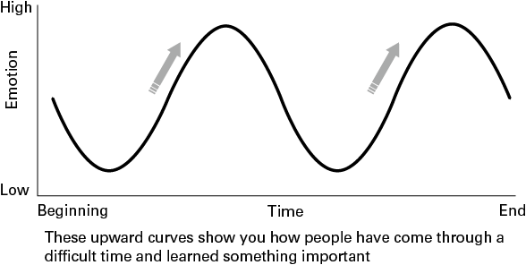

# 基于优势的辅导

在每次对话中发挥团队的优势

## 简而言之

基于优势的辅导旨在帮助个人认识和探索他们做得好的地方，这样他们就可以更有效地表现并在这样做时体验到能量感。由于通过发展优势来利用高绩效，您如何进行基于优势的辅导对话？
成功在于实践，因此在本章中有 50 多个优势教练问题供您提出、回应和反思。

## 有什么问题？

有大量科学证据证实，通过发展优势可以利用高性能（例如 Linley，2008 年；Rath 和 Conchie，2019 年）。然而，三个因素使您在领导力辅导中出奇地难以实现这一目标。首先，进化赋予我们消极偏见，确保我们能够应对任何威胁。也就是说，我们会注意到我们有什么问题，团队正在犯什么错误，或者一天中遇到的困难。当您度过了有趣而积极的一天时，您就会知道这一点，但是当您回到家时，您的谈话可能会集中在恶劣的天气、停车、难相处的人、延迟的会议、过多的谈话等上！
其次，二战后，心理学的广泛领域做出了反应，将资源用于帮助那些患有焦虑、压力和抑郁症的人。学到了很多有用的东西，但这个方向被证明非常“粘”，以至于心理学领域被固定在以问题为中心的“病理学”模型中，该模型贯穿于组织世界。什么对我们来说是“正确的”，或者我们如何开发心理资源以感觉良好和运作良好，直到马丁塞利格曼在 21 世纪之交用所谓的“积极心理学”重新平衡该领域之前，几乎被忽视了。
最后，有一种观点认为，利用优势是脆弱的，甚至是危险的，要实现真正的改变，我们需要抓住弱点。正如 Chamorro-Premuzic (2016) 在他的《哈佛商业评论》文章中所写，“忽视我们的局限性和缺点似乎有点奇怪，甚至在智力上不负责任。我们无法一厢情愿地解决领导层面临的严重问题。
Chamorro-Premuzic 有一个很好的观点，如果教练被用来简单地传递积极的信息而牺牲更困难的对话（见第 10 章）。然而，基于长处的辅导并不是要让人们夸大自己或忽视弱点。这是关于首先关注我们擅长什么。正如 Seligman 在 Flourish (2011) 中所写，“与我们做得好的事情保持联系是改变和发展的准备。”或者，正如我的一位客户最近对我说的那样，这是改变绩效的“金钥匙”他的团队。

## 大想法：锻炼你的教练肌肉

就像你为马拉松训练一样，缓慢但肯定地发展你的体能和肌肉，力量训练也是如此。你必须锻炼和锻炼你的教练肌肉，以便：
你的心态是自信的 +
你倾听长处 +
你有练习的意愿。

### 心态很重要
在任何教练课程之前，您对自己作为教练、过程和其他人的心态最终决定了结果。这很重要。以最近的教练计划中的三个例子为例：
莎拉：‘我是技术专家。我以前没有做过他们的工作。我不知道他们的优势是什么，甚至不知道这是否重要。
纳米尔：‘我们是朋友。我们是 IT 专家。如果我突然开始“指导”他们并“探索他们的优势”，他们会笑。
雷切尔：‘我们太忙了，时间紧迫。告诉我的团队该做什么比依靠教练的优势更容易。我知道我必须这样做……少一点指令，多一点倾听，我只是没有时间。
无论教练模式有多好，所有这三种信念都会对教练的结果产生无益的影响。我理解这里的问题。当然，刚开始时，执教朋友的团队成员会感觉很尴尬，是的，执教需要时间，即使您知道从长远来看它会回报您。无论多么有经验，每个人都质疑他们作为教练的信心。
不要让这阻止你。根据我的经验，即使是最顽固、最愤世嫉俗的同事也会发现优势指导非常有用、相关和实用——即使他们没有立即告诉你！因此，为了获得良好的结果，值得持有以下三种心态：
我们最有潜力的领域是我们最大的优势领域。
只有当我们也充分利用我们的优势时，我们才能通过修复我们的弱点来取得成功。
通过优势进行指导是您可以做的最小的事情，可以为您的团队带来最大的改变。

### 倾听优势

打开任何一本好的辅导书，都会强调倾听；不出所料，因为倾听是参与的关键技能。然而，并不是每个人都擅长倾听优势（同样是消极偏见的影响），而且经常希望提供帮助或给出答案会妨碍良好倾听。同样，我们对问题的兴趣会使我们看不到优势。听力的脱轨可以概括为三种方式：

- 分心
    正如珍妮范胡尔在她的书《听力转变》（2021 年）中所建议的那样，“听力很难，因为我们分心——我们的身体、我们的思想、我们的情绪和我们的环境不断地呼唤“注意我！”。成为一名优秀的倾听者不是魔法或天赋——而是自我意识、纪律和挑战。你必须找到一种方法来消除所有这些噪音。
- 拔河
    我认识的大多数领导人真的很想给出他们的建议！你可能会认识到这一点。会发生的情况是，您从问一些很好的开放性问题开始：“您如何解决这个问题？”“接下来您想做什么？”等等，但是当您听到可以解决的问题时，您就跳入了对话并提供解释、解决方案和答案。教练结束了——我们又回到了管理圈（见第 1 章）。
- 倾听问题
    教练通常接受过以问题为中心的问题的培训，例如，“是什么阻止了你......？”“这里真正的问题是什么？”“障碍是什么？”。这些都是很好的问题，可以阐明过去的问题、障碍和问题，但它们并没有帮助您的同事理解、探索或反思他们的优势。
- 愿意实践
    因此，就像许多领导技能一样，它归结为实践。这里有三个练习，可帮助您学习锻炼您的力量训练“肌肉”。我建议你以三种方式练习：与你的团队一起练习；与您的同龄人和个人。

## 试试这个 #1

### 时间线练习

这是一个非常宝贵的练习，可以提取团队的优势资源，也是我在任何基于团队的教练实践中的起点。
在下周一早上的团队会议上，让每个团队从上周或上个月开始绘制一个粗略的时间表，突出显示高峰和低谷。这可能非常粗糙，如图 6.1 所示：

你可能会被特定的高潮和低谷所吸引，但我希望你专注于你的团队每次都是如何度过低谷的。图中箭头所在的地方，就是足智多谋的力量所在。以下是一些可以练习提问的问题：
我们作为一个团队利用了哪些优势来度过低迷期？
作为一个团队，我们从自己身上学到了什么？
什么重要？什么对我们有用？
未来我们将如何再次利用这一学习成果？
您在此所做的是帮助您的团队认识到他们已经拥有强大的优势资源，他们自然会利用这些优势。一旦认识到这一点，它就可以在未来重复。非常强大的学习。

## 试试这个 #2

### 发现优势

与同伴结成伙伴，并要求与他们分享基于优势的引导式对话。无论哪种方式都只需 15 分钟。专注于提出问题（而不是聊天），倾听优势并反思信息以提出进一步的问题。这个练习有两个有启发性的结果：a) 专注于提问、倾听和反思很难但值得，b) 通过关注同事的长处，你会学到很多关于他们的知识。
以下是我要练习的 10 大优势问题：

1. 是什么让您觉得自己在工作中度过了成功的一天？
2. 当你感觉最好的时候你在做什么？你认为为什么会这样？
3. 你什么时候感觉最有活力和活力？
4. 你在工作中在多大程度上利用了你的优势？
5. 你如何在工作中更大程度地利用你的优势？
6. 什么让你感到自豪？
7. 你会说你最热衷的是什么？
8. 你能描述一下享受这种激情的感觉吗？
9. 你什么时候觉得“真实的你”出来了？
10. 当你表达“真实的你”时，你会发现自己处于哪些情况？

### 试试这个 #3
### 拨上/拨下

我鼓励您向您的团队引入优势心理测量，例如克利夫顿优势人才评估、强度范围工具或 VIA（行动中的价值观）品格优势调查，后者是唯一免费提供的一项强大的证据基础（第 12 章列出了这些优势）。或者，您可以从我的网站上为您的团队提供一包优势卡片。
一旦此人选择了他们的最大优势（以及他们的中到低优势的想法），请支持他们通过以下问题反思他们的发现。这里的目的有三个：a) 帮助个人认识到他们最大优势的力量，b) 将其与他们在工作场所的表现联系起来，以及 c) 学习如何发挥他们的优势。

#### 顶级优势：

- 你什么时候使用你的最大优势？
- 每种力量都能为您提供什么？
- 这种力量让你感觉如何？
- 你还能想到什么其他新颖的方式来使用这种力量来为你服务？

#### 工作场所：

- 你在工作中如何充分利用你的优势？
- 你还能如何在你的角色中利用你的优势来激励你？
- 你的优势在哪些方面没有得到利用？这怎么能改变呢？
- 作为您的经理，我如何在工作中更有效地发挥您的优势？

#### 拨上/拨下：

- 本周你想通过什么力量来帮助你应对你所面临的挑战？你怎么能拨号呢？
- 本周你需要什么力量来降低，这样你才能更有效地面对你的挑战？
- 你有什么力量可以通过拨号来改善你与“X”的关系？
- 你可以拨出什么力量来加强这种关系？

## 实际灵感

### SABAT——教练模式
在承诺练习之后，您如何通过从头到尾进行基于优势的良好辅导对话来整合这种学习？ 如果您不熟悉教练，请从头开始练习此模型。 如果您是一位经验丰富的领导力教练，请查看 SABAT 的“B”，以便通过建立积极的方面并扩大他们的知识来补充您现有的实践：

- 设置
- 同意
- 建立和扩大
- 确认
- 采取行动

图 6.2 SABAT 教练模式

#### 设置

对于任何教练对话，在开始之前都需要问自己三个基本问题。优势工作也不例外：
我确定这是辅导谈话吗？ （或者我只是想引导他们做出我的决定并告诉他们该怎么做？）
我们的个性风格有何不同？ （这意味着我需要调整自己的行为以获得积极的结果？）
我的意图是积极的吗？ （我的状态是否适合进行这次谈话？）

#### 询问并同意

开放式问题是任何教练对话的基石。所以，如果你刚开始执教，只需坚持“如何？”或“什么？”。如果你发现自己在问，“你不觉得……？”你在引导对话。回到上面的问题（和第 1 章）并检查您的意图。
这个阶段的主要目的是询问并同意对话的界限，以及被教练者期望的结果。将此对话视为合同，并且是保持对话正常进行的重要起点。在基于优势的教练中，您要求被教练者仔细考虑他们希望通过教练带来的差异：
你想从哪里开始？
在这次谈话中，关注什么最有用？
今天什么会给你带来最大的价值？
您希望通过我们的指导有什么不同？

#### 建立和扩大

这个阶段非常简单和微妙，但会对你的领导力教练实践产生真正的影响。不是从基于问题的问题开始，你的起点是建立在积极的基础上，首先请某人思考已经有效的方法：
这什么时候适合你？
这什么时候对你有用了？
您以前在哪些方面取得了成功？
你做了什么不同的事情？
在他们的著作 The Solutions Focus（Jackson 和 McKergow，2006 年）中，作者建议在这个阶段添加一个量表，这为你和另一个人提供了一个进步的基准。如果你想使用一个量表，请让对方用一个量表给自己打分，10 是理想的结果，0 是相反的结果。然后询问个人为达到该数字他们已经成功完成了哪些工作。
这个阶段非常重要，它分为两部分，第二部分是扩展你的知识。此处的目的是通过寻找可以为该潜在解决方案增加价值的其他人来帮助个人扩大能力以增强其能力：
还有什么作用？
谁已经在组织中这样做了？
谁会是一个好的榜样？
我能提供什么帮助？
将此阶段视为在教练对话中增加广度和深度。

#### 确认

这是一个小阶段，经常被跳过，但对你的优势练习的成功来说是无价的。你不仅肯定了这个人的足智多谋选择、广阔的思维和积极的方向，而且表明你已经倾听并能反映他们的语言：
我听到的很棒……
我真正喜欢你所说的是......

#### 采取行动

在这个阶段有一些具体的问题要问。首先，小步骤很重要！如果您正在使用体重秤，只需向前轻推一步。如果没有，请问下面的问题。记住要找出进步的外观和感觉——对他们自己和他人。并注意最后一个问题：“你希望我如何进一步支持你？”最后，请记住，教练赋予他人所有权和自主权。因此，了解他们希望您如何查看他们的进度：
哪一小步会让你积极向前（朝着你想去的方向）？
什么动作会让你在秤上前进一个数字？
你想下一步该做什么？
您将如何注意到取得的进展？ （其他人会如何注意到？）
你希望我如何进一步支持你？

### SABAT 实践
J 是一位新的高级领导，这是她上任的第一个月。 J 具有善于表达的个性，易于交谈并且愿意接受指导。 以下是您与 J 对话的基本内容，右侧是 SABAT 的各个阶段。

在结束本章时，最后说一下审查进展情况。进步是我们动力的基础，也是任何力量训练理念的核心。由您来注意到进步、奖励进步并庆祝成功。

## 基于优势的教练的十大秘诀

1. 在你的指导下，从人们已经拥有优势资源的前提开始。通过你的问题找出它们是什么。
2. 练习倾听优势。与您的团队、同事和同事一起工作。要求进行基于优势的对话，直到您的注意力自然转移。
3. 将您的语言从问题转移到解决方案的重点。而不是“为什么会出错？”，而是转向“什么时候会正确？”
4. 带着你的问题，想想广度和深度。通过建立在积极的基础上来扩大广度，通过拓宽知识来扩大深度。
5. 成年人需要欣赏。肯定他们的答案并奖励个人通过自主思考问题和解决方案。
6. 避免“Tug of Tell！”坐下来，克制自己，再问一个问题。
7. 小步骤很重要。鼓励你所指导的人做出最小的改变以获得最大的结果。
8. 进步是动力。注意它，奖励它并庆祝它。
9. 定期自我评估自己的进步。你今天帮助某人提高他们的表现了吗？您是否提出了使某人能够发挥其潜力的好问题？
10. 你承认并承认某人的成就吗？您是否关注某人的未来潜力？
11. 继续做有用的事（停止做没用的事！）。