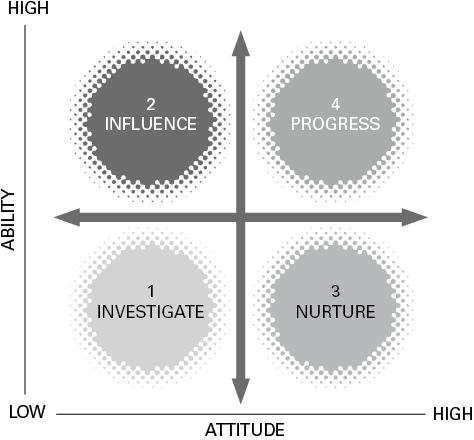
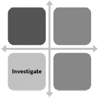
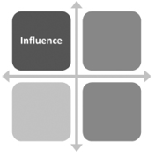
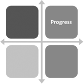

# 通过进步计划实现您的继任

## 简而言之

进步不仅仅是证明自己的表现和潜力。出色的领导力不仅在于让团队中的人能够成功并在组织中取得进步，还在于你放手的能力。本章将带您完成一个进步指导计划，以在您的团队中培养个人，为您的下一个职业章节腾出空间。

## 有什么问题？

你如何回答以下问题？
至少在您自己看来，您是否选择了一位或多位潜在的继任者？

这是罗伯特·卡普兰 (Robert Kaplan) (2011) 对领导者提出的关键业务问题之一，他直接进入了继任的核心。令我惊讶的是，很少有领导者能够对这个问题给出肯定的答案，也许是低估了潜伏在没有为您制定继任计划或没有为您的团队制定发展计划的问题。没有之一，问题可以用一个词来概括——“卡住”：
如果没有继任者（或广泛且可能不必要的外部搜索），您将无法向上移动。
即使您是新职位，如果没有继任计划，您也不太可能像应有的那样广泛授权，扼杀您自己的战略行动能力。
您的团队同样陷入困境，因为如果没有您的继任计划，他们就不太可能发挥自己的潜力。当我在教练中讨论职业规划时，初级领导者的常见反应是，他们的职业生涯被没有制定发展计划的高级经理扼杀，让他们的团队飘忽不定。
当然，任何人都可以离开您的组织，但这意味着您将失去宝贵的人才和内部能力。

为什么缺乏继任计划？根据我的经验，以下是最常见的原因：

- “我刚到这里！”由于您的非凡专业知识，您刚刚被提升到您的领导职位，但现在是时候让这些专业知识发挥作用并在您的团队中培养批判性思维和领导力——即使他们是你以前的同龄人。这是一项艰苦的工作！当你为获得你眼中的领导地位而奋斗了一段时间时，你才刚刚踏入谈判桌，也许你的自信仍然摇摇欲坠，立即将你的手转向培养他人的感觉是不正常的。到达同一点。然而，这正是你必须做的。
- “感觉自己可以被替换是很痛苦的。” 面对这样一个事实，你是可以消耗的，没有你世界会继续下去，这很痛苦。如果别人更好呢？如果你只是避免思考继承，你的自我就会保持完整。
- “我会考虑的。”你的团队有个人发展计划和目标，现在感觉已经足够了。
- “没有明显的继任者，这有什么意义？”你不明白为什么要在这里付出努力，可能会倾向于外部解决方案。
- “我自己还不知道要做什么。”你自己没有计划，也不知道你的下一步，所以你要做的最后一件事就是发展其他人。
- “你知道，我不会退休！” 长期以来，继任计划一直稳居未来 CEO 准备领域，让整个企业的其他领导者逍遥法外。无论您担任何种领导角色，您都需要制定继任计划，即确定和培养潜在未来领导者以填补关键业务角色的计划。这不一定是关于你的角色，但你确实有责任培养适应性强、有能力的人才，他们可以走多种路线并担任各种可能的角色。
- “我不知道该怎么做。”最后一点很容易，我们将在本章中讨论。其他一切都与您对开发的心态有关，这就是我们将首先探索的内容，然后再将我们的镜头转向您的团队。

## 反思时间

### 你是推动者还是阻碍者？

良好的继任计划建立在从您开始的坚实基础之上。制定一个在纸面上看起来很棒的理论计划几乎没有意义，因为您的团队会发现他们的进展在实践中不像在书面上那样认真。当您阅读上述陈述并考虑自己的立场时，请思考以下问题：

#### 反思题

1. 我对继任的态度如何，这对我的团队有何影响？
2. 我在哪些方面充当了团队进步潜力的“阻碍者”？
3. 我需要做什么来释放和鼓励我的团队的潜力？
4. 我在哪些方面扮演了团队的“推动者”角色？
5. 我怎样才能加强这个领域并确保继任计划的强大？
6. 我的下一步是什么？

### 实际灵感

#### 制定六步发展计划

您的人力资源团队极有可能为您的组织制定了继任计划，人才规划了未来领导者的绩效和潜力。这不会让你摆脱困境！我们在本章中共同探讨的是，您如何通过进步计划让其他人发挥他们的潜力，以便您也能够更上一层楼。
从一开始，让我强调，制定发展计划不仅仅是寻找一两个潜在的人来接替您——现在或将来。这是继承的一方面，但范围很窄。出色的继任计划还涉及培养灵活的领导人才库，这些人才可以在您的组织中担任广泛的角色，可能超出他们直接的专业领域。这些人将随着您的组织的转变和变化而成长和发展，并且对您的业务非常宝贵。 Miecha Forbes (2020) 将其称为“有意的路径规划”，即让您的团队为多个可能的职位做好准备。
将进度计划视为建立和留下学习遗产。当你离开你的团队时，你不会只想留下模糊的回忆，即被你管理的感觉。你想要的是留下伟大的学习遗产——你是引导、哄骗、挑战、培养和资助这些人的领导者。这是您作为领导者的遗产。因此，当您即将退休时，您并没有将您的遗产视为某种东西，而是突然转向——‘救命！我会因为什么而被人们记住？”——把它翻过来，把建立和留下学习遗产作为一个持续的项目，而不是你所有知识和经验的总和。
将进度计划视为建立和留下学习遗产。

图 15.1 以一个简单的矩阵开始您的进度计划。但是在开始使用它之前，您需要先做一些基本的工作。

#### 第 1 步：重置

设定期望是领导力的基础。想象一下，你加入了一个新团队。你注意到他们在不同的领导下多年来建立了自己的习惯和行为，你想建立自己的方式。你的第一项工作是重新设定期望，设定好的外观并建立团队的行为界限。
试试这个
您可以通过与您的团队一起完成四项陈述来做到这一点：
这个团队的目的是……
该团队通过……增加价值
我们通过以下方式在这个团队中表现出对彼此的信任和尊重……
不错的样子……

#### 第 2 步：定义

左下方是调查象限，其中能力和态度都较低。左上角是影响象限，能力高，态度低。右下方是培养象限，能力低而态度高。右上角是进步象限，其中两个能力态度都很高。
您目前如何评估某人的提升能力？如果您主观地这样做，您就不会孤单。也就是说，您的团队成员已经工作多年并且他们的表现很好，他们已经参加了许多课程并接受了在职培训。他们在整个组织中都很受尊重，而且似乎已经做好了准备。
我建议在此处添加一个更透明客观的层，评估“硬和软”技能能力。硬技能（能力轴）将发挥作用，并取决于您的业务和部门需求。软技能（态度轴）通常更难确定，但我会为此提供一些想法。

##### 能力

首先，让我们定义能力轴。在过去的十年中，我领导了几个研究项目来定义卓越领导力的技能。我已经将这些减少到前 20 名。

> 评估领导能力
> 展示洞察力
> 自我意识 对自己的情绪、优点和缺点有一个清晰而现实的了解。
> 自信 以坦诚和开放的方式进行沟通，并乐于接受不知道答案或犯错的情况。
> 诚信 具有人们可以认同和相信的有意义的价值观。
> 学习者 对发展需求承担个人责任，定期学习。
> 练习弹性
> 乐观 通过采取乐观的态度，即使面对挫折，也有继续前进的精神力量。
> 自我调节 了解个人触发因素，并能够控制自己的情绪和情绪冲动。
> 观点 提供观点，能够在危机中表现得冷静冷静。
> 能量 照顾好自己的身体并管理自己的压力水平。
> 激励他人
> 清晰 清晰地沟通，让复杂的事情变得简单。
> 激情 对您的业务表现出真诚和真正的兴奋。
> 包容性 通过以诚实和独立的方式表达自己的观点、倾听他人的意见并接受不同的观点来推动协作。
> 信任 营造一种信任和开放的氛围，在这种氛围中，人们因说出自己的真实想法、感受和信仰而受到重视，并且可以这样做而不必担心受到批评或判断。
> 行动起来
> 成就者 被驱动去实现并展现出一种不屈不挠的能量来把事情做得更好。
> 重点 与团队合作，制定一系列重点关注能源和资源的优先事项。
> 步调 为企业提供步调、动力和行动动力。
> 不确定性 能够应对不确定性，并根据模糊和复杂的数据做出决策。
> 为团队赋能
> 教练 通过发展计划、辅导和指导帮助他人在职业上成长。
> 委派 让别人发光，带头，自主操作，不犯错。
> 反馈 在需要时做出艰难的决定，不要让棘手的情况无人理会。
> 同情心 对他人真诚地感兴趣，并对他人表现出关怀和同情心。

### 试试这个
在开始与团队合作之前，我建议您先探索自己的技能。查看这 20 个领导力因素中的每一个，并在每项技能上给自己打 1-4 分：
1 = 您很少表现出这种行为并将其视为发展需要。
2 = 您有时会这样做，但方式不一致。
3 = 您始终在高水平上展示此行为。
4 = 这是一种非凡的力量，您被视为他人的榜样。
分数解读：

#### 20-39 之间

你仍然需要努力提高你的领导能力。好消息是这个分数不是固定的，你可以通过学习来增加这些技能。在工作、家庭和社区中更多地使用这些技能，您将成为周围人的真正资产。你可以做到，现在是开始的好时机！

#### 40-59 之间

作为领导者，你做得很好，你有潜力做得更好。虽然您已经建立了有效领导的基础，但这是您提高技能并成为最好的人的机会。检查您失分的领域，并确定您可以做些什么来发展这些领域的技能。

#### 60-80 之间

优秀！你正在成为一名伟大的领导者。然而，领导力总是有改进和学习的空间，因为你永远不会太有经验，所以看看你没有给自己最高分的领域，找出你可以做些什么来提高你的领导力。
通过以下问题增加您的反思：
你的强项是什么？
你的弱点是什么？
如果您要优先考虑发展领域，您会如何对它们进行排名？
你可以采取哪些简单的步骤来加强你的技能？
当您熟悉这些技能时，开始评估您团队的能力。这作为相互对话会更好地实现，您可以使用这四个相同的问题来指导您的教练对话。

#### 态度

因此，您现在已经为模型的能力轴设置了一些客观性。现在让我们转向 Attitude 轴。评估“态度”是主观的。您正在考虑发展的动力、心态和意愿。以下是如何在您的团队成员中发现良好态度的方法：

1. 使用的语言。语言是如此有力的态度指标。听听这个人如何谈论他们的角色。他们是否使用诸如“必须”、“为”、“必须这样做”之类的词？或者他们会选择诸如“想要”或“喜欢”之类的语言吗？这会给你一个信号，表明这个人是外在动机还是内在动机（你可以在第 5 章使用动机量表阅读更多相关内容）。
2. 他们选择承担的任务超出了他们工作职能的严格界限。
3. 他们给别人的帮助。
4. 愿意在需要时“超越”，表现出承诺。
5. 他们对错误的反应，对失败持有成长心态。

### 第 3 步：了解
#### 象限 1：调查

能力低下
低空
每当领导者制定他们的晋升计划矩阵时，我常常担心放在象限 1 中的人会因为“招聘不佳”而被注销。我的第一个问题是，“你是在这种状态下把这个人带进这个团队的吗？”这不太可能，所以发生了什么？你在这里的第一阶段是调查。是什么导致这个人在第一象限？查看第 4 步中的辅导问题，了解与此人的前进道路。在做出决定之前，请寻求了解。

#### 象限 2：影响

能力强
低空
在之前的职业生涯中，我担任欧洲最大的销售培训机构的培训总监，每月负责为他们的新销售职位培养大约 50 名毕业生。不可避免地，每个月都会有一两个毕业生需要我所谓的“有影响力的聊天”。这些毕业生很聪明，能力很强，有可能成为他们组织未来的销售明星。他们的能力被他们的态度所损害，要么“扮演小丑”，要么迟到，对学习漠不关心，总是把别人拖进他们的游戏。 “影响聊天”总是遵循一个非常简单的公式，如下所示：
你有很大的能力，有能力就有力量。
你有选择。
你可以选择消极或积极地影响他人。
目前你选择了前者，这对他人有不利影响。
造成这种情况的原因是什么？
你需要怎样选择积极地影响他人？
如果你选择这条路，你就有成为超级巨星的潜力……
通常这是一个梦想，人们在职业生涯的早期就认识到他们的影响力，并选择永远使用这块肌肉！
你团队中的人最终进入第二象限的原因有很多。也许他们想要你的工作？还是不同的领导？也许他们已经不再喜欢你的公司或职能，或者他们只是无聊？
你在这里的第一阶段是调查和影响。除了我在下面建议的指导问题外，您还需要给象限 2 中的个人强烈反馈。如果他们的负面影响控制了团队，他们可能会成为变革方向的破坏性力量。

#### 象限 3：培育

能力低下
高姿态
通常，象限 3 中的个人对他们的角色不熟悉，目前无法在工作中表现出色。但他们的态度很好，这对未来的潜力是无价的。
你在这里的第一个阶段是培养。培养能力，培养态度。

#### 象限 4：进展

能力强
高姿态
第 4 象限中的个人已准备好取得进步，而您的工作是实现这一目标。当您将某人培养到高绩效加上坚定的态度时，请帮助他们挺身而出——引导、挑战、委派和鼓励他们的进步。最重要的是，不要挡着这个人的路！

### 试试这个
#### 你的团队在哪里？

- 将您的团队置于象限中——您认为您的团队在计划中处于什么位置？
- 重要的是，与团队的每个成员进行相互对话，并使用下面的指导问题来指导这次对话。 明确你的期望。
- 有时，如果您的评估不同，您需要为艰难的对话做好准备。 好好组织这个对话（有关这方面的帮助，请参阅第 10 章）。
- 共同制定进步计划。 从第 4 步中的辅导问题开始。

### 第 4 步：开发

以下是一系列辅导问题，可帮助您制定升学计划：
象限 1：调查

辅导问题：
你为什么认同这个象限？
你的职业生涯在这里发生了什么？
为什么你的动力下降了？
你想做什么？
你需要什么支持才能做出改变？
象限 2：影响

辅导问题：
你想成为什么样的网红？
你认为你对球队有什么影响？
您希望对团队产生什么影响？
什么会激励你接下来学习？
你想负责什么？
象限 3：培育

辅导问题：
你需要什么培训来提高你在这个职位上的能力？
你怎么学得最好？
你想从我那里得到什么支持？
你多久想要一次教练？
团队如何为您提供最好的支持？
象限 4：进展

辅导问题：
你理想的下一步是什么？
你需要我提供什么帮助才能到达那里？
您对赞助商/导师或教练有什么想法？
你现在还有什么想做的事情会挑战你吗？
什么能让你足够伸展以帮助你迎接这个新挑战？

### 第 5 步：构建
辅导只是您的进步辅导计划的一个要素。如果您对继任很认真，那么通过使其成为团队日常运作的核心和自然来建立学习遗产也是值得的：
在会议上，表现出好奇心并对完成熟悉任务的新方法持开放态度。
要求团队成员每个月选择新的学习主题，并鼓励思维的广度。
使学习自我导向。给予团队成员自主选择学习计划的权利。
鼓励跨职能角色互换，以发展组织知识的深度。
使学习范围比手头的工作职能更广泛。
确保您的高级团队成员得到贵组织高管层的赞助和指导。
以身作则学习行为，为团队带来新的想法。
在您的会议中，提出更广泛、更具挑战性的问题。 Jon Hagel (2021) 坚持认为，伟大的领导力就是提出更好的问题，例如，建议：
什么是可以创造比我们过去提供的价值更多的改变游戏规则的机会？
我们的客户有哪些新出现的未满足需求可以为全新业务奠定基础？

### 第6步：放手！
我热切希望您的团队不会急于让您离开！但是，我确实希望他们为您的离开做好准备。你已经建立了一个自主学习的团队，他们从你的领导中受益，他们正在迈向令人兴奋的新牧场，有人准备接替你。现在你必须放手。你怎么知道是时候放手了？
如果你对自己诚实，那么你的角色就没有什么挑战了。
你没有学到任何新东西。
人们在问你下一步的计划。
你的动力正在下降，你的好奇心正在激起！
您会发现自己正在扫描工地或与猎头公司交谈。
有人在等着你来担任你的角色。
你不去是因为你害怕。
这些都表明是时候勇敢地采取下一步行动了。成为组织内的推动者，而不是阻碍者，并知道您正在建立和离开一个学习遗产，这将受到您的追随者的重视。如果您质疑自己未来的目标，请阅读下一章，以帮助您反思幸福、意义以及是什么让您的生活值得一过！

## 升学计划的十个重要提示

1. 从担任领导职务的第一天起就开始制定发展计划。
2. 使进步计划成为一个透明和相互的过程。与您的团队进行对话，了解您如何才能最好地支持他们取得成功。
3. 推动团队学习文化的榜样行为，产生洞察力。
4. 推动学习的自主性，鼓励自我导向的广度和深度。
5. 您团队中的每个人都需要与您不同的方法。在您的升学计划中保持灵活和支持。
6. 从很好的问题开始，激励人们在需要时寻求帮助。
7. 播下您的才华，从沙漠到绿洲。继任计划很重要。
8. 使您的团队能够提出解决方案并支持他们的努力。他们越闪耀，你就越闪耀。
9. 如果您发现自己与团队成员进行了多次“困难”对话，这是由于进展计划不佳，缺乏明确的期望造成的。
10. 知道什么时候该放手了。成为帮助他人并因正确原因而被人们记住的领导者！