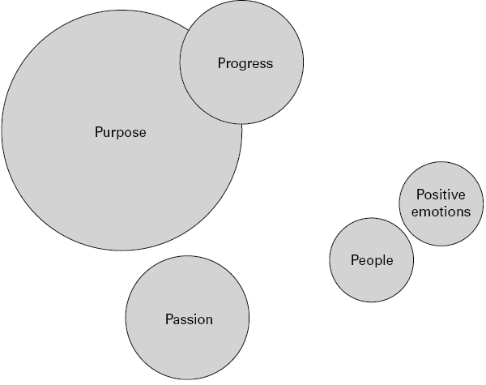
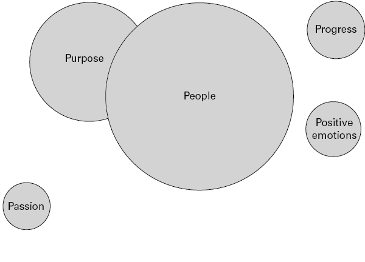

# 暂停
对幸福和领导力的思考

## 简而言之

你的幸福很重要。除了将成就卓著的领导者与高绩效团队联系起来的科学之外，反思您的生活评估以及您选择将时间投资在哪里也同样重要。幸福是关于目标、参与、人、取得进步和感觉良好，本章考虑如何在这些元素之间实现重要的平衡，让自己永远更快乐。

## 有什么问题？

幸福和领导力这两个词有一个有趣的难题，除非我们谈论哲学或自助，否则它们很少被同时提及。如果你浏览一些更熟悉的关于领导力的书籍的内容，幸福这个主题几乎看不到。
我得出的结论有两个原因。首先，许多人认为幸福是一个站不住脚的话题，与诸如战略和创新等更强大的领导力主题不相上下。当领导者说他们要去学习“战略领导力”时，你不会发现他们遭到嘲笑。但是试着用幸福做同样的事情。作为一个放弃几年攻读积极心理学硕士学位的人，我可以保证怀疑论者的兴起——“幸福？......你没有更好的时间来做吗？......两个年？我会给你几本书，你会在一个晚上完成’等等！诚然，这是十年前，随着人们对积极心理学科学的接受正在发生变化，但是当与“领导力”相结合时，“幸福”这个词仍然会随波逐流。
真的很奇怪。因为如果你问任何父母他们想要他们的孩子什么，第一句话通常是，“我只是想让他们快乐。”所以，这对我们的孩子来说很重要，但对我们自己或当我们处于领导他人。
第二个原因是，对于许多领导者来说，研究幸福感是自私的或与他们的角色无关。在你的职业生涯中，一个伟大的领导者可能会通过仆人式领导帮助他人发挥潜力并赢得追随者，而不是以幸福的名义追求个人道路，这可能是你职业生涯中反复出现的主题。鉴于时间是您最宝贵的商品之一，您不太可能在这里度过。所以，你留下了一个问题：
幸福对领导者来说真的重要吗？

是的，但你可能直到失去它才意识到它。或许你会在职业生涯中感到飘忽不定，失去平衡，或者处于过渡点。在反思的那一刻，你问自己这个问题，“我快乐吗？”并意识到你不确定答案。事实上，你甚至不确定你是否理解它的意思。
让我们从含义开始。鉴于幸福的概念在文化和哲学上有着不同的历史，因此不可能有一个单一的定义在任何时候都适用于所有人。然而，Sonja Lyubomirsky (2008) 在她的著作 The How of Happiness 中指出，幸福是“快乐、满足或积极幸福的体验，以及一种生活美好、有意义和值得的感觉”。或者，正如积极心理学领域的先驱马丁·塞利格曼 (Martin Seligman) (2003) 所言，幸福生活是一种快乐、参与和意义的平衡。
那么，重要吗？嗯，有相当多的科学（例如 Chan，2009）将快乐、满足和满足的人与更强的免疫系统、创造力、财务成功、积极的关系和弹性联系起来，而积极的领导与高绩效团队相关（你可以阅读更多关于这在第 6 章）。但从本质上讲，幸福是你如何评价自己的生活——积极的评价值得你关注。

## 反思时间 #1

### 你有多开心？
Ed Diener (1996) 是一位领先的幸福科学家，他对幸福领域的最大贡献之一涉及幸福本身的测量，或者 Diener 所说的主观幸福。 Diener 认为，一般来说，如果人们认为他们快乐，他们就会快乐。或者至少，每个人都是自己是否幸福的最佳判断者。他提出了非常简单的问题，包括这四个，您现在可以回答：
在 1-10 的范围内（1 表示非常低，10 表示非常高）：
我会把我的幸福评价为……
当我反思我的生活时，我会将我对生活的满意度评价为……
到目前为止，我已经实现了我想要的生活中的重要事情。
如果我能重来一次，我几乎什么都不会改变。
他在世界各地的工作表明，大多数人是快乐的，而不是不快乐的。少数受访者基本上不快乐，较少比例的人感到沮丧，人们很少会长时间保持兴高采烈或极度快乐。普通人有轻微到中等程度的快乐（平均分 6-7）。在与 Michaela Chan (2009) 的对话中，Ed Diener 得出结论，人类基本上倾向于轻度幸福。
您对这些问题的评分可以总结为您的幸福“设定点”。这是一个心理学术语，用于描述您的总体幸福水平。根据我们的遗传和条件，我们每个人都有不同的情况。一些科学家 (Diener and Diener, 1996) 坚信，虽然您一生中可能会有情绪起伏，但这些都是暂时的。不管生活给你带来什么，随着时间的推移，你的幸福感会反弹到同一点。虽然其他人认为这个设定点是灵活的（Haidt，2006），但我始终站在科学一边，认为生活的技能、才能和特征是可移动的，而不是固定的。所以，把你的幸福能力想象成有一个范围，而不是一个固定点，你可以改变和持续扩展。如何做到这一点是下一节的主题。

## 大想法：重新平衡幸福

幸福是难以捉摸的，你自然追求的许多增加幸福的途径都行不通。通过增加金钱、地位或物质财富来追逐幸福，你会得到一个递减的回报率——我们习惯了我们拥有的东西，然后想要更多（它被称为享乐跑步机）。将自己与他人进行比较，会感到自己的幸福感变差了——这是众所周知的快乐杀手，没有任何好处。总会有人拥有更多、更好、更快或更大（这就是社会比较理论）。
有用的是通过五个因素来探索幸福：积极情绪、激情、人、目标和进步。你是人类，不太可能在所有五个维度上都保持快乐，所以在本节中，我们将探讨如何理解和重新平衡你的快乐。一旦你知道你的幸福为什么以及如何破裂，你就可以负责并采取一些措施。阅读并思考下一节中五个因素中每一个的含义以及指导问题，这样你就可以开始判断你现在的幸福在哪里，以及你希望它在未来在哪里。

### 反思时间#2

#### 幸福的五个要素

#### 积极的情绪

积极情绪是关于感觉良好，也是感觉快乐的最直接途径。这不仅仅是一时的喜悦（尽管这有帮助！）；它还包括对过去的积极反思，或至少接受过去，以及对未来的积极预期：
你多久体验一次肆无忌惮的快乐？
一般来说，与消极情绪相比，您是否体验到更多的积极情绪，例如善良、宽恕、希望、感激和乐观？

#### 热情

激情就是沉浸或参与到能够发挥你的优势的特定活动中，并且你会体验到一种称为“心流”的状态（Csikszentmihalyi，1990）。时光飞逝，您感觉自己处于巅峰状态，您不想受到任何干扰——您就在这个区域！
你最大的才能是什么，你是如何使用（或浪费）它们的？
你上一次如此全神贯注于一项其他事情都不重要是什么时候？
你在做什么？

#### 人们

与那些你体验到深度理解、情感支持和尊重的人建立积极的关系与幸福高度相关。我们天生就不仅想要，而且需要、爱、欣赏、感情和联系。领导者通常会优先考虑工作中的积极关注，在家中表现出疲惫的自我。所以：
当你处于最佳状态时，谁会得到你的时间？
您如何以一种为您所爱的人留下空间的方式来过您的工作生活？

#### 进步

幸福更多地来自于朝着目标取得进展（Haidt，2006）而不是实现目标（当你经常感到失望，或者“接下来怎么办？”）。您在设定目标过程中所体验到的自主性、毅力和挑战，以及让您向前迈进的每一步，都是您积极、富有成效的旅程的一部分：
您如何标记您在实现目标方面取得的进展？
你如何庆祝通往成就的旅程，而不是列出目标？

#### 目的

目标感是由你的个人价值观和生活中对你真正重要的东西引导的。它通常被描述为为比你自己更伟大的事物服务，可以在你的职业、社会或政治事业、你的家庭和生活方式或精神信仰中找到。有目标可以让你专注于对你重要的事情并有方向感：
您的核心价值观是什么，它们如何反映在您的工作中？
您所过的生活与对您很重要的价值观的一致性如何？

## 试试这个

你现在在哪里？
拿一张纸，在上面画五个圆圈，考虑上面的五个维度和辅导问题。每个圆圈的大小应该反映你在每个维度和你付出的时间对你的生活的感受。圆圈之间没有正确或错误的大小、形状或距离，只要按照你的直觉去做。以下是指导您的两个示例，但您的体验将是独一无二的：
例 1：内森八年前继承了意大利餐馆的家族企业。他的目标是将独立、成功的企业代代相传的家族遗产，这与内森的独立、家庭和财务安全价值观有关。业务进展顺利，他们又开设了两家餐厅，并在超额实现今年的财务目标方面取得了坚实的进展。内森也对烹饪充满热情，这是从他祖母那里传下来的爱，也是他纯粹为了快乐而做的事情。然而，内森不是做饭，而是拥有 83 名员工的领导者。事实上，他已经不记得上次他为朋友做晚餐只是为了好玩是什么时候。他没有与日益壮大的家人共度时光，而是日夜奔波于餐厅之间，他向自己和他的搭档表示，“他正在为他们和他们的未来做这件事”。他疲惫不堪，家里争吵更频繁，但他继续前进，朝着自己的目标前进。当我问内森对自己的生活是否满意时，他说“可能不满意，但那不是关于我吗？”

目的有最大的圆圈，并附在一个较小的圆圈上，这就是进步。外围的其他小圈子包括激情、人和积极情绪。
示例 2：Dominique (Dom) 将自己描述为“讨人喜欢的人”。她喜欢这个词，因为她的善良、爱心和服务价值观与她每天为家人、团队和朋友所采取的行动密切相关。为一个资源匮乏的非营利组织工作，在同等程度上既充满活力又令人筋疲力尽，但她通过帮助他人（无论是在家中还是在工作中）感到一种使命感。多姆无法举出她上次为自己做某事或为自己的生活而不是为他人设定目标的例子。她对自然、园艺、爬山和游泳的热爱在她的生活中处于次要地位，因为她理清了其他人的生活。当我问她对自己的生活是否满意时，她沉默了一会儿，然后摇摇头说，“一路上我已经失去了自己的感觉，但这是一种非常自私的态度，不是吗？”
图 16.2 重新平衡幸福感，示例 2

人们被放置在最大的圆圈中，并附在一个较小的圆圈上，这就是目的。外围的其他小圈子包括激情、进步和积极情绪。

## 反思时间#3

### 你想要什么？

当你思考你绘制的图表时，要问的问题是：
您对目前的状态有多满意，您希望或需要做出哪些改变来为未来提供更好的基础？

现在按照您希望的未来重新绘制图表。
内森重新绘制了他的图表，更加关注人和积极情绪。他和他的伴侣坐下来，就他们未来的幸福进行了深思熟虑的讨论。 Nathan 热爱他的家族企业，并为它赋予他的使命而自豪，他们共同决定采取三项行动：培养两名董事并优先处理工作量；作为一个家庭的边界时间是实用且一致的，并且每周通过为朋友做饭来优先考虑乐趣。内森对他天生的热情再次生根感到高兴，并正在学习享受企业为他提供的生活方式。
在重新绘制她的图表时，多姆有片刻的认出。她不必为了自己的幸福而牺牲帮助他人的愿望。她可以将两者融合。她的一个举动很简单，但对她的生活产生了深远的影响。多姆加入了一个女子山地徒步小组，每个星期六下午，一旦孩子们的任务、俱乐部和午餐安排妥当，她就会步行两个小时。仅仅两个小时，坚持不懈的行动，Dom 的朋友圈扩大了，她的享受增加了，积极影响了她对幸福生活的评价。

## 实际灵感
7种方法让你永远快乐
当您查看您绘制的两个图表时，您会注意到这些圆圈是相互依存的。克里斯·迈尔斯 (Chris Myers，2018 年) 在《福布斯》杂志上撰写关于在生活中寻找幸福和平衡的文章指出，“很容易成为孤立思维的受害者，即我们的工作、家庭、激情和欲望都是我们生活中相互独立且不相关的方面.有可能忠于自己的激情，过有意义的生活，并且仍然使用商业作为表达的媒介。”
这里有七个练习供您考虑，它们将增加您在生活、工作、家庭和娱乐中体验到的快乐和满足感。有些快速而简单；其他人需要更长的时间。自然，作为一个务实的心理学家，这些练习有科学验证，但更重要的是，来自更快乐的客户的积极反馈和结果。
1. 创造一个引人注目的未来
想象一下你希望你的生活在 10 年后是什么样子。你的日子是怎样度过的？你住在哪儿？你与哪些人共度时光？如果你知道你要去哪里，就更容易知道要关注什么以及为什么这样做很重要。为此，请将写作与冥想相结合。只需问问自己，“10 年后我的理想生活会是什么样子？”，让您的思维空间进行创作，然后写下您想到的内容。
Fiona Parashar (2021) 是 Leadership Coaching 的首席执行官兼《A Beautiful Way to Coach》一书的作者，她经常将这种可视化延伸到您 80 岁生日后的逆向工程，想象您当时拥有的一切以及您是如何到达那里的。
2. 释放你的热情
在第 12 章中，列出了来自积极心理学领域的 24 项优势，可帮助您建立品牌。查看此列表或进行在线问卷调查，例如“行动价值清单”或“克利夫顿优势评估”，以发现您的优势以及您的热情所在：
考虑你的最大优势，问问自己你使用它们的频率以及如何扩大它们在你生活中的功效。您如何以不同的方式使用它们？
现在好好看看那些你已经忘记的优势。那些你曾经爱过但已经从列表中滑下并从你的生活中消失的人。对我来说，它是创造力和幽默。我对学习的热爱和好奇心的最大优势已经淹没了我的工作生活，但在某些时候，快乐已经消失了。我努力工作和学习，与很棒的客户一起赚了大钱。但这是一台训练跑步机，它对我造成了伤害。重新连接创造力和幽默是令人愉快的。我忘记了我对多种形式的创造力有多热情，以及它的播放时间有多有趣。您需要释放或重新点燃哪些优势才能发挥您对生活的真正热情？
3. 充电你的目的
    在第 2 章中，有一个弹性健康检查，探索您的精神、身体、社交、情感和有目的的能量。当我们进一步探索与幸福的联系时，我承诺会重新审视本章中的目的问题。这些是我建议你反思的问题：
    我了解自己的长处，并有时间在工作中成为最好的领导者。
    我知道我要去哪里，并对我的方向充满热情。
    我可以表达我的价值观，以及什么对我来说很重要。
    我的价值观与我在现实中的生活方式相一致。
    每天，我都会花时间思考什么对我领导他人的方式很重要。
    您已经采取措施回答了上面的前两个问题，所以让我们继续追求意义并过上具有积极意义的生活。这并不繁重——你赋予生活的意义是快乐的、主观的，并且和其他人一样有效——但这很重要。拥有人生目标可以预测健康、长寿，并且是韧性的最强大机制之一（Frankl，1946；George 和 Park，2016）。使命感指导人生决策、影响行为、塑造目标、提供方向感并创造意义。
    图 16.3 是您可以在本练习中使用的值的简短列表，但是如果您上网，您会找到大量可用于添加到本练习中的值列表示例：
    
    粗略列出您在职业生涯中担任过的工作：对您来说重要的主题是什么？你在哪里找到了你职业生涯的目标？
    使用图 16.3 中的列表，或根据您个人的知识，在一张纸上列出您的个人价值观（我建议少于五个）。
    请三个您信任的人选择您展示的价值观。他们的清单与您的清单有多一致？
    问问自己“为什么？”为什么这些价值观对你很重要？他们对你有什么影响？
    考虑您选择的价值观与您所过的生活的一致性。什么需要改变才能为你的目的充电？
    最后，将您的价值观与您的领导目标联系起来。用 25 个或更少的词描述你作为领导者的目的。
    图 16.3 核心价值观列表

它们是：成就、承认、行动、冒险、感情、野心、真实性、平衡、做我自己、归属感、挑战、选择、清晰、亲密、竞争力、信心、联系、贡献、控制、应对、创造力、直接、轻松、享受、环境、兴奋、探索、忠诚、家庭、经济安全、自由、友谊、乐趣、慷慨、健康、诚实、荣誉、独立、灵感、正直、亲密、快乐、倾斜、爱、自然、机会、安心、表现、力量、进步、生活质量、认可、放松、奖励、根源、安全、自力更生、服务、灵性、稳定、力量、成功、信任、有用、活力、温暖、财富和幸福。
4.记录你的感激之情
  这对你们中的许多人来说可能是一个熟悉的练习，如果你做过，你就会知道它的简单性掩盖了它的价值（Emmons and McCullough，2003）。我喜欢它，并发现它是一种动人且接地气的运动，每当我感到我的锚正在远离我生活中重要的事物时，我都会这样做。这很容易做到。每天晚上，记下你感激的三件事，从微小的观察到深刻的认识——任何事情都会发生。这样做两周（我发现它变得不那么有趣，而且在此之后更多的是一件苦差事）并注意生活中对你来说重要的事情的模式。把这个练习想象成你头脑中的牙刷。
5.优先考虑平衡并学会说不
  如果你的五个圈子不平衡，你不可避免地会以牺牲自己的幸福为代价对很多人说“是”。更优先考虑平衡和你自己的幸福会是什么样子？你有什么必要说不？你怎么能在不损害你的价值观的情况下做到这一点？
6. 敞开心扉接受探索、新体验并学会说“是”
一旦你学会了对别人的要求说不，你就必须学会对自己的热情和积极情绪的个人扩张敞开心扉。正如马丁·塞利格曼 (Martin Seligman) 在他的《蓬勃发展》(2011) 一书中所说，“你有能力去思考是什么激发了你的灵感，是什么让你发笑，或者是什么给了你希望，并培养这些情感。”
你想说“是”什么来激发你的精神并给你带来快乐？你内心的批评者是什么阻止你说“是”（告诉你你很自私，不应该这样做）？你怎么能在不损害你的价值观的情况下做到这一点呢？
7. 向外关注并欣赏他人
虽然本章是关于你和你未来的幸福，但我想以最简单但最深刻的领导力实践来结束它。我在这本书中反复强调人们需要欣赏，但也许我没有强调欣赏他人的行为会为你作为领导者的幸福加油。他们的喜悦将成为你的喜悦。
当我为本书的序言采访迪·福特时，她将这项练习描述为对领导者的成功和团队的幸福“极其重要”，并且每天都在练习。
您所要做的就是每天向某人发送一封电子邮件，感谢他们的帮助、团队合作、进步、力量或成就，并将所有认识他们的人抄送给他们。让他们发光，看看你是多么欣赏他们。

## 幸福和领导力的十大秘诀

1. 认识到幸福和领导力是相互依存的，创造良性循环。你越快乐，你的团队就越积极、更有效率，从而激发你的积极性。
2. 幸福没有单一的钥匙。将其视为以正确方式组合多种成分的食谱。平衡五个“P”以找到您的食谱。
3. 你的幸福水平不是固定的，你可以通过你的心态和行动来改变。明智地使用您的代理。
4. 追求领导财富和地位可能会在短期内让您感到高兴，但仅此而已，他们的追求对您的幸福感的影响会越来越小。平衡是关键。
5. 优先投资于好朋友和家人。关心你的人和你深切关心的人。这是您通往满意生活的最重要途径。
6. 让自己参与到您重视的活动中，就像那些让您感兴趣并带来乐趣的活动一样。
7. 当你可以定义你的人生目标时，你会觉得你的生活有意义和重要。花时间定义你的领导目标。
8. 在取得成就的过程中，你会感受到高效和前进的感觉，从而在很多方面提升你的成就感。
9. 决定你的价值观，然后说话。表明他们对您的团队很重要，并且您准备好根据真实的行事方式做出严肃的决定。
10. 控制你看待世界的方式。训练自己不要为琐碎的小麻烦做大事；专注于朝着目标努力的过程，并养成注意生活中美好事物的习惯。