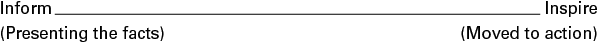
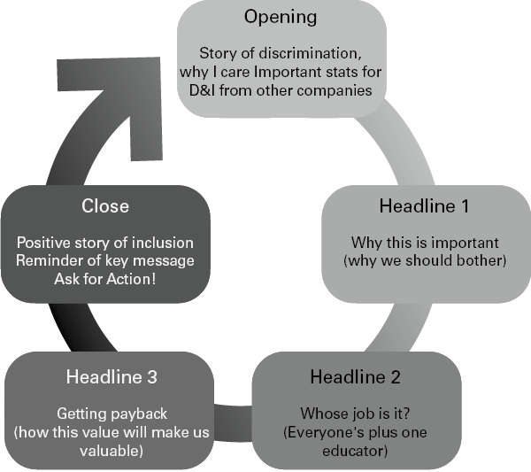

# 从告知到启发

如何进行成功的演示并获得您想要的操作

## 简而言之

无论您的演示是小型虚拟会议还是大型会议厅，都可以将您的演示从仅传达信息转变为让您的听众感到受到启发并愿意采取行动。了解连接的力量，并让受众成为您计划和交付的核心。使用六个问题作为重点内容，并练习五种方法来征服你的神经。总而言之，本章可帮助您以观众应得的参与度和热情传达您的信息！

## 有什么问题？

大多数商业演示令人惊讶地沉闷。令人惊讶的是，尽管有大量材料可以帮助您为演示文稿增添趣味并使其充满魅力和光彩，但商业演示文稿仍然充满了无休止的幻灯片、冗长的事实和无穷无尽的信息。也许我在这里夸大了，你的演讲每次都达到目标？我希望如此，因为当奇迹发生时，当你听到一个结合了惊人事实、个人热情和行动的情感呼吁的演讲时，它是快乐的。相信我，观众感激不尽！
伟大的罗马演说家西塞罗（Cicero）将灵感定义为表现、表现和动摇的能力。也就是说，向观众证明你的建议，让他们高兴，让他们感动。灵感的一个很好的定义。如果我们在一端采用“通知”，另一端采用“启发”的连续统，并考虑您的上次演示，您会将其放置在规模上的哪个位置？
图 13.1 灵感连续体

如果您的演示文稿位于天平的左侧，那么是什么阻止了您让听众受到启发，第二天记住您，更不用说接下来的一周了？
指导过领导者在小型会议上到体育场进行演讲，我拒绝认为这与懒惰或缺乏能力有关的想法。大多数人非常关心他们的交流，但受到一个主要心理障碍的阻碍：脆弱性。
在你的商业生活中，很少有角色需要你在人们面前站出来接受评判。这可能是你角色中最暴露的部分，并且会引发对被“发现”的深深恐惧，有时甚至是一种瘫痪的怯场。因此，难怪你会以多种方式掩盖这个漏洞：

- 隐藏在 PowerPoint 或 SlideShare 后面，确保您在没有幻灯片的情况下发言的时间最少；
- 关灯；
- 站在讲台后面；
- 坐下并确保笔记本电脑覆盖您的大部分身体；
- 编写您的演示文稿并阅读它；
- 输入这么多信息，希望正确的东西坚持下去；
- 谈论您的组织以及您的所有产品和服务；
- 提供您一直做的相同演示，只需更改客户名称；
- 不透露自己的任何信息；
- 坚持事实，不带感情，不讲故事；
- 开始时道歉；
- 我的宠物讨厌，用幻灯片结束，“有什么问题吗？”

我得到它。我在二十出头的时候靠唱歌和表演谋生，伴随着一种严重的怯场，这让我离开了这个行业，转而从事销售。在我从伦敦的销售总监调到悉尼的总经理之后，我不得不在澳大利亚各州进行大规模的演讲，并面临着紧张的情绪。教练、催眠疗法和健康的经验让我到达那里，此外，为了面对我的恐惧，我每周有四个晚上参加卡拉 OK 表演！
无论您的脆弱程度如何，克服怯场并将您的演示文稿推向灵感的规模都是完全可以实现的。这就是我在本章中的目标，尽管改变习惯、以开放的心态练习并接受自己的弱点需要你的愿望。

## 大创意：连接的力量
观众对你有什么要求？准备豪华幻灯片时比您想象的要少。观众渴望的是联系。他们要求您：
通知我
明白我
告诉我你能为我做什么
解释为什么你对我比别人更好
帮我做决定
您可以通过两种主要方式实现连接：通过您的计划和交付。想到计划是一个伟大的想法，也许你会沮丧地叹息：“你的意思是，就是这样？”是的，我知道。通过联系激发灵感的艺术的一半在于您的计划方式。另一半在于你的头脑，以及你在做演讲时如何与自己交谈。先说第一件事。
规划连接时的关键点是向外关注。绝大多数的商业演讲都是以一个单一的问题来准备的：我想告诉你什么？你可能会问这个问题比这更优雅，但归结为这个问题。
所以，让我们用六个问题来扭转焦点，这些问题都是关于将重点放在应该放在的地方——观众身上。

## 实践灵感#1
### 外向规划

1. 你向谁展示？
2. 你的唯一重要信息是什么？
3. 他们真正想听到什么？
4. 你想让他们感受到什么？
5. 你希望他们采取什么行动？
6. 你为什么在乎？

1. **你向谁展示？**
让我们把客户放在你关注的最前面。如果这是一小部分观众，请仔细考虑您面前的个性，并相应地调整您的方法。他们想要五分钟的总结吗？电子表格中的所有分析？有多种选择，还是在正式开始之前进行长时间的交谈？
您可以安全使用什么级别的语言或行话？哪些轶事或故事会引起观众的共鸣？
问问自己，在我发言之前，听众会做什么？这是一个非常重要的问题。你会在漫长的一天结束时进行演讲吗（在这种情况下，你最好非常快，而且非常有活力）？如果您要向 1,000 人展示，他们是否已经坐了很长时间（在这种情况下，让他们站起来）？
问题 1 给出了您的语言水平。
2. **你的单一关键信息是什么？**
想象一下。你做了一个重要的团队演示，第二天我拜访了你的团队，问他们演示中的一个重要想法。他们记得什么？他们会给我你想要的答案吗？
问题 2 为您提供了 FOCUS。
3. **他们（观众、客户或团队）真正想知道什么？**
这是您的演示文稿的锚点。这不是你想告诉他们的，而是他们真正想知道什么？而不是典型的结构：
提醒我们是谁
我们的背景和历史
新想法
它将如何运作
任何问题？
您正在围绕他们的想法设计演示文稿：
这个想法有什么了不起？
值得吗？
我们为什么要打扰？
我们的替代方案是什么？
它要花多少钱？
为什么你？
问题 3 构成了您的内容方向。
4. **你想让他们感受到什么？**
这个问题在计划演示时很少被问到，即使在你背后，人们会情绪化地谈论你。你令人惊讶、迷人、无聊、务实、随和、焦虑等等。观众不会说，‘哇，第 34 张幻灯片，太棒了。很好的预算解释……”
回顾关于品牌的第 12 章，想想你想给人们留下的影响。考虑一下您希望人们在背后谈论您什么。您希望人们感受到您的自信、欢笑、震惊并采取行动或看到您的可信度吗？
一旦你仔细考虑并写下来，它就会渗透到你所说的内容和你的影响中。
问题 4 给出了您的情绪水平。
5. **你希望你的听众采取什么行动？**
如果您不希望您的听众（无论大小）采取任何行动——您只是希望他们听取您的信息——请不要浪费每个人的时间。只需向他们发送包含材料的电子邮件即可。
要将您的演示文稿从 Inform 转变为 Inspire，必须有采取行动的理由。灵感就是感觉被感动，获得联系感，有理由采取行动。这不必很大；它可能只是与您交谈，给您一些反馈，以某种方式与您或您的团队互动。但是你的演讲是有目的的。而这个目的决定了一切。
问题 5 给出了你的演讲动力和目的。它还为您提供 CLOSE。
6. **你为什么关心？**
如果您热情洋溢，观众会原谅您很多事情。他们不会在意你在中间出错，你一开始很紧张，技术在某一点上有点不稳定，因为你在乎。你关心的事实是显而易见的，对观众来说很重要。
问题 6 给你激情。

## 试试这个 #1
当您查看此处的示例时，请仔细考虑您即将进行的演示，并根据您的情况回答以下六个问题：
阿里是一家媒体机构的负责人。多元化和包容性主题对组织很重要，是他们的价值观之一，也是对阿里的个人热情。他认为，通过招聘一名全职的多元化冠军，歧视会减少，包容的工作环境会变得活跃和有意义。阿里正在向高层领导团队提出他的建议。他的计划文件是这样的：

1. 你向谁展示？
    八个人，性格混杂但要简短。 SLT（高级领导团队）月会结束时的谈话。给定 15 分钟，但可能会被挤到 5 分钟。房间里有一些冠军，一些怀疑论者。大多数人认为它应该是每个人的角色，而不仅仅是一个角色。
2. 你的唯一关键信息是什么？
    对我们有好处，对生意也有好处。
3. 他们真正想知道什么？
    我们应该打扰吗？我们做得还不够吗？
    为什么要一个人做这件事？不是每个人的工作吗？
    他们会怎么做？
    我们如何获得回报？
4. 你想让他们感受到什么？
    我是可信和有说服力的。感受我的热情。
5. 你希望他们采取什么行动？
    最好在招聘时签字。如果目前步伐太大，请查看我制定的案例研究以及其他公司在该领域所做的工作。参与其中。感兴趣。
6. 你为什么在乎？
    我曾面临歧视，希望 D&I 不仅仅是言语。在有人掌舵的情况下，我们可以启动讨论、活动和教育。

现在阿里已经回答了这些问题，他可以开始从观众的角度设计一个演示文稿，具有适当的信息和情感水平。

图13.2 灵感之环

这些步骤包括： 1. 开场——歧视的故事，为什么我关心其他公司的 D&I 的重要统计数据；” 2. 标题 1 – 为什么这很重要（为什么我们应该打扰）； 3. 标题 2 – 谁的工作？ （每个人加一名教育者）； 4. 标题 3 – 获得回报（这个价值如何让我们变得有价值）； 5. 结束——积极的包容性故事，关键信息的提醒，要求采取行动。
阿里在这里所做的是使用他在回答问题 3“他们真正想知道什么？”时写下的反问句，构成他的灵感圈的基础。
以圆圈的形式写出你的演示文稿有很多好处：

- 你在给我们讲一个故事，有开头、中间和结尾。
- 保持三个标题——三个规则可能是陈词滥调，但它有效。
- 用有趣的相关信息支持每个标题——视觉、故事、案例研究、证据数据。
- 你感到自信，知道你正在回答观众想听到的。
- 您将保持正轨，因为标题和关键词会引导您完成。
- 如果您缩短了时间，您可以轻松决定将精力集中在哪里。

### 打开和关闭
没有什么比开场和结束的演讲更令人满意的了。即使您可能认为您的主题是最枯燥的商业主题（我已经看过有关催化转化器、火柴棍和冷冻豌豆的演讲），但我可以向您保证，没有无聊的主题，只有沉闷的演讲者！所有的商业演示仍然是故事，应该有开始、中间和结束。或者，就像任何好故事一样，有一个情况、一个问题和一个解决方案。
随着您的开场，让您的主题栩栩如生。你为什么关心（回头看问题 6），为什么这如此重要？告诉我们，让我们也关心它。
阿里将讲述他所面临的歧视以及该组织已经采取的积极步骤的重要性的故事。然后他可以使用他对六个问题的回答来标记演示：
在接下来的 15 分钟内，我将讨论为什么我们应该招聘一名全职多元化倡导者，该职位将涉及什么，以及重要的是，它将如何使整个组织受益。我的目的是让您看到这对我们来说是正确的方向，并且最终也会对业务有利。在 15 分钟结束时，我想听听您的问题和疑虑，以便我们采取下一步措施寻找合适的人选。

关于结束，想想你从哪里开始和结束故事。提醒你的听众为什么它很重要以及你希望他们采取什么行动。例如：
我们已经在取得积极进展。当 Glenda 上个月成为我们组织最年轻的主管时，她的成就受到了庆祝，她已经带头开展了“年轻女性成为领导力”运动。我们可以而且应该继续这一旅程，如果您今天同意，我们可以开始招聘。

### 交付连接

我是学者 Brene Brown 关于脆弱性和不完美的工作的忠实粉丝。在她的书《不完美的礼物》（2010 年）中，她写到“放手”是为了减少脆弱性并增加联系。
要做到这一点，你需要放弃两件事：
放弃完美。
放开别人的规矩。
完美主义与努力做到最好不同。正如布朗所说，“我们拖着一个 20 吨重的盾牌，以为它会保护我们”。如果您花费数小时调整幻灯片、记住脚本以免出错、练习感觉不像自己的动作或整晚睡不着担心，您就会知道自己已经养成了完美主义的习惯。
我不是说你不应该练习。我的意思是说，在某些时候，您必须放弃完美并知道自己很好。如果你出错了，那也没关系。事实上，当你出错时，往往是观众第一次看到主持人背后真正的自然人。拥抱这些联系的机会。
这意味着你必须朝着自信不确定的心态努力。我建议您在每次演讲时都采用这种心态——自信地知道您已经从观众的角度考虑过这一点，并且您已经实践过了。并且有足够的信心知道您可能没有答案，但您确实知道在哪里可以找到它。

### 做真实的自己

重要的是，您了解自己作为主持人的类型并发挥自己的长处。我在 18 岁时接受了一名前警察的训练，每当我说“嗯”或移动我的手臂时，他都会吹口哨。作为一个善于表达的人，它多年来阻碍了我的行动！
如果您的声音柔和，请通过故事增加您的影响力，让人们可以倾心聆听。
如果您的声音单调，请刻意强调您的标题。
如果您有活力，请有目的地移动。
如果您是一个静止的人，请确保您的声音有足够的明暗以保持兴趣。
如果你的声音很深，请在句子的末尾保持冲击力。
如果你挥动你的手臂，用它们来冲击，而不是像旋转一样。
最重要的是，交付您自己的材料。即使你有公司脚本和幻灯片，也要重写元素，这样这个演示文稿就是你的，而且是你自己的。

## 试试这个 #2
### 意识圈

演讲的第一分钟很重要，对完美的渴望真正开始。这也是客户对你做出所有无意识决定的时候，你的身体根据你的思想状态学会战斗或逃跑。 所以，试试这个简单的技术：
在演示开始时，关闭幻灯片，放下笔记，关闭笔记本电脑。 接受你的弱点，走到舞台、房间或你的虚拟空间的前面。 看着你的观众的眼睛。 自己接地。 深呼吸一次，两次，然后微笑。 暂停。 让房间放松一下。 简单地介绍一下你自己，说能见到他们并来到这里是多么的好。 就是这样。 然后继续。

### 实际灵感#2
#### 管理“怯场”的五种方法

尽管你有计划并渴望建立联系，但有时内心的批评者会强烈地控制你的想象力。神经很好，因为它们可以让你保持警惕，让你做好表现和维持肾上腺素的准备。但是，当他们感到失控时，这里有五种久经考验的方法来管理您的心态：

1. 看法。通过提醒自己在生活的大计划中还有什么对你重要，从而正确看待这个演示。例如，与您的家人或亲人合影；正面评价；一个咒语；一个将您与您所爱的事物联系起来的对象。
2. 呼吸。更好的是，打哈欠或唱歌（我知道这可能看起来很奇怪，但它有效！）。你想让你的横膈膜工作，你的呼吸来自你身体的下部，这样它就不会在你的头上肆虐。
3. 把聚光灯从你身上移开。在您的演示文稿开始时获得参与和互动，因此它不完全是关于您的。问一个问题，举手，分发一些东西，让人们写下一些东西，转向他们的邻居并告诉他们一些事情。一旦您与观众建立联系并与您合作，您的紧张情绪就会消失。
4. 展望未来。想象一下人们在演讲后会说的积极的事情。使这尽可能生动。人们会使用哪些形容词？他们会感兴趣地记住哪一件事？为什么他们发现这很有用？你传达了激情吗？
5. 实践。实践。实践。对你提供的每一个机会说“是”。如果你只考虑展示，你永远不会变得更好。你现在必须采取行动。自己录视频。向值得信赖的同事寻求反馈。

最后一点是结束本章的好地方。信心来自经验，而经验来自于尝试——而不是在计划不完全时自责。从每一次经验中学习，然后再试一次。

## 进行鼓舞人心的演讲的十大技巧

1. 对其他人感兴趣。他们如何反应。他们感觉如何。对他人比对自己更感兴趣，并将注意力转移到观众身上。
2. 给我讲一个故事。拥有强大的叙事驱动力是使演讲耸人听闻的原因。
3. 准备。使用六个问题。这完全取决于您如何设置，如何管理期望以及之后如何跟进。
4. 打开和关闭好。首要法则和新近法则意味着观众会记住你说的第一句话和最后一句话。抓住观众的注意力，表现出色，在嘈杂的声音中开车。
5. 将演示文稿的核心内容缩减为三点。三的规则可能是陈词滥调，但它经受住了时间的考验并且有效。
6. 不要沉闷。不要复杂。
7. 信念是有说服力的。对你讲述的故事充满热情的信念可能非常诱人。
8. 时机很重要。顺应时间，永不过时。知道你的时间可能会被缩短，所以准备好在 30 秒内传达你的关键信息，在 5 分钟内传达你的三个标题。
9. 不要让困难的行为让你出轨。如果人们打哈欠、走开、关闭变焦相机或看起来很无聊，请关注那些感兴趣的人。
10. 好好享受！