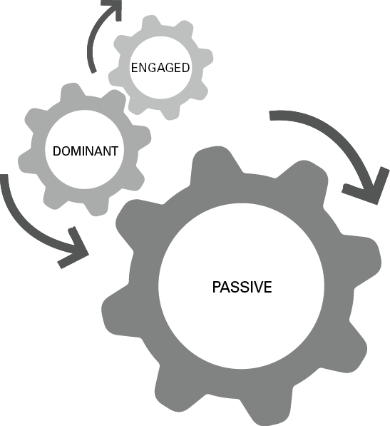
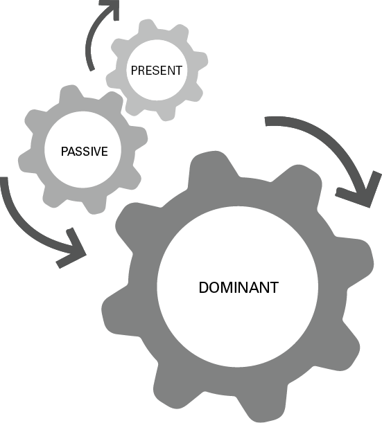
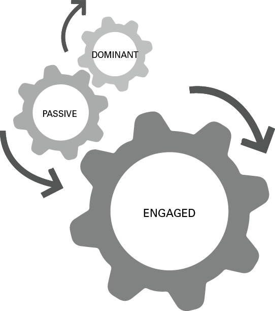
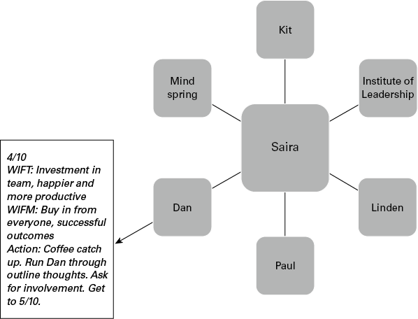

# 如何以诚信扩大您的领导影响力
## 简而言之

诚信行事的有影响力的领导者明白，成功和积极的结果只能通过他人、与他人一起实现。有三种方法可以实现这一点并扩大您的影响力： a) 通过确保您的声音被听到来提高您在会议中的参与度； b) 走出你的孤岛，对你的业务网络的范围和质量保持积极主动，并且 c) 在向上影响和明智地说服时获得对你的想法的承诺。

## 有什么问题？

问题很简单：作为领导者，你不得不拥有影响力，你可以选择如何使用这种权力。如果您查看影响力的定义，即“某人对他人的行为、行为和意见产生强制力或产生影响的能力（或权力）”（dictionary.com，2021 年），那就很多了一个领导的责任！本质上，它意味着你所做或不做的一切，说或不说，存在或选择不存在，都会产生影响，无论是好是坏。
作为一名领导者，你会投下阴影，这个概念很简单：你的团队是你的地图，你的阴影会投射在你权威之下的人身上。例如，您在会议上的出席可能会对人们产生积极或消极的影响。你在场的风格或性质、你说什么或你怎么说以及你表现出的态度很重要。你越聪明地知道你所做的事情，或者你的事情对他人的影响，你就能变得越有效率。
不过，这不仅仅是使用您的权限。你会从经验中知道，影响他人的能力就是控制的同义词。也就是说，一旦你拥有领导地位，就可以不难强迫、强迫或诱导他人采取行动。然而，尽管有大量文献专门讨论有毒领导的危险（例如 Goldman，2009），但我遇到的大多数领导者都希望成为一个积极的影响者，以正确的理由可见并赢得追随者的信任。
因此，影响他人不仅仅是让他人始终同意您的观点——您可能能够影响他们与您合作，而他们可能并不总是同意您的观点。这不是不惜一切代价赢得胜利，也不是必须一直按照自己的方式行事。这不是强迫或让他人改变——你无法改变他人。扩大你的影响力是关于：

- 参与并出席会议；
- 以向他人发出改变邀请的方式行事；
- 走出你的孤岛，在整个组织中发展更广泛的翼展；
- 发展双赢关系，更多地基于给予而不是索取；
- 获得对您的想法的承诺；
- 后退一步，腾出时间反思你投下的阴影。

## 大理念：在场、主动、有说服力

这三个“P”将通过以下方式帮助您扩大影响力：
出席：不仅仅是知名度，这还涉及通过全神贯注的注意力来影响，尤其是在会议上。
积极主动：通过规划您的利益相关者并在您的网络技能方面采取积极主动的步骤，有意识地扩大您的影响力。
有说服力：了解如何推销您的想法、获得承诺并影响您想要的行动。

### 需要您的出席：在会议上施加影响
在会议上，你的影响力最有可能在工作中被感受到和注意到。不仅因为它公开展示了您的想法、决策技巧以及与团队的关系。而且，因为这是您花费大部分时间的地方。研究表明，大多数领导者每周花大约 23 小时开会（Perlow 等人，2017 年），根据我的经验，这个数字偏低，我认识的许多领导者每天最多花 10 小时在会议上会议，无论是虚拟的还是面对面的。在如此苛刻的日程安排下，出席会议或完全参与会议的呼声逐渐减弱也就不足为奇了。
您可以通过三种方式来定义您在会议中的出席情况——被动、主导或参与——而您的行为方式将取决于上下文、一天中的时间和信心。例如，如果您作为团队中的一个“沉默的支持者”参加会议，您可能会选择采取更被动的方法。如果你一整天都在开会，很晚了，你很累，人们聊了太久却无处可去，你可能会选择一种更具主导性的方法来快速做出决定。如果你在房间里拥有最高的地位，人们通常会向你寻求答案，他们自己会采取更被动的方式。或者，如果你是房间里的初级领导，你可能不会说出来，因为害怕出错。
但是，如果您的选择是成为一个积极的影响者，您需要积极选择参与状态，因为这就是影响的魔力发生的时候。正如 Patsy Rodenburg (2007) 所建议的那样，“只有当我们全神贯注时，我们才能做到最好，并给他人留下最深刻的印象。”

### 影响力的三个齿轮

将这三种存在状态视为齿轮——您可以设计或调整一种机制，为您提供不同的输出。正如您将在下面看到的，尽管“参与”状态通常是最有益的，但被动（您在那里支持其他人）或主导（召集会议做出决定）也有好处。这意味着您可以在齿轮之间移动，但重要的是要确保您选择的齿轮来自积极和积极的意图。
确保您选择的装备来自积极和积极的意图。

这是您将体验到的三个齿轮中的每一个。

### 被动存在

图 14.1 影响的被动齿轮

- 你感到担心，想着如何插话但保持安静。
- 你在场，但很安静。
- 你离开会议时意识到你几乎没有说话。
- 您经常因为没有参与讨论而退出讨论。
- 你作为观察者在那里。
- 你满足于让别人发光。
- 你对占主导地位的声音感到沮丧，在你看来，他们说得很少，但声音很大。
- 人们忘记了你在会议上。

### 占主导地位

图 14.2 影响的主导齿轮

- 你对缺乏快速决策感到沮丧。
- 你呼吁人们做出决策。
- 你经常打断别人。
- 你对别人“胡说八道”感到不耐烦。
- 您为会议注入了活力。
- 您掌控了讨论（有时为时过早）。
- 你不理会别人的想法。

### 参与的存在

图 14.3 影响啮合的档位

- 你会感到细心和准备。
- 你学习和使用其他人的名字。
- 当你说话时，人们会听你的。
- 你问了很多问题。
- 您共享“空间”，让其他人参与进来并确保每个人都可以发言。
- 你会注意到其他人的细节——情绪、肢体语言、口头语言。
- 你对一个想法感到好奇——而不是判断。
- 你承认别人的感受。

## 反思时间

想想你本周参加的会议。哪方在每次会议中都占上风，为什么？谁或什么让你变成了无用的齿轮？
用这 10 个问题进一步激发您的思考，在会议期间对这些影响技能中的每一项进行 1-10（差-一致）的评分：

1. 我积极影响他人以找到共识解决方案。 ☐
2. 我在会议上很有说服力，不会否定他人的贡献。 ☐
3. 我在会议上很自信，并会确保我的声音被听到。 ☐
4. 我倾听与谈话同等重要。 ☐
5. 我在会议中使用问题来激发兴趣、获取信息并鼓励参与。 ☐
6. 人们会形容我是一个很好的倾听者。 ☐
7. 在压力下，我仍然平易近人。 ☐
8. 我鼓励人们看到他们贡献的价值。 ☐
9. 我赞扬想法和建议。 ☐
10. 我积极鼓励分歧，提出意见并促进讨论。 ☐

## 实践灵感#1

### 参与的 10 个步骤——让你的声音被听到

如果您对上述问题的分数低于 50，那么您并不孤单。对于我指导的许多领导者来说，他们对无法以令人满意的方式表达自己的声音或表达方式感到沮丧。你越气馁，你的行为就会变得越被动或占主导地位。
因此，当您反思上述问题的答案时，这里有 10 种实用方法可以让您的声音被听到并扩展您的积极影响技能：

1. 陈述你的观点
    使用“我”陈述来区分你的观点和事实，并强调它是你的观点：“在我看来，问题是……”、“我的经验是……”
2. 同意他人的意见和建议
    如果你明确表示你的支持，而不是保持沉默或点头，这对他人有帮助——实际上说你同意。这有助于确保考虑而不是忽略有用的建议。
3. 不同意并提出疑问
    说出你的立场很重要，包括当你不同意或有重大疑问时。但是，这些行为会阻碍会议的进行，因此接受与正确相关的责任很重要。这意味着您需要具有建设性：
    “我确实对此有疑问……，那怎么样……”
    “我同意你的总体方法，瓦尔。然而，我不喜欢的部分是……”
    给出你怀疑的理由：
    “我的看法不同。” “我的经历与此不同。”
4. 提出建议
    建议或提议是行动声明。如果人们将它们视为建议，他们更有可能做出积极的反应。尝试从短语开始，例如：
    '在我的经验中…'
    '怎么样…？'
    '我们可以…？'
    “我建议/提议我们……”
5. 要求澄清
    在对他人的观点做出反应之前，您可能需要准确地检查他们的意思。不要让自己失望：“也许只是我，比尔，但我不明白……”
    果断：
    “法拉，当你说这个项目时，你指的是‘x’还是‘y’？”
    ‘我做对了吗？你想要…'
    “你是什么意思，比尔？”
6. 中断
    避免打断别人的观点。避免他人打扰：
    “我只想说完我说的话……”
    “让我说完……”
    “我会回来找你的……”
7. 询问他人的反应
    人们并不总是公开自己的立场、观点和想法。您可以通过果断地询问来鼓励他们这样做：
    “你觉得我的建议怎么样？”
    “你对……有什么看法？”
    “你有什么想法……？”
8. 发出双赢的氛围：从不能到可以
    对某些人来说，将“不能”变成“可以”是有用的做法。告诉人们你能做什么，而不是你不能做什么：
    “如果我能在加工方面得到一些帮助，我就能做到。”
    “我可以为你做这件事，尽管我们需要讨论你建议的时间表。”
    “我确实想帮助你完成那个项目，所以我可以每周给你一天时间。”
9. 标记您的目标是双赢
    “我们能找到一种对我们双方都有效的方法吗？”
    “我想同意你的方法，我们都会感到高兴。”
10. 声音和看起来积极！
    声音应该稳定和控制。
    手势打开。
    面部表情是关心、体贴和愿意，而不是不相信。

### 积极主动：利益相关者的广度和深度
您扩大影响力的下一步是检查您与利益相关者的关系。您可能会陷入成为一名优秀管理者的角色、“能力陷阱”（参见第 1 章），因此您作为领导者的工作是摆脱孤岛，扩大内部和外部的联系，并加深与您的关系。那些重要的人。通过这种方式，您可以更有效地解决系统性问题，同时将您的团队与更广泛的组织联系起来。
实际灵感#2
影响地图
在第 1 章中，我谈到了网络。影响地图是一种简单而有效的方法，可以实际扩展这一想法并在您的关键关系中获得广度和深度。它可以帮助您专注于关系的共同利益，并向前采取小行动。小步骤很重要——任何太戏剧化的事情都不会发生。
画出你的关键关系的简单蜘蛛图。把你自己放在中间，每个利益相关者（或组织、研究所、协会）的名字在其中一个方格中。在此地图中最多可容纳 10 人。
对于每个连接，回答以下四个问题：
满分 10 分，评价当前关系的状态（是的，这是主观的，但没关系）。
WIFT：他们对提高这种关系的有效性有什么好处？
WIFM：我对提高这种关系的有效性有什么好处？
接下来是什么？你可以采取什么简单的行动来提高你的分数？
图 14.4 影响图

本例中的“对他们有什么好处”或 WIFT：对团队的投资，更快乐，更高效。 “对我有什么好处”或 WIFM：从每个人那里购买，成功的结果。行动：咖啡迎头赶上。通过大纲思想运行丹。要求参与。到达 5/10。
例如，这是Saira影响地图的开始。 Saira 负责学习和发展职能部门，并担任该职位已有六个月。 Kit 是她的老板，首席人事官；林登是她的副手；保罗和丹是她想要并需要与之建立更密切关系的两个同龄人。 Saira 刚刚与领导力学院建立了新的关系，以认可他们的内部课程，而 Mindspring 是她的主要外部培训供应商。
Saira 从这些利益相关者中的一个开始，从商业主管 Dan 开始。她将这种关系评为 4/10，因为他们曾在几个项目上合作过，但尚未建立可提供价值的可信赖的业务合作伙伴关系。 Saira 知道 Dan 是开放和富有表现力的，并且会保护他的团队。她知道他之前没有参与过团队的内部培训计划，她的愿望是共同创造与他的团队相关且富有成效的成果。她希望丹成为 L&D 的倡导者并建立双赢的关系。为了最初将关系转变为 5，Saira 决定从非正式的咖啡开始，并贯穿她对商业团队的思考。

### 给予和接受

影响地图的核心是给予和接受的概念。建立良好的工作关系和互惠需要信任、信誉和积极的意愿，与他人交换事物以实现互惠互利的做法是您成功的核心。这个概念有一个严格的证据基础来改变人们的行为和促进协作（Cialdini，2007），并且使用得当，来自于诚信的立场。这是关于首先给予。我不是问自己从发展这种潜在的利益相关者关系中可以获得什么，而是要问你可以提供的价值，这将丰富这个人的工作方式。这是因为如果您的利益相关者认为发展这种关系只是为了您能从中获得什么，他们就会悄悄地停止与您合作。
在亚当格兰特 (Adam Grant) (2014) 的著作《给予与接受》(Give and Take) 中，他强调，当他们设法给予很多而不会让自己筋疲力尽或被利用时，他们会建立庞大的朋友和盟友网络，并建立起对他们长期有效的良好声誉。 - 长期优势，而获取者，即使他们设法创造了短期的给予者声誉，最终他们的自私行为后来又回来破坏他们的声誉并破坏他们的网络和关系。正如格兰特所说，“这就是我发现成功给予者最吸引人的地方：他们在不削减他人的情况下达到顶峰，找到扩大蛋糕的方法，使自己和周围的人受益。”

## 试试这个
画出你的影响地图。想一想：

- 现有的主要利益相关者
- 潜在/期望的主要利益相关者
- 外部协会

并为每个人分配一个当前的分数、互利和行动。那么，开始吧！你的影响力地图是一个动态工具，所以在一个月内重新审视它，调整分数并创建新的行动。记录你正在取得的进步和每段关系的成长。

### 有说服力：向上影响并获得承诺

许多领导者在影响他人时不愿意接受说服技巧，根据我的经验，当你向上影响时，这一点变得尤为突出。这通常是因为你觉得自己的地位低了，你的信心减弱了，说服的本质感觉太接近于操纵，因此被拒绝了。区别在于：操纵是没有信任的说服，我知道您是一位希望以诚信和责任行事的领导者。
你会惊讶地发现，有多少董事会和执行委员会与高级领导一起坐过，表达了他们对领导者无法（或不愿意）说服他人采取行动的失望。卖给我们，他们恳求！说服我们！我们为什么要这样做？提出你的建议！
这里有六种方法可以将你的好主意转化为有意义的行动：

1. 做好准备
如何准备与前辈的会议至关重要。大多数人为任务和会议做准备，但不是为人做准备。了解谁将出席以及他们希望从会议中获得什么。如果您需要对某项计划的支持，请找出可能支持您的利益相关者，并在会议之前与他们交谈。
2. 有说服力
他们不必买，你必须卖！许多领导者忘记了他们必须说服他人接受他们的想法，而这就是利益销售。他们买什么？与组织的更大需求相关，而不仅仅是您的职能，并且不要假设您的受众可以自动将您的职能的利益与更大的组织的利益联系起来。换句话说，“倡导的艺术是根据您的条件引导您得出我的结论”（格兰特，2014 年）。
3. 简洁
知道如何将您的大量幻灯片转换为五分钟。对这个人或一群人来说真正重要的是什么？从这里开始。并且不要以为仅仅因为某人比您年长，他们就会“理解”您的想法。把你复杂的想法变成一个简单的行动，这将产生积极的影响。
4. 现实一点
对您的想法进行现实的成本效益分析。正如 Marshall Goldsmith (2004) 所建议的：
每个组织的资源、时间和精力都是有限的。接受你的想法很可能意味着拒绝其他人认为很棒的想法。准备好对你的想法的成本进行现实的讨论。承认这样一个事实，为了实现你的想法，可能必须牺牲其他东西。

5. 平等
当你遇到一个你尊敬的人或对你有重大影响的人时，你很可能会极大地改变自己的行为。当你想影响向上时，你需要相信你们是平等的——这种情况没有什么特别的。有影响力的人不会光顾或看不起与他们在一起的人。但他们不会以敬畏或谄媚的态度仰望他们。你明白你们都有长处——都不比对方强。
6. 要有主见
你的建议是什么？虽然您的演示文稿中可能有选项，但请对您推荐的提案以及理由保持自信。做出判断，坚持你的想法，散发出自信！
做一个积极的榜样：最后一句话
在本章中，我一直强调，一旦你成为领导者，你就会有影响力，通过你的行为和行动，你的语言和态度，你会被人知道。而且会传染！你的心情会蔓延（如野火），你的话会被别人反映，你的表现也会被复制。所以这是第四个“P”——通过选择你每天在组织中的表现方式来成为一个积极的榜样。我敦促您以积极的方式使用这一责任，以便您的追随者获得他们应得的领导者。
作为本章的结束，这里有一个快速的方法，可以让自己每天早上保持正确的心情，通过有意识和有意识的。使用这个每天两分钟的反思练习来回顾你的选择并更新你的领导优势。对于初学者，这里有四个日常问题：
我感觉如何？
我想要怎样的感觉？
为了达到这种感觉，我需要做什么、思考、感受或听到什么？
我今天的意图是什么？

## 扩大影响力的十大秘诀
1. 值得信赖、可信和有意。积极影响是关于你每天做出的选择。每天通过自我反省来回顾和更新你的选择。
2. 如果人们不信任你，他们就不会允许你影响他们。建立信任的一个聪明而简单的方法是少说多听。
3. 呈现积极的态度。没有人说你不能有糟糕的一天，但如果你能在压力大的时候表现出力量、冷静和毅力，你就会向你的团队灌输同样的东西。
4. 向上影响的一个很好的指导方针是记住你想对组织产生积极的影响。将您的想法与更大的图景联系起来。
5. 您使用“影响地图”采取的小步骤将对扩展您的网络产生最大的影响。
6. 其他人越能用你的想法“获胜”，你的影响力就越大。
7. 影响，不要操纵。有一个简单的区别。操纵是没有信任的说服。
8. 通过诚信赢得信任。做出改善整个企业的决策，并在应得的时候给予信用。
9. 付出多于索取。通过建立可信赖的同事网络来扩大您的影响力。
10. 确保通过积极参与听到您的声音。既不被动也不支配，选择主动倾听、询问、反思和建议。